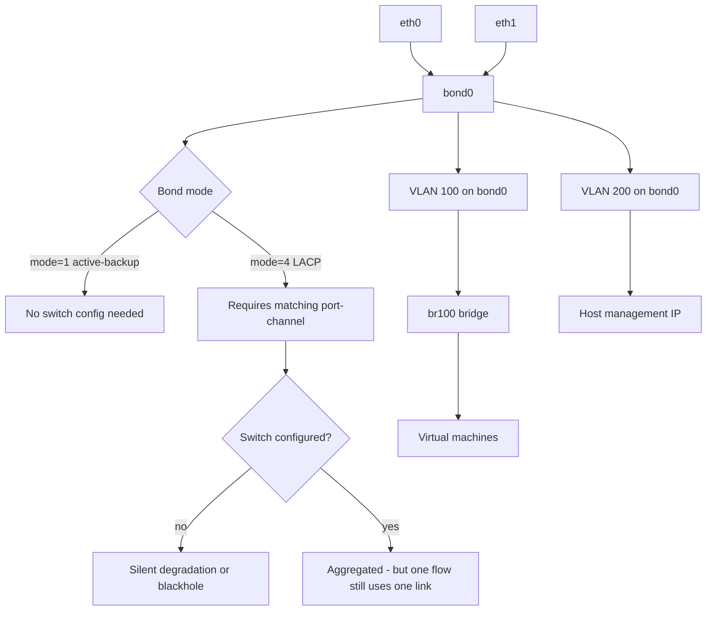

# Bonding, Teaming, VLANs and Bridges

**Level:** Intermediate
**Tree:** [Networking & Core Services](../README.md)
**Branch:** [Network Stack & Filtering](README.md)
**Forest:** [Linux](../../../README.md)

## Explanation

# Bonding, Teaming, VLANs and Bridges

A production Linux host rarely has a single flat network interface. It has redundant links, tagged VLANs and often a bridge feeding virtual machines or containers.

## Bonding modes that matter

**mode=1 active-backup** needs nothing from the switch. One link carries traffic, the other stands by. It is the safe default and the right answer when you do not control the switch configuration.

**mode=4 802.3ad (LACP)** aggregates bandwidth and requires a matching port-channel on the switch. When the switch side is not configured, LACP silently degrades or blackholes traffic - one of the most common and most confusing network faults in a new build.

Understand also that LACP **does not make a single flow faster**. Hashing distributes flows across members, so one large transfer still uses one link. People expecting a 2 Gbps single-stream from two bonded 1 Gbps links are always disappointed.

## VLANs and bridges

A VLAN interface consumes 802.1Q tagged frames on a parent interface; the switch port must be a trunk carrying that VLAN or nothing arrives at all.

A **bridge** is a software switch. Virtual machines attach to it and appear directly on the physical network. Order matters: you bond first, put VLANs on the bond, and bridge the VLAN - building the stack in the wrong order produces a configuration that looks correct and does not pass traffic.

## NetworkManager is the right tool

On RHEL, NetworkManager owns interfaces. Hand-editing ifcfg files or using ip commands for persistent configuration fights the tool. Use **nmcli**, which writes durable connection profiles, and remember that a connection must be brought up before it does anything.

## Architecture and flow



## Commands

### Command 1

Every connection profile and the state of each device - the starting point for any change

```text
nmcli connection show; nmcli device status
```

### Command 2

Create an LACP bond with fast link monitoring

```text
nmcli connection add type bond con-name bond0 ifname bond0 bond.options "mode=802.3ad,miimon=100,lacp_rate=fast"
```

### Command 3

Enslave a physical interface to the bond

```text
nmcli connection add type ethernet con-name bond0-p1 ifname eth0 master bond0
```

### Command 4

Authoritative bond state including per-slave link status and LACP negotiation

```text
cat /proc/net/bonding/bond0
```

### Command 5

Add a tagged VLAN interface on top of the bond

```text
nmcli connection add type vlan con-name vlan100 dev bond0 id 100
```

### Command 6

Create a bridge and attach the VLAN to it for VM connectivity

```text
nmcli connection add type bridge con-name br100 ifname br100; nmcli connection modify vlan100 master br100
```

### Command 7

Detailed link information showing bond mode and VLAN protocol

```text
ip -d link show bond0
```

### Command 8

Activate a profile - creating a connection does not bring it up

```text
nmcli connection up bond0
```

## Automation scripts

### Bond and LACP negotiation verifier

```bash
#!/usr/bin/env bash
# Confirms every bond has all members up, and that LACP actually negotiated with the switch.
set -uo pipefail
rc=0

shopt -s nullglob
bonds=(/proc/net/bonding/*)
if [ ${#bonds[@]} -eq 0 ]; then echo "no bonds configured"; exit 0; fi

for f in "${bonds[@]}"; do
  name=$(basename "$f")
  mode=$(awk -F: '/Bonding Mode/{sub(/^ /,"",$2); print $2; exit}' "$f")
  up=$(grep -c "MII Status: up" "$f" || true)
  down=$(grep -c "MII Status: down" "$f" || true)
  printf '%-8s mode=%-34s up=%s down=%s\n' "$name" "$mode" "$up" "$down"

  if [ "${down:-0}" -gt 0 ]; then
    echo "  ALERT: $name has $down member(s) down"
    rc=1
  fi

  # LACP that has not negotiated is the classic silent failure
  case "$mode" in
    *802.3ad*)
      if grep -q "Partner Mac Address: 00:00:00:00:00:00" "$f"; then
        echo "  ALERT: $name is LACP but the switch is NOT negotiating (partner MAC is null)"
        echo "         the switch port-channel is probably not configured"
        rc=1
      else
        echo "  OK: LACP negotiated with a partner"
      fi
      ;;
  esac
done
exit $rc
```

## Lab

**Objective:** Build a bond, VLAN and bridge stack in the correct order, and reproduce the silent LACP failure caused by an unconfigured switch.

### Steps

1. Create an active-backup bond from two interfaces with nmcli and confirm both members show up.
2. Pull one link and confirm traffic continues on the survivor with no interruption.
3. Change the bond to 802.3ad without configuring the switch, and observe the partner MAC stay null.
4. Configure the switch port-channel (or revert to active-backup) and confirm negotiation succeeds.
5. Add a tagged VLAN interface on the bond and confirm connectivity on the correct trunk VLAN.
6. Create a bridge on the VLAN, attach a VM, and confirm the VM reaches the physical network.

### Validation

The stack is built bond then VLAN then bridge, and the ordering is confirmed with ip -d link showing each layer on the one below it,A continuous ping survives a deliberate slave failure with no packet loss - the loss measured during the failure, not inferred from the ping returning afterwards,An LACP bond is shown up on the host while the switch has not negotiated, and the difference is read from the aggregator and partner fields rather than from the bond state alone,/proc/net/bonding is used to identify which specific slave failed, since the bond reports up throughout and hides that on its own

## Operational automation

## Automating network configuration

**Use nmcli or the network role, never hand-edited files or bare ip commands.** ip changes are lost on restart and hand-edited files fight NetworkManager. The nmstate and Ansible network roles express the whole stack declaratively.

**Build the stack in dependency order and validate at each layer.** A bridge on a VLAN on a bond has three places to be wrong; verifying only the top layer means debugging blind.

**Check LACP partner state explicitly in monitoring.** A bond can show all members up while LACP has not negotiated at all, which behaves fine until load or failover exposes it.

**Apply network changes with a rollback timer on remote hosts.** nmcli has connection rollback semantics, and a scheduled revert means a mistake restores itself rather than requiring a data-centre visit.

## Troubleshooting

### Scenario 1: Bond shows both members up but throughput is halved or traffic is intermittent

**Likely cause:** The bond is in 802.3ad mode but the switch has no matching port-channel, so LACP has not negotiated

**Resolution:** Check for a null partner MAC in /proc/net/bonding/bondX; either configure the switch port-channel or move the bond to active-backup

### Scenario 2: A VLAN interface is up but no traffic arrives

**Likely cause:** The switch port is an access port, or the trunk does not carry that VLAN ID

**Resolution:** Confirm with the network team that the port is a trunk carrying the VLAN; verify tagged frames arrive with tcpdump -e -i <parent>

### Scenario 3: Virtual machines on a bridge cannot reach the network

**Likely cause:** The bridge was built on the wrong layer, or the physical interface still holds the IP instead of the bridge

**Resolution:** Ensure the address is on the bridge rather than the enslaved interface, and confirm the stack order is bond then VLAN then bridge

### Scenario 4: Network configuration reverts after a reboot

**Likely cause:** Changes were made with ip commands, which are runtime-only and not persisted by NetworkManager

**Resolution:** Recreate the configuration with nmcli connection add or modify, which writes a durable profile, then nmcli connection up

## Interview questions

### 1. Will bonding two 1 Gbps links give a single transfer 2 Gbps?

No. LACP distributes flows across members using a hash of packet headers, so any individual flow is pinned to one member and still sees one gigabit. Aggregation increases total capacity across many flows and provides link redundancy, but a single large file transfer will not go faster. The common misunderstanding leads people to bond links expecting single-stream performance and conclude the bond is broken when it is behaving exactly as designed. To make one flow faster you need a faster link, not more of them.

### 2. How do you tell whether an LACP bond has actually negotiated?

Read /proc/net/bonding/bondX and look at the partner information. If the partner MAC address is all zeros, the switch is not participating in LACP - the host is sending LACPDUs and getting nothing back. The dangerous part is that member interfaces still show MII status up, so the bond looks healthy from a casual check and from most monitoring. It typically behaves acceptably until a failover or a load spike exposes that traffic is not being distributed as expected.

### 3. Why does the order of bond, VLAN and bridge matter?

Because each layer encapsulates the one below it. The bond aggregates physical links into one logical link, VLAN interfaces then tag traffic on that logical link, and the bridge switches traffic for virtual machines on a specific VLAN. If you bridge the bond directly and then try to add VLANs above the bridge, tagging happens at the wrong layer and frames arrive at the switch untagged or double-tagged. The IP address also has to sit on the topmost interface, which is a frequent mistake when a bridge is added to a working configuration.

## Certification alignment

- RHCSA EX200 - configure network interfaces, bonding and teaming
- RHCE EX294 - automate network configuration with the network system role
- CompTIA Linux+ XK0-005 - network configuration and troubleshooting
- Network+ - VLANs, trunking and link aggregation

## References

- Red Hat documentation - Configuring and managing networking (bonds, VLANs, bridges)
- man 5 nm-settings-nmcli and man 1 nmcli
- Linux kernel bonding documentation - modes and monitoring
- IEEE 802.1Q and 802.3ad standards overview

## Suggested video search

Linux nmcli bonding LACP VLAN bridge configuration NetworkManager tutorial

---

> Validate commands, versions, permissions, licensing, and rollback procedures in an isolated lab before production use.
