# Linux Bridges veth Pairs and Network Namespace Virtual Networking

**Level:** Advanced
**Tree:** [Networking & Core Services](../README.md)
**Branch:** [Network Stack & Filtering](README.md)
**Forest:** [Linux](../../../README.md)

## Explanation

# Bridges, veth Pairs and Network Namespaces

Everything containers and virtual machines do for networking is built from three kernel primitives. Learning them directly means container and hypervisor networking stops being magic.

## The three primitives

A **network namespace** is an isolated copy of the network stack — its own interfaces, routing table, firewall rules and sockets. Two namespaces cannot see each other at all unless you connect them.

A **veth pair** is a virtual cable: two interfaces where anything entering one comes out the other. It is the only way to cross a namespace boundary, so **one end lives in the namespace and the other outside it**.

A **bridge** is a software layer-2 switch. Interfaces attached to it can reach each other, and it learns MAC addresses exactly as a physical switch does.

Put together: a container gets a namespace, a veth pair connects it to a bridge on the host, and the bridge switches between containers. **That is precisely what Docker's default bridge network is**, built from these parts.

## Why a bridge does not give internet access

The bridge is layer 2. It switches frames between attached interfaces and does nothing else.

For a container to reach outside you additionally need **IP forwarding enabled** on the host, a **default route** in the namespace, and **NAT** (masquerade) so replies find their way back. Missing any one produces a different symptom, which is why *the container has no network* is not one problem:

- No veth or bridge attachment — no link at all.
- No IP address — link up, no addressing.
- No default route — local subnet works, nothing else does.
- No IP forwarding — packets reach the host and stop there.
- No NAT — packets leave and replies never return, which looks like a firewall problem.

Working through those in order is faster than guessing.

## The bridge firewall surprise

**br_netfilter** determines whether bridged traffic traverses iptables. When enabled, traffic between two containers on the same bridge passes through the host firewall — which is either exactly what you wanted for policy enforcement, or an unexpected place your rules are being applied.

This is a genuine source of confusion because the behaviour depends on a module being loaded and a sysctl being set, and neither is obvious from looking at the bridge.

## What this explains elsewhere

**Kubernetes CNI plugins** do this work: bridge plugins build exactly the structure above, while overlay plugins add encapsulation to carry traffic between nodes.

**Hypervisor networking** is the same — a bridge on the host with a tap interface per VM instead of a veth pair.

**MACVLAN and IPVLAN** are alternatives that attach directly to the physical interface, giving a container a real address on the physical network with no bridge and no NAT — useful, and they commonly cannot talk to the host itself, which is a documented and surprising limitation.

Understanding this layer means you can debug the abstraction rather than only the tool.

## Architecture and flow

```mermaid
flowchart TD
    T["Three kernel primitives build everything"] --> T1["NETWORK NAMESPACE - isolated copy of the network stack"]
    T1 --> T1a["Own interfaces, routes, firewall rules, sockets"]
    T1a --> T1b["Two namespaces cannot see each other at all"]
    T --> T2["VETH PAIR - a virtual cable"]
    T2 --> T2a["In one end, out the other"]
    T2a --> T2b["The ONLY way to cross a namespace boundary"]
    T2b --> T2c["One end inside, one end outside"]
    T --> T3["BRIDGE - a software layer-2 switch"]
    T3 --> T3a["Learns MACs exactly like a physical switch"]
    T1 --> A["Assembled: namespace + veth + bridge"]
    T2 --> A
    T3 --> A
    A --> A1["Precisely what Docker default bridge networking IS"]
    W{"Why a bridge alone gives no internet"} --> W1["The bridge is LAYER 2 - it switches frames and nothing else"]
    W --> W2["Also needed: IP FORWARDING on the host"]
    W --> W3["Also needed: a DEFAULT ROUTE in the namespace"]
    W --> W4["Also needed: NAT so replies find their way back"]
    S["'No network' is not one problem"] --> S1["No veth or attachment -> no link at all"]
    S --> S2["No IP address -> link up, no addressing"]
    S --> S3["No default route -> local subnet only"]
    S --> S4["No IP forwarding -> packets reach the host and stop"]
    S --> S5["No NAT -> packets leave, replies never return"]
    S5 --> S6["Looks exactly like a firewall problem"]
    S6 --> S7["Work through in order rather than guessing"]
    F["The bridge firewall surprise"] --> F1["br_netfilter decides if bridged traffic hits iptables"]
    F1 --> F2["Enabled: container-to-container traffic crosses the host firewall"]
    F2 --> F3["Either exactly what you wanted for policy"]
    F2 --> F4["...or an unexpected place your rules apply"]
    F --> F5["Depends on a module AND a sysctl"]
    F5 --> F6["Neither is visible from looking at the bridge"]
    E["What this explains elsewhere"] --> E1["CNI bridge plugins build exactly this structure"]
    E1 --> E2["Overlay plugins add encapsulation between nodes"]
    E --> E3["Hypervisors: same, with a TAP per VM instead of veth"]
    E --> E4["MACVLAN and IPVLAN attach to the physical interface"]
    E4 --> E5["Real address on the physical network, no bridge, no NAT"]
    E5 --> E6["And commonly CANNOT talk to the host itself"]
```



## Commands

### Command 1

Create an isolated network namespace, which starts with no connectivity to anything

```text
ip netns add testns; ip netns list
```

### Command 2

Create the virtual cable and place one end inside the namespace, which is the only way to cross the boundary

```text
ip link add veth0 type veth peer name veth1; ip link set veth1 netns testns
```

### Command 3

Create the software switch and attach the host end of the pair to it

```text
ip link add br0 type bridge; ip link set br0 up; ip link set veth0 master br0; ip link set veth0 up
```

### Command 4

Address the namespace end and give it a default route, without which only the local subnet is reachable

```text
ip netns exec testns ip addr add 10.10.0.2/24 dev veth1; ip netns exec testns ip link set veth1 up; ip netns exec testns ip route add default via 10.10.0.1
```

### Command 5

Enable forwarding and NAT, without which packets leave and replies never return

```text
sysctl -w net.ipv4.ip_forward=1; iptables -t nat -A POSTROUTING -s 10.10.0.0/24 -j MASQUERADE
```

### Command 6

Inspect bridge membership and the learned MAC table, which behaves exactly like a physical switch

```text
bridge link show; bridge fdb show br br0 | head
```

### Command 7

Determine whether bridged traffic traverses the host firewall, which depends on a module and a sysctl and is invisible from the bridge itself

```text
sysctl net.bridge.bridge-nf-call-iptables; lsmod | grep br_netfilter
```

## Automation scripts

### diagnose-namespace-connectivity.sh

```bash
#!/usr/bin/env bash
# Diagnoses container or namespace connectivity in the order the layers actually stack,
# because 'no network' is not one problem and each cause has a different symptom.
#
#   no veth or attachment  -> no link at all
#   no IP address          -> link up, no addressing
#   no default route       -> local subnet works, nothing else does
#   no IP forwarding       -> packets reach the host and stop there
#   no NAT                 -> packets leave and replies never return, which looks exactly
#                             like a firewall problem and sends people the wrong way
#
# Working through them in order is faster than guessing, and each check below corresponds
# to one layer of the namespace + veth + bridge structure that Docker default networking,
# CNI bridge plugins and hypervisor networking are all built from.

set -o nounset
set -o pipefail

ns=${1:-}
if [ -z "$ns" ]; then
    printf 'usage: %s <netns-name> [test-target]\n' "${0##*/}" >&2
    printf '       ip netns list   to see available namespaces\n' >&2
    exit 2
fi
target=${2:-1.1.1.1}

if ! ip netns list | grep -qw "$ns"; then
    printf 'namespace %s does not exist\n' "$ns" >&2
    exit 1
fi

findings=0
printf 'CONNECTIVITY DIAGNOSIS for namespace %s\n\n' "$ns"

# --- layer 1: is there a link at all ---------------------------------------------------
printf '1. LINK\n'
links=$(ip netns exec "$ns" ip -o link show 2>/dev/null | grep -v ' lo:')
if [ -z "$links" ]; then
    printf '   NO INTERFACE besides loopback. There is no veth pair reaching this namespace.\n'
    printf '   A veth pair is the only way to cross a namespace boundary - one end inside,\n'
    printf '   one end outside.\n'
    exit 1
fi
printf '%s\n' "$links" | sed 's/^/   /'
down=$(printf '%s\n' "$links" | grep -c 'state DOWN' || true)
if [ "$down" -gt 0 ]; then
    printf '   %s interface(s) DOWN - bring them up with ip link set <dev> up\n' "$down"
    findings=$((findings + 1))
fi

# --- layer 2: is the host end attached to a bridge ---------------------------------------
printf '\n2. BRIDGE ATTACHMENT (host side)\n'
peer_idx=$(ip netns exec "$ns" ip -o link show 2>/dev/null | grep -o 'link-netnsid [0-9]*' | head -1 || true)
bridges=$(ip -o link show type bridge | awk -F': ' '{print $2}')
if [ -z "$bridges" ]; then
    printf '   No bridge on the host. A bridge is a software layer-2 switch; without one the\n'
    printf '   veth host end is not switched anywhere.\n'
    findings=$((findings + 1))
else
    for b in $bridges; do
        members=$(bridge link show br "$b" 2>/dev/null | awk '{print $2}' | tr -d ':' | tr '\n' ' ')
        printf '   %-12s members: %s\n' "$b" "${members:-none}"
    done
fi

# --- layer 3: addressing -----------------------------------------------------------------
printf '\n3. ADDRESSING\n'
addrs=$(ip netns exec "$ns" ip -o -4 addr show scope global 2>/dev/null)
if [ -z "$addrs" ]; then
    printf '   NO GLOBAL IPv4 ADDRESS. Link is up, nothing is addressed.\n'
    findings=$((findings + 1))
else
    printf '%s\n' "$addrs" | awk '{printf "   %s %s\n", $2, $4}'
fi

# --- layer 4: default route ---------------------------------------------------------------
printf '\n4. DEFAULT ROUTE\n'
defroute=$(ip netns exec "$ns" ip route show default 2>/dev/null)
if [ -z "$defroute" ]; then
    printf '   NONE. The local subnet will work and nothing beyond it will.\n'
    findings=$((findings + 1))
else
    printf '   %s\n' "$defroute"
fi

# --- layer 5: host forwarding ---------------------------------------------------------------
printf '\n5. IP FORWARDING (host)\n'
fwd=$(sysctl -n net.ipv4.ip_forward 2>/dev/null || echo 0)
if [ "$fwd" != '1' ]; then
    printf '   DISABLED. Packets reach the host and stop there.\n'
    printf '   sysctl -w net.ipv4.ip_forward=1\n'
    findings=$((findings + 1))
else
    printf '   enabled\n'
fi

# --- layer 6: NAT -----------------------------------------------------------------------------
printf '\n6. NAT / MASQUERADE (host)\n'
if iptables -t nat -S POSTROUTING 2>/dev/null | grep -q MASQUERADE; then
    iptables -t nat -S POSTROUTING 2>/dev/null | grep MASQUERADE | sed 's/^/   /'
else
    printf '   NO MASQUERADE RULE. Packets will leave and replies will never return.\n'
    printf '   This looks exactly like a firewall problem and is not one.\n'
    findings=$((findings + 1))
fi

# --- bridge firewall behaviour -----------------------------------------------------------------
printf '\nBRIDGE FIREWALL BEHAVIOUR\n'
nf=$(sysctl -n net.bridge.bridge-nf-call-iptables 2>/dev/null || echo 'module not loaded')
printf '   bridge-nf-call-iptables: %s\n' "$nf"
if [ "$nf" = '1' ]; then
    printf '   Traffic between containers on the SAME bridge traverses the host firewall.\n'
    printf '   That is either exactly what you wanted for policy enforcement, or an\n'
    printf '   unexpected place your rules are being applied. It depends on a module and a\n'
    printf '   sysctl, and neither is visible from looking at the bridge.\n'
fi

# --- end to end -------------------------------------------------------------------------------
printf '\nEND TO END\n'
if ip netns exec "$ns" ping -c2 -W2 "$target" >/dev/null 2>&1; then
    printf '   reachable: %s\n' "$target"
else
    printf '   NOT reachable: %s\n' "$target"
    findings=$((findings + 1))
fi

printf '\n'
[ "$findings" -gt 0 ] && { printf '%d finding(s).\n' "$findings"; exit 1; }
printf 'All layers present.\n'
exit 0
```

## Lab

**Objective:** Build container-style networking from kernel primitives and demonstrate that each missing layer produces a distinct symptom.

### Steps

1. Create a network namespace and confirm it has only a loopback interface.
2. Create a veth pair and move one end into the namespace.
3. Attempt to reach the host and record the failure with no addressing.
4. Create a bridge, attach the host end, and bring both ends up.
5. Address both ends and confirm the namespace can reach the bridge address.
6. Attempt to reach an external address with no default route and record the symptom.
7. Add the default route and retry, recording the new symptom.
8. Enable IP forwarding and retry, observing where packets now reach.
9. Add a masquerade rule and confirm end-to-end connectivity.
10. Enable bridge netfilter and observe whether container-to-container traffic now hits the host firewall.

### Validation

Each of the five missing layers produces a distinguishable symptom rather than a generic failure.,Connectivity works only once all of veth, bridge, address, route, forwarding and NAT are present.,The absence of NAT is shown to look like a firewall problem.,Bridge netfilter is demonstrated to change whether host firewall rules apply to bridged traffic.

## Operational automation

## Automating network diagnosis

**Check the layers in order rather than testing end-to-end connectivity.** A single ping tells you it is broken; the ordered check tells you which layer, and each layer has a different owner and a different fix.

**Assert IP forwarding and NAT rules in configuration management.** Both are host-level settings that survive nothing, and their absence produces symptoms that look like something else entirely.

**Record whether bridge netfilter is enabled as part of host baseline.** It changes whether host firewall rules apply to container-to-container traffic, and it is invisible unless you specifically look.

**Do not automate around the primitives.** Understanding namespace, veth and bridge is what lets you debug a CNI plugin or a hypervisor rather than only the tool that configured them.

## Troubleshooting

### Scenario 1: A container has no network connectivity at all

**Likely cause:** This is not one problem — it could be missing veth, missing address, missing route, forwarding disabled or missing NAT

**Resolution:** Work through the layers in order; each produces a distinct symptom and guessing between them is slower than checking

### Scenario 2: Packets leave the container and no replies arrive

**Likely cause:** No masquerade rule, so return traffic has no route back to the private address

**Resolution:** Add the NAT rule; this failure looks exactly like a firewall dropping traffic and sends people to the wrong place

### Scenario 3: The container reaches its local subnet and nothing else

**Likely cause:** No default route inside the namespace

**Resolution:** Add a default route via the bridge address; the namespace has its own routing table entirely separate from the host

### Scenario 4: Packets reach the host and go no further

**Likely cause:** IP forwarding is disabled on the host

**Resolution:** Enable the forwarding sysctl and persist it, since a namespace cannot forward on the host behalf

### Scenario 5: Host firewall rules unexpectedly affect container-to-container traffic

**Likely cause:** Bridge netfilter is enabled, so bridged traffic traverses iptables

**Resolution:** Decide deliberately whether you want that — it is useful for policy enforcement and surprising otherwise, and it depends on a module plus a sysctl

### Scenario 6: A MACVLAN container cannot reach the host it runs on

**Likely cause:** MACVLAN attaches directly to the physical interface and commonly cannot communicate with the parent host

**Resolution:** This is a documented limitation rather than a misconfiguration; use a bridge or add a dedicated MACVLAN interface on the host if host communication is required

## Interview questions

### 1. What are the primitives behind container networking?

Three things. A network namespace is an isolated copy of the network stack — its own interfaces, routing table, firewall rules and sockets — and two namespaces cannot see each other at all. A veth pair is a virtual cable: two interfaces where anything entering one comes out the other, and it is the only way to cross a namespace boundary, so one end lives inside and one outside. And a bridge is a software layer-2 switch that learns MAC addresses exactly as a physical switch does. Put together, a container gets a namespace, a veth pair connects it to a bridge on the host, and the bridge switches between containers. That is precisely what Docker default bridge networking is, and knowing it means container networking stops being magic — you can debug the abstraction rather than only the tool.

### 2. Why does attaching to a bridge not give a container internet access?

Because the bridge is layer 2 — it switches frames between attached interfaces and does nothing else. Three more things are needed: IP forwarding enabled on the host, a default route inside the namespace, and NAT so that replies find their way back to a private address. The useful part is that each missing piece produces a different symptom, so no network is really five different problems. No veth means no link at all. No address means link up and nothing addressed. No default route means the local subnet works and nothing beyond it. No forwarding means packets reach the host and stop. And no NAT means packets leave and replies never return — which looks exactly like a firewall dropping traffic and reliably sends people to investigate the wrong thing. Checking them in order is much faster than guessing.

### 3. What is the bridge netfilter surprise?

Whether traffic between two containers on the same bridge passes through the host firewall depends on the br_netfilter module being loaded and a sysctl being set. When it is enabled, bridged traffic traverses iptables — which is either exactly what you wanted, because it lets you enforce policy between containers, or a completely unexpected place your host rules are being applied. It causes real confusion because nothing about looking at the bridge tells you which behaviour you have; it is a module and a kernel parameter rather than a property of the bridge. I would record it as part of the host baseline for that reason, because two hosts that look identical can behave differently here.

### 4. How does this knowledge transfer?

Directly, to almost everything else. Kubernetes CNI bridge plugins build exactly the namespace-veth-bridge structure by hand; overlay plugins add encapsulation on top to carry traffic between nodes, but the per-node part is the same. Hypervisor networking is the same structure with a tap interface per virtual machine instead of a veth pair. And MACVLAN and IPVLAN are the alternatives that skip the bridge entirely and attach straight to the physical interface, giving a container a real address on the physical network with no NAT — genuinely useful, with the well-known and surprising limitation that such a container commonly cannot talk to the host it is running on. Once you know the primitives, all of those are variations rather than separate technologies to learn.

## Certification alignment

- Red Hat RHCSA (EX200) — configure networking and network services
- CNCF Certified Kubernetes Administrator (CKA) — cluster networking fundamentals
- LPIC-2 — advanced network configuration
- CompTIA Linux+ — networking and virtualisation concepts

## References

- ip-netns(8), ip-link(8) and bridge(8) manual pages
- Linux kernel networking: bridge and netfilter interaction
- CNI specification and the reference bridge plugin
- Docker networking: bridge, macvlan and ipvlan drivers

## Suggested video search

Linux network namespace veth pair bridge br_netfilter ip forwarding masquerade NAT CNI bridge plugin macvlan ipvlan tap interface

---

> Validate commands, versions, permissions, licensing, and rollback procedures in an isolated lab before production use.
