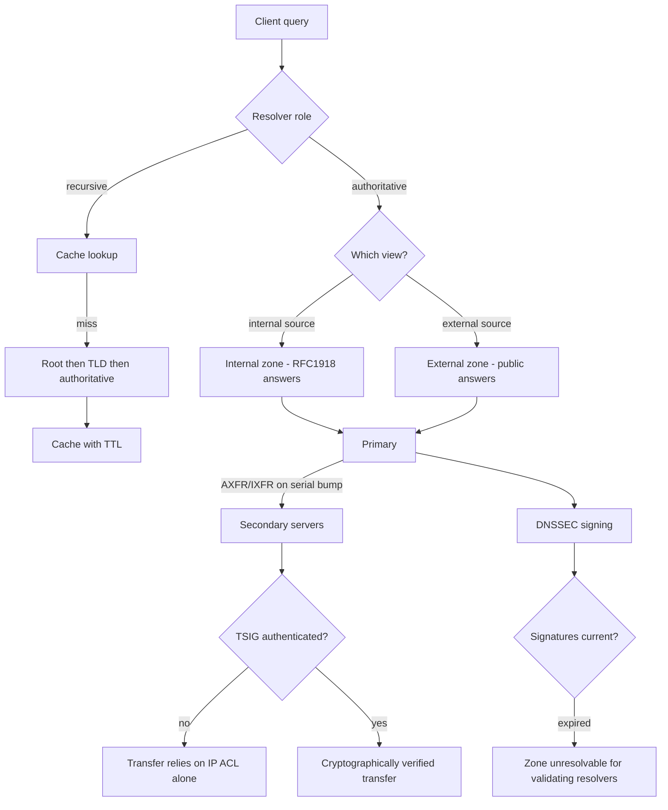

# DNS Server Design with BIND: Split-Horizon Zones and DNSSEC

**Level:** Advanced
**Tree:** [Networking & Core Services](../README.md)
**Branch:** [Network Stack & Filtering](README.md)
**Forest:** [Linux](../../../README.md)

## Explanation

# Enterprise DNS with BIND and Split-Horizon Design

DNS is the dependency everything else has. Identity, certificates, clustering and service discovery all break when it does, and DNS failures present as everything-is-broken rather than as DNS.

## Authoritative versus recursive

An **authoritative** server holds zone data and answers for names it owns. A **recursive resolver** answers for anything by walking the hierarchy and caching results. Running both roles on one instance is a long-standing security mistake - it enables cache-poisoning avenues and makes the blast radius of a compromise much larger. Separate them.

## Split-horizon

Enterprises routinely need the same name to resolve differently inside and outside. **Views** in BIND select a zone based on the client source address, so internal clients get RFC1918 addresses and external clients get public ones.

The classic failure is a name that exists in the internal view and not the external one, or vice versa - and the symptom is that a service works from the office and not from home, which gets reported as an application fault.

## Zone transfer and serials

Secondaries pull zone data by **AXFR/IXFR**, triggered by the **serial number** in the SOA record. If you edit a zone file and forget to increment the serial, secondaries never update and you get inconsistent answers depending on which server was asked. Use **TSIG keys** to authenticate transfers rather than relying on address ACLs alone.

## DNSSEC

DNSSEC signs records so a resolver can verify they were not tampered with. The operational risk is expiry: **signatures expire**, and a zone whose signatures lapse becomes unresolvable for validating resolvers - a self-inflicted outage that looks like the domain has vanished. Automate re-signing and monitor signature validity as a first-class alert.

## Architecture and flow



## Commands

### Command 1

Validate configuration and every zone file before restarting - never restart named unchecked

```text
named-checkconf -z
```

### Command 2

Validate one zone file and report the loaded serial

```text
named-checkzone example.com /var/named/example.com.zone
```

### Command 3

Query a specific server authoritatively and read the current serial

```text
dig @localhost example.com SOA +norec
```

### Command 4

Walk the delegation from the root - the definitive tool for resolution failures

```text
dig +trace www.example.com
```

### Command 5

Test an authenticated zone transfer with a TSIG key

```text
dig @secondary example.com AXFR -y hmac-sha256:key:secret
```

### Command 6

Reload one zone without restarting the daemon, and check server state

```text
rndc reload example.com; rndc status
```

### Command 7

Retrieve DNSSEC records and inspect signature validity windows

```text
dig example.com +dnssec +multi
```

### Command 8

Perform full DNSSEC validation and report why validation failed if it does

```text
delv @localhost www.example.com
```

## Automation scripts

### DNS zone serial and DNSSEC expiry monitor

```bash
#!/usr/bin/env bash
# Two failure modes that cause silent outages: secondaries stuck on an old serial,
# and DNSSEC signatures approaching expiry.
set -uo pipefail
ZONE="${1:?usage: $0 <zone> <primary> [secondary...]}"
shift
PRIMARY="${1:?primary server required}"
shift
rc=0

pser=$(dig +short @"$PRIMARY" "$ZONE" SOA 2>/dev/null | awk '{print $3}')
if [ -z "${pser:-}" ]; then echo "ALERT: primary $PRIMARY did not answer SOA for $ZONE"; exit 2; fi
echo "primary   $PRIMARY serial=$pser"

for s in "$@"; do
  sser=$(dig +short @"$s" "$ZONE" SOA 2>/dev/null | awk '{print $3}')
  if [ -z "${sser:-}" ]; then
    echo "  ALERT: secondary $s did not answer"; rc=1; continue
  fi
  if [ "$sser" != "$pser" ]; then
    echo "  ALERT: secondary $s serial=$sser does NOT match primary $pser"
    echo "         did the zone edit forget to bump the serial?"
    rc=1
  else
    echo "  OK     secondary $s serial=$sser"
  fi
done

echo "== DNSSEC signature expiry =="
exp=$(dig +dnssec +short @"$PRIMARY" "$ZONE" SOA 2>/dev/null | awk '/^SOA|RRSIG|[0-9]{14}/{for(i=1;i<=NF;i++) if ($i ~ /^[0-9]{14}$/) {print $i; exit}}')
if [ -n "${exp:-}" ]; then
  now=$(date -u +%Y%m%d%H%M%S)
  echo "  earliest signature expiry: $exp (now $now)"
  [ "$exp" \< "$now" ] && { echo "  ALERT: signatures EXPIRED - zone is unresolvable for validating resolvers"; rc=2; }
else
  echo "  zone does not appear to be signed"
fi
exit $rc
```

## Lab

**Objective:** Run authoritative DNS with split views, break replication with a forgotten serial, and see a DNSSEC expiry take a zone offline.

### Steps

1. Configure BIND as authoritative for a test zone with internal and external views returning different addresses.
2. Query from an internal and an external source address and confirm the answers differ.
3. Configure a secondary with TSIG-authenticated transfer and confirm the zone replicates.
4. Edit the zone without incrementing the serial, reload, and confirm the secondary never updates.
5. Increment the serial, reload, and confirm replication resumes.
6. Sign the zone with DNSSEC, then set the signature validity into the past and observe validating resolvers refuse to resolve it.

### Validation

A secondary is shown serving stale data after a zone edit with no serial increment, and the staleness is confirmed by comparing SOA serials between primary and secondary rather than by the record content,The secondary converges once the serial is bumped and a notify or transfer occurs, proving the serial was the sole cause,A zone is rendered unresolvable by letting DNSSEC signatures expire, and the failure is distinguished from a plain lookup failure using dig +dnssec and the validation status,Resolution recovers after re-signing, and the signature validity window is recorded, since an expiry with no monitoring is the same outage on a delay

## Operational automation

## Automating DNS safely

**Validate before reload, always.** named-checkconf -z parses the configuration and every zone; a syntax error that reaches a restart takes DNS down for everything that depends on it, which is everything.

**Automate the serial bump.** Generating the serial from a timestamp in the deployment pipeline removes the single most common cause of secondaries silently serving stale data.

**Monitor serial consistency across all servers, not just that named is running.** A secondary answering happily with month-old data passes every process check and is completely wrong.

**Alert on DNSSEC signature expiry with weeks of margin.** Expired signatures are a total, self-inflicted outage for validating resolvers, and the remediation window is short once it happens.

## Troubleshooting

### Scenario 1: Some clients get old DNS answers while others are correct

**Likely cause:** A secondary is stuck on an old serial because the zone was edited without incrementing it

**Resolution:** Compare SOA serials across all servers, bump the serial and reload; automate serial generation to prevent recurrence

### Scenario 2: A domain suddenly fails to resolve for many users but works for others

**Likely cause:** DNSSEC signatures expired - validating resolvers refuse the answers while non-validating resolvers still work

**Resolution:** Re-sign the zone immediately and confirm with delv; add expiry monitoring with weeks of lead time

### Scenario 3: A name resolves internally but not externally or vice versa

**Likely cause:** Split-horizon views are out of sync - the record exists in one view only

**Resolution:** Compare the record across both views; treat view content as a diffable artefact in configuration management

### Scenario 4: named fails to start after a configuration change

**Likely cause:** Syntax error in named.conf or a zone file, or a zone file permission or SELinux context problem

**Resolution:** Run named-checkconf -z to pinpoint the error, and check SELinux context on zone files with ls -Z and restorecon

## Interview questions

### 1. Why should authoritative and recursive DNS be separated?

They are different trust and exposure models. An authoritative server publishes data you own and should be reachable by the internet or by internal clients depending on the zone. A recursive resolver accepts arbitrary queries and caches answers from anywhere, so it is a far richer target - cache poisoning, amplification abuse and resolver-specific vulnerabilities all apply. Combining them means a compromise or a poisoning of the resolver side can corrupt answers for zones you are authoritative for, and it makes it much harder to apply appropriate access control to each role.

### 2. What is the most likely cause of a secondary DNS server serving stale data?

A zone file edited without incrementing the SOA serial. Secondaries decide whether to transfer by comparing serials, so if the serial does not change they conclude they are already current and never pull the update. What makes it dangerous is that everything looks healthy - named is running, the zone is loaded, queries are answered - just with old data, so answers vary depending on which server a client happened to ask. The fix is to generate the serial automatically in the deployment pipeline and to monitor serial consistency across all servers.

### 3. What operational risk does DNSSEC introduce?

Signature expiry. DNSSEC signatures have a validity window, and once they lapse every validating resolver refuses the answers rather than serving them unvalidated. The result is that your domain effectively disappears for a large fraction of the internet, and it is entirely self-inflicted. Because resolvers cache, the failure can also appear gradually and inconsistently, which makes it slow to diagnose. Mitigation is automated re-signing well ahead of expiry plus monitoring signature validity as a first-class alert with weeks of margin, not days.

## Certification alignment

- RHCSA EX200 - configure name resolution
- RHCE EX294 - deploy and automate network services
- CompTIA Linux+ XK0-005 - DNS configuration and troubleshooting
- Network+ and Security+ - DNS security and DNSSEC

## References

- ISC BIND 9 Administrator Reference Manual
- Red Hat documentation - Configuring DNS and name resolution
- RFC 1034/1035 (DNS), RFC 4033-4035 (DNSSEC), RFC 8945 (TSIG)
- man 8 named-checkconf, man 1 dig, man 1 delv

## Suggested video search

BIND named DNS views split horizon DNSSEC zone transfer TSIG enterprise tutorial

---

> Validate commands, versions, permissions, licensing, and rollback procedures in an isolated lab before production use.
