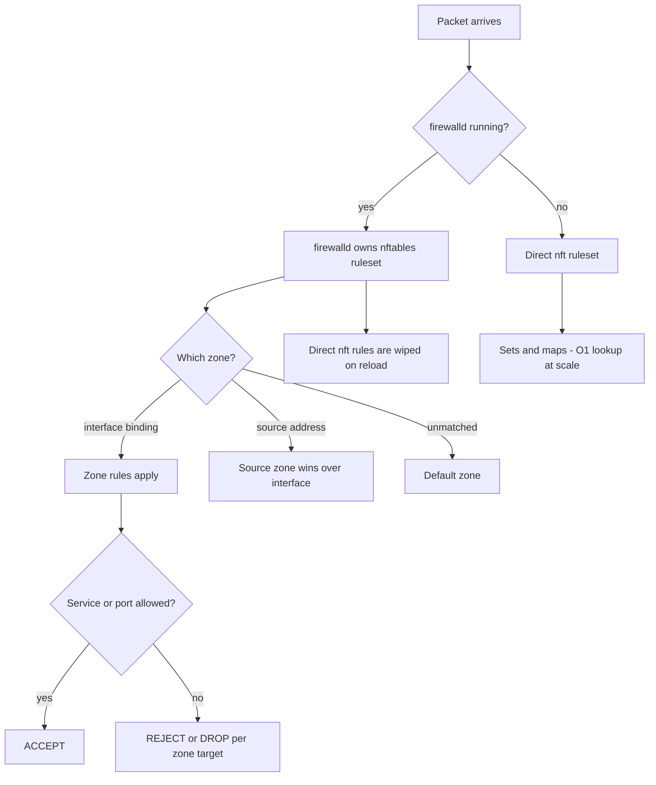

# nftables and firewalld Rule Design

**Level:** Advanced
**Tree:** [Networking & Core Services](../README.md)
**Branch:** [Network Stack & Filtering](README.md)
**Forest:** [Linux](../../../README.md)

## Explanation

# nftables and firewalld Rule Design

RHEL 8 replaced the iptables backend with **nftables**, and most of the confusion in the field comes from people writing iptables syntax against a system where firewalld is the actual owner of the ruleset.

## Who owns the rules

If firewalld is running, **it owns nftables**. Rules added directly with nft are wiped the next time firewalld reloads. You either manage through firewalld, or you disable firewalld and manage nftables directly - mixing the two produces rules that vanish unpredictably, which is one of the most frustrating failure modes in Linux networking.

## The zone model

firewalld is zone-based rather than a single ordered chain. An interface or source address is bound to a **zone**, and the zone determines which services and ports are permitted. The default zone catches anything unassigned. This is a better fit for hosts with several interfaces than a single flat rule list, but it means "where is my rule" requires knowing which zone the traffic landed in.

Critically, **--permanent changes are not live and live changes are not permanent**. Every engineer loses a rule set to this at least once: they add a rule, it works, they reboot, it is gone. Add with --permanent then --reload, or add twice.

## nftables directly

Where firewalld is not used, nftables gives a single unified framework for IPv4, IPv6, ARP and bridge filtering with one syntax, atomic ruleset replacement, and **sets and maps** that make large rule lists efficient. A set lookup is O(1) where an equivalent iptables chain is a linear scan, which matters enormously at scale.

Always remember the direction of the default policy. A drop policy with no accept rule for established connections will kill your own SSH session the moment it applies.

## Architecture and flow



## Commands

### Command 1

Confirm firewalld is running and which interfaces are bound to which zones

```text
firewall-cmd --state; firewall-cmd --get-active-zones
```

### Command 2

Everything a zone permits - services, ports, rich rules and its default target

```text
firewall-cmd --zone=public --list-all
```

### Command 3

The correct pattern: change permanently, then reload to make it live

```text
firewall-cmd --permanent --zone=internal --add-service=nfs && firewall-cmd --reload
```

### Command 4

Rich rule restricting a service to a source network

```text
firewall-cmd --permanent --zone=public --add-rich-rule='rule family="ipv4" source address="10.0.0.0/8" service name="ssh" accept'
```

### Command 5

The complete active ruleset as the kernel holds it, including what firewalld generated

```text
nft list ruleset
```

### Command 6

Create a set for efficient large-scale address matching

```text
nft add set inet filter allowed { type ipv4_addr\; flags interval \; }
```

### Command 7

Persist rules that were only added at runtime - recovers a session of live-only changes

```text
firewall-cmd --runtime-to-permanent
```

### Command 8

Atomically replace the entire ruleset from a file - all or nothing, no partial state

```text
nft -f /etc/nftables/main.nft
```

## Automation scripts

### Firewall ownership and drift detector

```bash
#!/usr/bin/env bash
# Detects the classic failure: rules that are live but not permanent, or direct nft
# rules on a firewalld-managed host that will vanish on the next reload.
set -uo pipefail
rc=0

if systemctl is-active --quiet firewalld 2>/dev/null; then
  echo "firewalld: ACTIVE (it owns the nftables ruleset)"
  for z in $(firewall-cmd --get-active-zones 2>/dev/null | grep -v "^ "); do
    run=$(firewall-cmd --zone="$z" --list-services 2>/dev/null | tr ' ' '\n' | sort -u)
    perm=$(firewall-cmd --permanent --zone="$z" --list-services 2>/dev/null | tr ' ' '\n' | sort -u)
    only_run=$(comm -23 <(printf '%s\n' "$run") <(printf '%s\n' "$perm") | tr -d ' ')
    if [ -n "$only_run" ]; then
      echo "  DRIFT zone=$z runtime-only services (lost on reboot): $only_run"
      echo "        fix: firewall-cmd --runtime-to-permanent"
      rc=1
    else
      echo "  OK    zone=$z runtime matches permanent"
    fi
  done
else
  echo "firewalld: inactive - nftables managed directly"
  if ! systemctl is-enabled --quiet nftables 2>/dev/null; then
    echo "  ALERT: nftables service not enabled - ruleset will not survive reboot"
    rc=1
  fi
fi

echo "== ruleset size =="
nft list ruleset 2>/dev/null | grep -c . | sed 's/^/  lines: /'
exit $rc
```

## Lab

**Objective:** Prove who owns the ruleset, lose a rule to the permanent/runtime trap deliberately, and build an efficient set-based ruleset.

### Steps

1. With firewalld running, add a service to a zone without --permanent and confirm it works.
2. Reload firewalld and observe the rule disappear - the classic runtime-only trap.
3. Re-add with --permanent plus --reload and confirm it now survives.
4. Add a rule directly with nft, then reload firewalld and observe it wiped.
5. Stop firewalld, write an nftables ruleset file with a named set of allowed sources, and load it atomically.
6. Add a drop policy without an established-connection rule in a test VM console to see how it severs SSH.

### Validation

Ownership of the ruleset on the host is established from evidence - which of firewalld, nftables or a configuration tool last wrote it - rather than from which one is installed,A rule added at runtime without --permanent is lost to a plain reload, observed directly, so the free rollback that behaviour provides is understood rather than read about,A hand-written nft rule is shown being overwritten when firewalld rewrites the ruleset, demonstrating that the two cannot both own it,After deciding the owner, the losing mechanism is disabled or documented, so the next person does not rediscover the same conflict

## Operational automation

## Automating firewall policy

**Decide ownership per host role and never mix.** Either firewalld manages the ruleset or nftables does. A host where both are in play will silently lose rules, and the failure appears long after the change that caused it.

**Always use --permanent plus --reload in automation, never runtime-only.** An Ansible task that adds a runtime rule produces a host that works today and fails after its next reboot, which is the worst kind of latent defect.

**Use nft atomic file loads for complex rulesets.** Loading a full ruleset from a file is all-or-nothing, so a syntax error leaves the previous working ruleset intact rather than a half-applied state.

**Always permit established connections before applying a drop policy**, and test firewall changes from console access, not from the SSH session you are about to sever.

## Troubleshooting

### Scenario 1: A firewall rule works, then disappears after a reboot

**Likely cause:** It was added to the runtime configuration only, without --permanent

**Resolution:** Recover the session with firewall-cmd --runtime-to-permanent, and always use --permanent plus --reload in future

### Scenario 2: Rules added with nft vanish periodically

**Likely cause:** firewalld is running and regenerates the entire nftables ruleset on every reload

**Resolution:** Manage through firewall-cmd instead, or disable firewalld and enable the nftables service to own the ruleset

### Scenario 3: Traffic is blocked despite a rule that appears to allow it

**Likely cause:** The traffic is landing in a different zone than expected - source-based zone binding takes precedence over interface binding

**Resolution:** Use firewall-cmd --get-active-zones and firewall-cmd --list-all-zones to find where the traffic actually matched

### Scenario 4: SSH session drops immediately when applying a new ruleset

**Likely cause:** A default drop policy was applied with no rule permitting established and related connections

**Resolution:** Always include a ct state established,related accept rule first; recover via console and rebuild the ruleset in a file for atomic loading

## Interview questions

### 1. A colleague adds an nftables rule and it disappears an hour later. What happened?

Almost certainly firewalld is running on that host. On RHEL 8 and later firewalld uses nftables as its backend and regenerates the complete ruleset whenever it reloads, which discards anything added directly with nft. The fix is to pick one owner: manage the policy through firewall-cmd, or disable firewalld and enable the nftables service so the file-based ruleset is authoritative. Mixing the two is the single most common cause of rules that vanish.

### 2. Why do nftables sets matter at scale?

Because matching against a set is effectively a constant-time lookup, whereas the equivalent in iptables is a chain of individual rules evaluated linearly. If you need to permit ten thousand source addresses, iptables evaluates up to ten thousand rules per packet while nftables performs one set lookup. That is the difference between a firewall that adds microseconds and one that becomes the bottleneck. Sets also make the ruleset far easier to read and update, since the policy and the data are separate.

### 3. What is the safe procedure for applying a restrictive firewall policy to a remote host?

First, have console or out-of-band access available, because the whole point is that you may cut yourself off. Second, write the ruleset to a file and load it atomically with nft -f so a syntax error cannot leave a half-applied state. Third, ensure the very first rule accepts established and related connections, or your existing session dies the moment the policy applies. Many people also use a scheduled rollback - apply the rules, and have a job revert them in five minutes unless you cancel it, so a mistake self-heals.

## Certification alignment

- RHCSA EX200 - configure firewall settings using firewall-cmd
- RHCE EX294 - automate firewall configuration with Ansible
- CompTIA Linux+ XK0-005 - firewall and network security
- CIS Benchmark for RHEL - host-based firewall controls

## References

- Red Hat documentation - Securing networks: Using and configuring firewalld and Getting started with nftables
- man 5 firewalld.zone, man 8 nft
- nftables wiki - sets, maps and atomic ruleset replacement
- CIS Benchmark firewall requirements for RHEL

## Suggested video search

nftables firewalld zones rich rules sets RHEL configuration deep dive

---

> Validate commands, versions, permissions, licensing, and rollback procedures in an isolated lab before production use.
