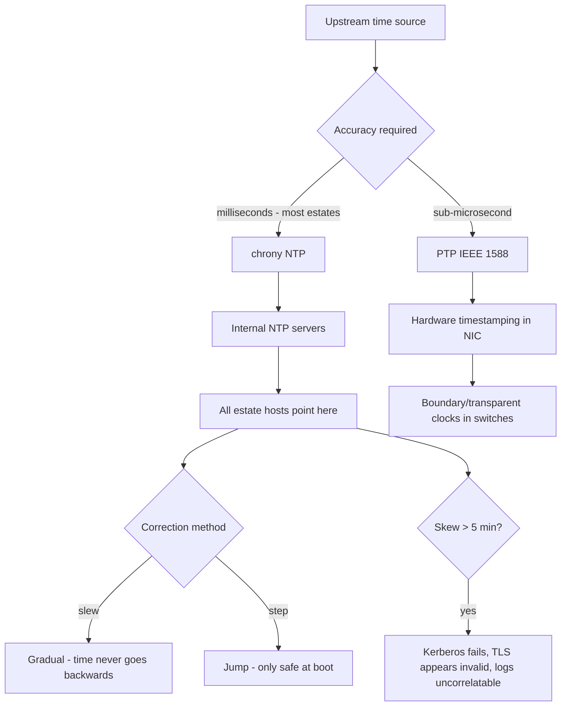

# Time Synchronisation with chrony and PTP

**Level:** Intermediate
**Tree:** [Networking & Core Services](../README.md)
**Branch:** [Service Availability & Time](README.md)
**Forest:** [Linux](../../../README.md)

## Explanation

# Time Synchronisation with chrony and PTP

Time is a silent dependency. Kerberos rejects tickets beyond a few minutes of skew, TLS certificates appear invalid, distributed databases corrupt ordering, and log correlation during an incident becomes impossible. Time problems never present as time problems.

## chrony over ntpd

RHEL uses **chrony**, which handles the realistic cases better than classic ntpd: it converges quickly from a large offset, copes with intermittent connectivity, and works on virtual machines whose clocks jump when the hypervisor suspends them.

The important behavioural distinction is **step versus slew**. Slewing adjusts the clock gradually so time never goes backwards, which matters because monotonically increasing time is an assumption in databases and log processing. Stepping jumps the clock, which is necessary for a large initial correction but dangerous while applications are running. The **makestep** directive controls when stepping is permitted, typically only for the first few updates after boot.

## Design for the estate

Do not point every host at the public internet. Run **a small number of internal servers** that synchronise upstream, and have everything else point at those. This gives consistent time across the estate even if the internet link fails, and it makes the dependency auditable.

In regulated environments the time source itself may need to be traceable, which usually means a GPS-disciplined appliance rather than a public pool.

## When milliseconds are not enough

**PTP (IEEE 1588)** achieves sub-microsecond accuracy where NTP achieves milliseconds, using hardware timestamping in the NIC and switches that participate in the protocol. It matters in financial trading (where regulation may mandate it), telecoms and industrial control. It requires hardware support end to end - PTP over switches that do not participate degrades to something not much better than NTP.

## Architecture and flow



## Commands

### Command 1

The key diagnostic: current offset, source, stratum and whether the clock is disciplined

```text
chronyc tracking
```

### Command 2

All configured sources with reachability, offset and which one is selected

```text
chronyc sources -v
```

### Command 3

Measured stability of each source over time - identifies an unreliable server

```text
chronyc sourcestats
```

### Command 4

Force an immediate step correction - use with care, it moves time abruptly

```text
chronyc makestep
```

### Command 5

Detailed per-source NTP exchange data including root dispersion

```text
chronyc ntpdata
```

### Command 6

System time, timezone, RTC state and whether NTP synchronisation is active

```text
timedatectl status
```

### Command 7

Show whether the NIC supports hardware timestamping - the prerequisite for PTP

```text
ethtool -T eth0
```

### Command 8

Query PTP daemon state including offset from the grandmaster

```text
pmc -u -b 0 "GET CURRENT_DATA_SET"
```

## Automation scripts

### Time skew and source health check

```bash
#!/usr/bin/env bash
# Alerts on skew before it breaks Kerberos (300s) and on loss of source reachability.
set -uo pipefail
WARN_MS="${1:-100}"
CRIT_MS="${2:-1000}"
rc=0

command -v chronyc >/dev/null 2>&1 || { echo "chrony not installed"; exit 2; }

track=$(chronyc tracking 2>/dev/null) || { echo "ALERT: chronyd not responding"; exit 2; }

ref=$(printf '%s\n' "$track" | awk -F': ' '/Reference ID/{print $2; exit}')
stratum=$(printf '%s\n' "$track" | awk -F': ' '/Stratum/{print $2; exit}')
offset=$(printf '%s\n' "$track" | awk -F': ' '/System time/{print $2; exit}' | awk '{print $1}')

echo "reference: $ref  stratum: $stratum"
echo "offset:    ${offset:-unknown} s"

# Unsynchronised chrony reports a null reference
case "$ref" in
  *00000000*|"") echo "ALERT: clock is NOT synchronised to any source"; rc=2 ;;
esac

if [ -n "${offset:-}" ]; then
  ms=$(awk -v o="$offset" 'BEGIN{ if (o<0) o=-o; printf "%d", o*1000 }')
  echo "offset:    ${ms} ms"
  if   [ "$ms" -ge 300000 ]; then echo "ALERT: skew exceeds Kerberos tolerance - authentication will fail"; rc=2
  elif [ "$ms" -ge "$CRIT_MS" ]; then echo "CRITICAL: offset ${ms}ms"; rc=2
  elif [ "$ms" -ge "$WARN_MS" ]; then echo "WARNING: offset ${ms}ms"; rc=1
  else echo "OK: within tolerance"; fi
fi

echo "== sources =="
chronyc sources 2>/dev/null | tail -n +3 | while read -r line; do
  echo "  $line"
done
reach=$(chronyc sources 2>/dev/null | grep -c "^\^\*" || true)
[ "${reach:-0}" -eq 0 ] && { echo "  ALERT: no source is currently selected"; rc=2; }
exit $rc
```

## Lab

**Objective:** Build an internal time hierarchy, observe the difference between step and slew, and prove that skew alone breaks authentication.

### Steps

1. Configure one host as an internal NTP server and point two clients at it.
2. Confirm synchronisation with chronyc tracking and identify the selected source.
3. Set a client clock 30 seconds fast and watch chrony slew it back gradually without going backwards.
4. Set the clock 10 minutes out and observe that chrony refuses to step outside the makestep window.
5. With the clock badly skewed, attempt a Kerberos authentication and confirm it fails.
6. Correct the time with chronyc makestep and confirm authentication immediately succeeds again.

### Validation

Kerberos or a similar time-sensitive authentication fails with the clock skewed and succeeds once corrected, with no other change made - isolating time as the sole cause,chronyc tracking is read to distinguish a host that is unsynchronised from one that is synchronised to the wrong source, which present identically to the application,A step and a slew are both observed, and the case where stepping is unsafe - a running database or a cluster where time going backwards breaks ordering - is stated for this estate rather than in general,The maximum tolerated offset before authentication breaks is known for the services on the host, so monitoring can alert before the outage rather than during it

## Operational automation

## Automating time

**Point the estate at internal servers, not the public pool.** It gives consistent time even when the internet link fails, reduces external dependency, and makes the time source auditable - which regulated environments require.

**Monitor offset, not just that chronyd is running.** A running daemon with no reachable source keeps drifting silently, and the first symptom will be Kerberos or TLS failures that nobody attributes to time.

**Alert well below the Kerberos threshold.** Five minutes is where authentication breaks; alerting at a second gives time to react before anything user-visible occurs.

**Be deliberate about makestep in automation.** Allowing unrestricted stepping means time can jump backwards on a running system, which breaks assumptions in databases, log processing and scheduled jobs.

## Troubleshooting

### Scenario 1: Kerberos authentication fails across many hosts simultaneously

**Likely cause:** Clock skew beyond the five-minute tolerance, often after a virtual machine was suspended or a time source failed

**Resolution:** Check chronyc tracking on affected hosts, correct with chronyc makestep, then fix the underlying source reachability

### Scenario 2: chronyd is running but the clock keeps drifting

**Likely cause:** No source is actually reachable or selected - the daemon is running with nothing to discipline against

**Resolution:** Run chronyc sources and confirm a source is marked selected; check firewall rules permit UDP 123 outbound

### Scenario 3: Log timestamps jump backwards and break correlation

**Likely cause:** The clock was stepped rather than slewed while applications were running

**Resolution:** Restrict makestep to the first few updates after boot so running systems only ever slew

### Scenario 4: PTP is configured but accuracy is no better than NTP

**Likely cause:** The network path lacks hardware support - switches are not acting as boundary or transparent clocks, or the NIC lacks hardware timestamping

**Resolution:** Verify NIC capability with ethtool -T and confirm every switch in the path participates in PTP

## Interview questions

### 1. Why is stepping the clock dangerous on a running system?

Because it can move time backwards, and a great deal of software assumes monotonically increasing time. Databases use timestamps for ordering and transaction visibility, log processing and correlation assume events arrive in order, and scheduled jobs can run twice or be skipped entirely. Slewing instead adjusts the rate at which the clock advances so it converges gradually and never goes backwards. Stepping is appropriate for a large correction at boot, before applications start, which is why makestep is normally restricted to the first few updates.

### 2. How does a time problem typically present?

Almost never as a time problem. It presents as Kerberos authentication failing across many hosts, TLS certificates appearing expired or not yet valid, replication or clustering behaving strangely, or an incident where logs from different servers cannot be correlated because the sequence makes no sense. Because the symptoms point at authentication or certificates, time is often the last thing checked, which is why it should be one of the first - chronyc tracking takes seconds and eliminates a whole class of causes.

### 3. When would you need PTP rather than NTP?

When you need sub-microsecond accuracy rather than the milliseconds NTP delivers. The classic cases are financial trading, where regulation such as MiFID II mandates traceable timestamps at fine granularity, telecoms synchronisation, and industrial or scientific measurement. The important caveat is that PTP needs hardware support along the entire path - hardware timestamping in the NIC and switches acting as boundary or transparent clocks. Deploying PTP over switches that do not participate gives accuracy not much better than NTP while adding considerable complexity, so the network has to be designed for it.

## Certification alignment

- RHCSA EX200 - configure time services and system clock
- RHCE EX294 - automate service configuration including chrony
- CompTIA Linux+ XK0-005 - system time and synchronisation
- Regulatory timestamp requirements (MiFID II, FINRA) for PTP contexts

## References

- Red Hat documentation - Configuring time synchronization (chrony and PTP)
- chrony documentation - chronyc commands and makestep semantics
- IEEE 1588 Precision Time Protocol overview
- man 5 chrony.conf, man 8 chronyd, man 8 ptp4l

## Suggested video search

chrony NTP PTP time synchronization Linux configuration troubleshooting tutorial

---

> Validate commands, versions, permissions, licensing, and rollback procedures in an isolated lab before production use.
