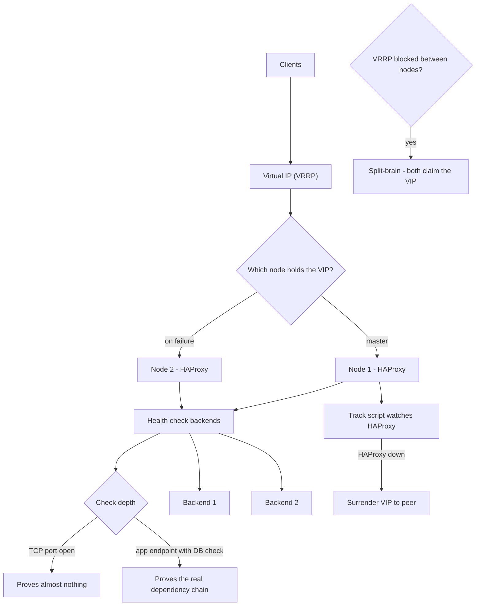

# HAProxy and Keepalived High Availability

**Level:** Advanced
**Tree:** [Networking & Core Services](../README.md)
**Branch:** [Service Availability & Time](README.md)
**Forest:** [Linux](../../../README.md)

## Explanation

# HAProxy and Keepalived High Availability

A load balancer that is itself a single point of failure has moved the problem rather than solved it. The standard Linux answer pairs **HAProxy** for load balancing with **Keepalived** for a floating virtual IP.

## What each part does

**HAProxy** terminates client connections, health-checks backends and distributes traffic. It operates in **TCP mode** (layer 4, fast, protocol-agnostic) or **HTTP mode** (layer 7, can route on path or header, insert headers, and understand response codes).

**Keepalived** implements **VRRP**: two or more nodes negotiate which holds a virtual IP, and if the master fails the backup claims it, usually within a second. Clients only ever talk to the VIP.

## Health checks are the whole game

A load balancer is only as good as its health check. Checking that a TCP port accepts connections proves almost nothing - an application can accept connections while returning errors for every request. **Check something that exercises the real dependency chain**, such as an endpoint that verifies database connectivity, and make sure the check is cheap enough to run frequently.

## Split-brain

The characteristic VRRP failure is **both nodes believing they are master**, which happens when they cannot see each other but both can see the network - typically a firewall blocking VRRP multicast or a switch not forwarding it. The result is two hosts answering for the same IP, producing intermittent and baffling behaviour. Use unicast VRRP peers where multicast is unreliable, and authenticate the VRRP exchange.

Also configure a **track script** so Keepalived surrenders the VIP when HAProxy itself is unhealthy. Without it the VIP stays on a node whose load balancer is dead, which is precisely the outage the pair was meant to prevent.

## Architecture and flow



## Commands

### Command 1

Validate configuration before reload - a bad config takes the load balancer down

```text
haproxy -c -f /etc/haproxy/haproxy.cfg
```

### Command 2

Backend status through the admin socket: which servers are up and why

```text
echo "show stat" | socat stdio /var/run/haproxy.sock | cut -d, -f1,2,18,19
```

### Command 3

Drain a backend for maintenance without a config change or restart

```text
echo "disable server web/web1" | socat stdio /var/run/haproxy.sock
```

### Command 4

Reload with connection handover - existing connections finish on the old process

```text
systemctl reload haproxy
```

### Command 5

Determine which node currently holds the virtual IP

```text
ip -brief addr show | grep -i "<vip>"
```

### Command 6

Watch VRRP state transitions live during a failover test

```text
journalctl -u keepalived -f
```

### Command 7

Capture VRRP advertisements - the definitive test for split-brain causes

```text
tcpdump -i any -n proto 112
```

### Command 8

Dump server state for persistence across restarts

```text
echo "show servers state" | socat stdio /var/run/haproxy.sock
```

## Automation scripts

### VIP ownership and split-brain detector

```bash
#!/usr/bin/env bash
# Confirms exactly one node holds the VIP. Two holders means split-brain,
# zero means the service is down entirely.
set -uo pipefail
VIP="${1:?usage: $0 <vip> <node1> [node2...]}"
shift
holders=()
rc=0

for n in "$@"; do
  if ssh -o BatchMode=yes -o ConnectTimeout=5 "$n" \
     "ip -brief addr show | grep -q '$VIP'" 2>/dev/null; then
    holders+=("$n")
    echo "  $n HOLDS $VIP"
  else
    echo "  $n does not hold $VIP"
  fi
done

case "${#holders[@]}" in
  1) echo "OK: exactly one holder (${holders[0]})" ;;
  0) echo "ALERT: NO node holds $VIP - service is down"; rc=2 ;;
  *) echo "ALERT: SPLIT-BRAIN - ${#holders[@]} nodes hold $VIP: ${holders[*]}"
     echo "       check VRRP reachability: tcpdump -i any -n proto 112"
     rc=2 ;;
esac

# A healthy VIP on a node with a dead HAProxy is still an outage
for n in "${holders[@]}"; do
  if ! ssh -o BatchMode=yes -o ConnectTimeout=5 "$n" \
       "systemctl is-active --quiet haproxy" 2>/dev/null; then
    echo "ALERT: $n holds the VIP but HAProxy is NOT running - track script missing?"
    rc=2
  fi
done
exit $rc
```

## Lab

**Objective:** Build an HA load balancer pair, prove failover works, and deliberately create split-brain to see how it presents.

### Steps

1. Configure HAProxy on two nodes with an HTTP health check that exercises a real application endpoint.
2. Configure Keepalived with a VRRP instance and confirm exactly one node holds the VIP.
3. Stop the master node and confirm the VIP moves and traffic continues within a second.
4. Add a track script so Keepalived surrenders the VIP when HAProxy stops, and verify by stopping only HAProxy.
5. Block VRRP (protocol 112) between the nodes with a firewall rule and observe both claim the VIP.
6. Restore VRRP, switch to unicast peers, and confirm the split-brain condition is resolved.

### Validation

The VIP moves on failover and the loss is measured against a running client, not assumed from the VIP appearing on the other node,Stopping HAProxy while the host stays up moves the VIP, proving the health check tracks the service rather than host liveness - the failure mode a naive setup misses,Split-brain is produced by blocking VRRP between the nodes, and both nodes are observed holding the VIP simultaneously rather than the condition being described,The network cause is identified specifically as VRRP advertisement loss, so the fix is understood to be network-level rather than a keepalived misconfiguration

## Operational automation

## Automating load balancer HA

**Validate config with haproxy -c in CI and reload rather than restart.** Reload hands over listening sockets so existing connections drain gracefully; restart drops them all.

**Always configure a Keepalived track script.** Without it the VIP tracks host liveness rather than service health, so a node with a dead HAProxy keeps the VIP and blackholes traffic - the exact failure the HA pair was built to avoid.

**Prefer unicast VRRP peers in cloud and modern switched networks.** Multicast is frequently filtered, and a VRRP pair that cannot see each other is a split-brain waiting for the first quiet moment.

**Use the admin socket for maintenance, not config edits.** Draining a backend through the socket is instant, reversible and leaves no configuration drift behind.

## Troubleshooting

### Scenario 1: Both nodes report they are master and clients see intermittent failures

**Likely cause:** VRRP advertisements are not reaching the peer - usually a firewall dropping protocol 112 or multicast not forwarded

**Resolution:** Confirm with tcpdump proto 112 on both nodes; permit VRRP in the firewall or reconfigure Keepalived to use unicast peers

### Scenario 2: The VIP stays on a node whose HAProxy has crashed

**Likely cause:** No track script - Keepalived is only monitoring the host, not the service

**Resolution:** Add a vrrp_script checking HAProxy with a weight that drops priority below the peer when it fails

### Scenario 3: Backends flap between up and down in the HAProxy stats

**Likely cause:** The health check is too aggressive for the backend, or the check exercises a slow dependency

**Resolution:** Increase the rise and fall counts and the check interval; use a lightweight endpoint that still proves the dependency chain

### Scenario 4: Clients see connection resets during a configuration change

**Likely cause:** systemctl restart was used instead of reload, dropping all established connections

**Resolution:** Use reload, which starts a new process and hands over listeners while the old one drains

## Interview questions

### 1. Why is a TCP port check an inadequate health check?

Because accepting a connection only proves a process is listening, not that it can do useful work. An application can happily accept TCP connections while its database connection pool is exhausted, its disk is full, or it returns a 500 for every request. The load balancer will keep sending traffic to a backend that fails every request. A good check exercises the real dependency chain - typically an HTTP endpoint that verifies the application can reach its database and returns a distinct status - while being cheap enough to run every couple of seconds across every backend.

### 2. What causes VRRP split-brain and how do you prevent it?

It happens when the nodes cannot exchange VRRP advertisements but both remain otherwise healthy, so each concludes the other is dead and claims the virtual IP. The usual causes are a firewall dropping IP protocol 112, or a switched or cloud network that does not forward multicast. The result is two hosts answering for one address, which produces intermittent, hard-to-reproduce failures. Prevention is to use unicast VRRP peers where multicast is unreliable, explicitly permit protocol 112 between the nodes, authenticate the VRRP exchange, and monitor for the condition directly by checking how many nodes hold the VIP.

### 3. Your HA pair failed over but the service was still down. What went wrong?

Most likely there was no track script, so Keepalived was monitoring host liveness rather than service health. The VIP moved because the node went away, but if HAProxy itself had failed while the host stayed up, the VIP would have remained on a node that could not serve traffic. The other common cause is that both nodes shared a dependency that failed - the same database, the same upstream network path - so failover moved the traffic without moving the problem. HA is only meaningful against the failure modes you actually designed for, which is why rehearsing failover is not optional.

## Certification alignment

- RHCE EX294 - deploy and automate network services
- Red Hat EX436 - High Availability clustering
- CompTIA Linux+ XK0-005 - service availability and load balancing
- Site Reliability Engineering practices - health checking and failover

## References

- HAProxy configuration manual - health checks, stats socket and reload semantics
- Keepalived documentation - VRRP instances, track scripts and unicast peers
- RFC 5798 - Virtual Router Redundancy Protocol version 3
- Red Hat documentation - Load balancing and high availability

## Suggested video search

HAProxy Keepalived VRRP virtual IP high availability health check tutorial Linux

---

> Validate commands, versions, permissions, licensing, and rollback procedures in an isolated lab before production use.
