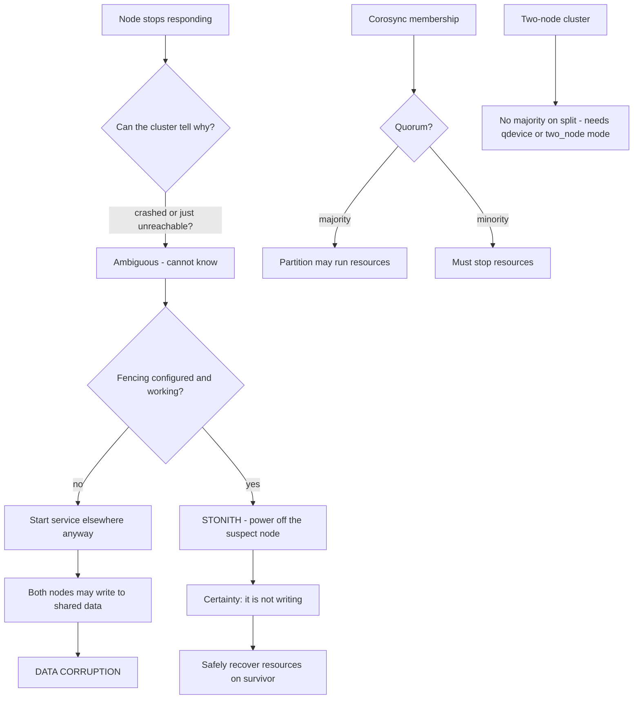

# Pacemaker Clustering, Fencing and Quorum

**Level:** Advanced
**Tree:** [Networking & Core Services](../README.md)
**Branch:** [Service Availability & Time](README.md)
**Forest:** [Linux](../../../README.md)

## Explanation

# Pacemaker Clustering, Fencing and Quorum

A high-availability cluster keeps a service running when a node fails. Done badly it does the opposite - it produces data corruption that a single unclustered server would never have suffered.

## The stack

**Corosync** provides cluster membership and messaging: which nodes are alive and can they talk. **Pacemaker** is the resource manager: it decides where resources run, in what order, and what to do when something fails. **pcs** is the administrative interface to both.

## Quorum

A cluster must know when it has enough members to act safely. With **quorum**, a partition holding more than half the votes may run resources and a minority partition must not. This is why two-node clusters are awkward: neither half has a majority when they split, so they need special handling - two_node mode with fencing, or a **qdevice** arbitrator providing a third vote.

## Fencing is not optional

When a node stops responding, the cluster cannot tell whether it has crashed or is merely unreachable and still writing to shared storage. Starting the service elsewhere while the original is still running means **two nodes writing to the same data**, which corrupts it.

**Fencing (STONITH)** removes the doubt by forcibly powering off or isolating the suspect node before recovering its resources. A cluster without working fencing is not highly available - it is a data-corruption mechanism with extra steps. Every production cluster needs a tested fence device: IPMI/iLO/iDRAC, a managed PDU, or the hypervisor or cloud API.

The most common real-world mistake is configuring fencing and never testing it, then discovering during the first real failure that the credentials expired or the BMC is on a network the cluster cannot reach.

## Architecture and flow



## Commands

### Command 1

Overall cluster state: nodes, resources, failures and whether anything is stopped

```text
pcs status
```

### Command 2

Quorum state and vote counts - the first thing to check on a partition

```text
pcs quorum status; corosync-quorumtool -s
```

### Command 3

Define a fence device for a node via its BMC

```text
pcs stonith create fence-n1 fence_ipmilan ip=10.0.0.11 username=admin password=secret pcmk_host_list=node1
```

### Command 4

Manually fence a node - this is how you test that fencing actually works

```text
pcs stonith fence node2
```

### Command 5

Create a managed floating IP resource with health monitoring

```text
pcs resource create vip IPaddr2 ip=10.0.0.100 cidr_netmask=24 op monitor interval=10s
```

### Command 6

Keep resources together and start them in the correct order

```text
pcs constraint colocation add vip with webserver INFINITY; pcs constraint order webserver then vip
```

### Command 7

Gracefully move resources off a node for maintenance

```text
pcs node standby node1
```

### Command 8

Clear stale failure counts and take a point-in-time cluster snapshot

```text
pcs resource cleanup; crm_mon -1
```

## Automation scripts

### Cluster safety posture check

```bash
#!/usr/bin/env bash
# The three things that make a cluster dangerous rather than highly available:
# no fencing, no quorum, and resources in a failed state nobody noticed.
set -uo pipefail
rc=0

command -v pcs >/dev/null 2>&1 || { echo "pcs not installed"; exit 2; }

echo "== fencing =="
stonith_enabled=$(pcs property show stonith-enabled 2>/dev/null | awk '/stonith-enabled/{print $2}')
echo "  stonith-enabled: ${stonith_enabled:-unset}"
if [ "${stonith_enabled:-true}" = "false" ]; then
  echo "  ALERT: fencing is DISABLED - this cluster can corrupt shared data on split-brain"
  rc=2
fi
devs=$(pcs stonith status 2>/dev/null | grep -c "Started" || true)
echo "  fence devices started: ${devs:-0}"
[ "${devs:-0}" -eq 0 ] && { echo "  ALERT: no fence device is running"; rc=2; }

echo "== quorum =="
if corosync-quorumtool -s >/dev/null 2>&1; then
  q=$(corosync-quorumtool -s 2>/dev/null | awk -F: '/Quorate/{gsub(/ /,"",$2); print $2}')
  echo "  quorate: ${q:-unknown}"
  case "$q" in Yes|yes) ;; *) echo "  ALERT: cluster is NOT quorate"; rc=2 ;; esac
fi

echo "== failed resources =="
failed=$(pcs status 2>/dev/null | sed -n '/Failed/,/^$/p' | grep -c "OCF\|systemd\|lsb" || true)
if [ "${failed:-0}" -gt 0 ]; then
  echo "  ALERT: $failed failed resource action(s) - run pcs status for detail"
  rc=1
else
  echo "  OK: no failed resource actions"
fi
exit $rc
```

## Lab

**Objective:** Build a two-node cluster, prove that fencing prevents corruption, and see what happens without it.

### Steps

1. Build a two-node Pacemaker cluster with pcs and confirm both nodes are online.
2. Create a floating IP and a service resource with an ordering constraint between them.
3. Configure a fence device (hypervisor or IPMI based) and test it with pcs stonith fence.
4. Sever cluster communication between the nodes and observe fencing resolve the partition decisively.
5. Disable fencing, repeat the partition, and observe both nodes attempt to run the resource.
6. Add a qdevice arbitrator and confirm the two-node split now resolves by quorum rather than by luck.

### Validation

A network partition is induced and resolved cleanly with fencing enabled - the losing node fenced and the resource started once, with the fence action confirmed in the log,The same partition with fencing disabled results in both nodes running the resource, and the resulting data divergence is observed rather than described,Quorum behaviour is checked separately from fencing, since a two-node cluster needs explicit quorum handling and the two are routinely confused,The fencing device itself is tested independently, because a configured fence agent that cannot actually power off the node gives the appearance of protection with none of it

## Operational automation

## Automating clusters

**Never disable fencing to make a cluster start.** It is the single most common shortcut and it converts an availability mechanism into a corruption mechanism. If fencing will not work, fix the fence device rather than removing the protection.

**Test fencing on a schedule, not once at build.** Fence devices fail quietly - BMC credentials expire, management networks get re-segmented, cloud API tokens rotate. A fence device that has not been exercised in a year is an assumption, not a control.

**Automate build and constraints, but keep failover manual to rehearse.** Regular planned failovers using pcs node standby prove the cluster does what the design claims while someone is watching.

**Alert on quorum loss and failed resource actions.** A cluster running with stale failure counts or a non-quorate partition looks alive to a process check and will not recover when it matters.

## Troubleshooting

### Scenario 1: Resources will not start and the cluster reports it cannot fence a node

**Likely cause:** The fence device is misconfigured or unreachable, so the cluster correctly refuses to risk starting resources

**Resolution:** Fix the fence device (credentials, network path to BMC) and verify with pcs stonith fence; do not disable fencing to work around it

### Scenario 2: A two-node cluster stops all resources after a network blip

**Likely cause:** The split left neither side with a majority, so both correctly declined to run resources

**Resolution:** Add a qdevice arbitrator for a third vote, or configure two_node mode with reliable fencing

### Scenario 3: A resource keeps failing over repeatedly between nodes

**Likely cause:** The monitor operation is failing on both nodes - the underlying service problem is not node-specific

**Resolution:** Investigate the resource agent logs and the service itself; use pcs resource cleanup after fixing, and consider a migration-threshold to stop the flapping

### Scenario 4: A node was fenced unexpectedly during normal operation

**Likely cause:** Corosync token timeout was exceeded - often caused by network congestion, a saturated link or heavy host load

**Resolution:** Review corosync token and consensus timings against the real network characteristics, and investigate what caused the latency spike

## Interview questions

### 1. Why is a cluster without fencing worse than no cluster at all?

Because it can actively cause data corruption that a standalone server never would. When a node stops responding, the cluster cannot distinguish a crash from an unreachable node that is still running and still writing to shared storage. Without fencing it must guess. If it guesses wrong and starts the service on a second node, two systems write to the same data concurrently and corrupt it. A single server would simply have been down - recoverable and unambiguous. Fencing removes the guess by forcibly powering off the suspect node before recovery, which is why a production cluster with fencing disabled should be treated as a serious defect.

### 2. Why are two-node clusters a special case?

Because quorum is a majority of votes, and when a two-node cluster splits neither side has a majority - each has exactly half. Strictly applied, both sides must stop resources, so the cluster fails safe but is completely unavailable. The two standard solutions are two_node mode, which relaxes quorum but relies absolutely on fencing to resolve the split, or adding a qdevice arbitrator that provides a third vote from a separate host so one side genuinely wins. Three nodes avoids the problem entirely, which is why three is the usual recommendation where the hardware allows it.

### 3. A node was fenced during normal operation with no obvious fault. What do you investigate?

Almost always the Corosync token timeout was exceeded, meaning the node failed to respond to cluster membership messages within the configured window. The node itself may have been perfectly healthy - the usual causes are network congestion or packet loss on the cluster interconnect, a saturated link shared with storage or backup traffic, or heavy CPU or IO load starving the Corosync process. I would examine the interconnect for loss and latency around the event, check whether cluster traffic shares a path with bulk traffic, and review whether the token and consensus timings are realistic for the actual network rather than left at defaults.

## Certification alignment

- Red Hat EX436 - High Availability Clustering specialist
- RHCE EX294 - automate service deployment
- Red Hat EX200/EX294 foundations for cluster-managed services
- Enterprise HA design patterns and quorum theory

## References

- Red Hat documentation - Configuring and managing high availability clusters
- ClusterLabs Pacemaker documentation - fencing, constraints and quorum
- Corosync documentation - token timeouts and membership
- man 8 pcs, man 8 crm_mon, man 8 corosync-quorumtool

## Suggested video search

Pacemaker Corosync pcs fencing STONITH quorum cluster configuration RHEL tutorial

---

> Validate commands, versions, permissions, licensing, and rollback procedures in an isolated lab before production use.
