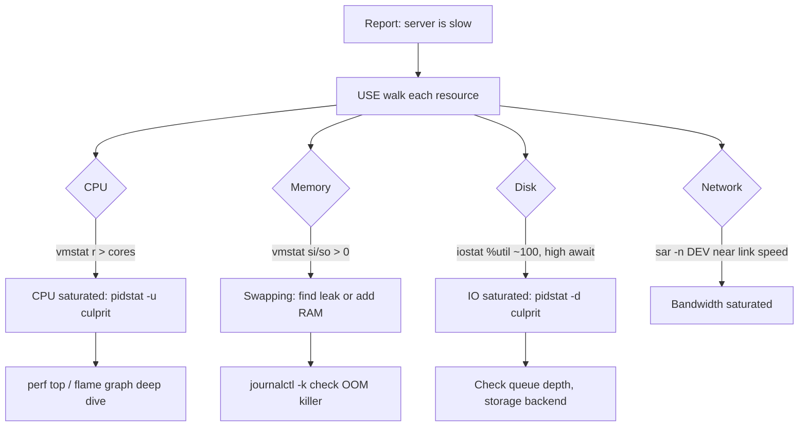

# Performance Analysis: USE Method and Core Tools

**Level:** Expert
**Tree:** [Performance & Security](../README.md)
**Branch:** [Performance Tuning](README.md)
**Forest:** [Linux](../../../README.md)

## Explanation

## Diagnosing before touching

Serious performance work starts with a methodology, not a tool. The **USE method** (Brendan Gregg) checks every resource - CPU, memory, disks, NICs - for **U**tilization, **S**aturation, and **E**rrors. Saturation is the one that hurts users: a CPU at 90% utilization with an empty run queue is fine; one at 70% with a run queue of 30 is a problem. This framing turns a vague "the server is slow" into a checklist you can walk in ten minutes.

The core toolkit maps onto it. **CPU**: top/htop for utilization, but the load average and vmstat's r column reveal saturation (runnable threads exceeding cores); pidstat -u attributes it per process; mpstat -P ALL exposes single-core saturation that averages hide - the classic symptom of a single-threaded bottleneck. **Memory**: free distinguishes used from reclaimable cache; vmstat's si/so columns show active swapping (saturation); sar -B page-scan rates show reclaim pressure before swap even starts. Watch for the OOM killer in journalctl -k. **Disk**: iostat -x is the workhorse - %util near 100 with high aqu-sz means a saturated device, and the await columns split read versus write latency; pidstat -d names the guilty process. **Network**: sar -n DEV for throughput against link speed, ss -s for socket state, and /proc/net/dev drops column for errors.

Two habits separate seniors: always capture data before restarting anything (a restart destroys the evidence), and keep historical baselines - sar's sysstat collector archives ten years of "what normal looks like" in /var/log/sa for free. For deep dives, perf top shows where CPU cycles actually go, and flame graphs make the picture reviewable by others.

## Rollback

Analysis is **read-only, and should be kept that way**. The commands in this leaf observe; the risk is not to system state but to the investigation, because a change made mid-analysis destroys the baseline being measured against.

The exception is **perf and tracing overhead**, which is real on a loaded system. High-frequency profiling on a machine already saturated can worsen the symptom being studied, so reduce the sample rate rather than concluding the system got worse.

## Security implications

perf and eBPF read **kernel and process memory**, so they expose whatever is in it - keys, tokens, request payloads. perf_event_paranoid governs who may do this, and lowering it to enable diagnosis widens that access for everyone until it is restored.

Treat a profile or trace as **sensitive output**. A flame graph is usually harmless; a raw perf record from a process handling credentials is not, and it will typically be copied off the host to be analysed.

## Monitoring

The distinction this leaf teaches is the one to instrument: **utilisation says how busy, saturation says who is waiting**. PSI under /proc/pressure reports stall time directly, and it is the signal that correlates with user-visible slowness when CPU utilisation does not.

Retain **one-second granularity for short windows**. A one-minute average is arithmetically incapable of showing a two-second stall, so a monitoring stack that only stores averages cannot investigate the complaints it receives.

## High availability and disaster recovery

A **performance baseline is a recovery artefact**. Without one, nobody can say whether a restored or failed-over host is performing correctly or merely running, and the question always arises at the worst time.

Capture the baseline from the **standby as well as production**. Different hardware, different storage tier and different neighbours mean a failover target that has never been measured is an assumption, and failover is when it gets tested.

## Anti-patterns

**Reading load average as CPU utilisation.** On Linux it counts uninterruptible sleep too, so a high load with idle CPUs is usually IO or lock contention - the number means something different from what most people assume.

**Treating iowait as a storage verdict.** It reports that a CPU had nothing else to run while IO was outstanding; a busy system can hide serious IO latency behind a low iowait figure.

**Optimising the first thing measured.** Without the USE pass, effort goes to whichever resource was looked at first rather than the one that is saturated.

## Change control

Diagnosis needs no approval; the **change that follows it** does, and the trap is that an investigation under pressure slides into tuning without a record. Separate the two explicitly.

Where a diagnostic step does need elevated access - lowering perf_event_paranoid, enabling tracing - treat it as a **temporary, recorded change with a restoration step**, because it is a security-relevant setting that will otherwise stay relaxed indefinitely.

## Architecture and flow



## Commands

### Command 1

Watch run queue (r), swapping (si/so), and CPU wait per second

```text
vmstat 1 10
```

### Command 2

Extended device stats: %util, await, and average queue size per disk

```text
iostat -x 2 5
```

### Command 3

Per-process CPU, disk I/O and memory deltas to name the culprit

```text
pidstat -u -d -r 2 5
```

### Command 4

Per-core CPU breakdown - exposes single-core saturation

```text
mpstat -P ALL 2 3
```

### Command 5

Load and run-queue history from a previous day for baseline comparison

```text
sar -q -f /var/log/sa/sa15
```

### Command 6

Live sampled view of which kernel/user functions consume CPU

```text
perf top -g
```

## Automation scripts

### use-snapshot.sh

```bash
#!/usr/bin/env bash
# One-shot USE-method evidence capture BEFORE any restart.
set -euo pipefail
OUT="/var/tmp/perf-snapshot-$(date +%F-%H%M%S)"
mkdir -p "$OUT"
{ uptime; echo; vmstat 1 5; } > "$OUT/cpu-mem.txt" 2>&1
iostat -x 1 5              > "$OUT/disk.txt" 2>&1
sar -n DEV 1 5             > "$OUT/net.txt" 2>&1
ps aux --sort=-%cpu | head -15 > "$OUT/top-cpu.txt"
ps aux --sort=-%mem | head -15 > "$OUT/top-mem.txt"
ss -s                      > "$OUT/sockets.txt"
dmesg -T | tail -50        > "$OUT/kernel-tail.txt"
echo "Evidence captured in $OUT - safe to remediate now."
```

## Lab

**Objective:** Generate three distinct bottlenecks (CPU, memory, disk) with stress-ng and correctly identify each using only vmstat, iostat and pidstat.

### Steps

1. Install sysstat and stress-ng; start the sysstat collector.
2. Run stress-ng --cpu 8 --timeout 120 and observe vmstat r exceeding core count while wa stays low.
3. Run stress-ng --vm 2 --vm-bytes 90% --timeout 120 and watch free, then si/so become non-zero.
4. Run stress-ng --hdd 2 --timeout 120 and observe iostat -x %util near 100 with rising await.
5. During each run, use pidstat to name the stress-ng workers as the top consumer.
6. Write a three-line diagnosis for each scenario citing the exact metric that proved it.

### Validation

CPU scenario: vmstat r column exceeded the number of vCPUs.,Memory scenario: si/so columns were non-zero (or the OOM killer fired in journalctl -k).,Disk scenario: iostat %util was at or near 100 with aqu-sz well above 1.,pidstat output correctly attributed each bottleneck to the stress-ng processes.

## Operational automation

### Automating performance visibility

- **sysstat everywhere**: enable the sysstat-collect.timer via Ansible on every host - historical sar data is the cheapest observability you will ever deploy.
- **node_exporter + Prometheus**: export the same USE metrics continuously; alert on saturation signals (load per core, swap-in rate, disk saturation) rather than raw utilization.
- **Incident capture**: ship the use-snapshot.sh script fleet-wide and train the on-call runbook to run it before any service restart, attaching output to the ticket automatically.

## Troubleshooting

### Scenario 1: Load average high but total CPU utilization low

**Likely cause:** On Linux, load average includes tasks in uninterruptible sleep (D state) - usually blocked on disk or NFS

**Resolution:** ps -eo state,pid,cmd | grep '^D' to find blocked tasks, then chase the I/O or hung mount they are waiting on

### Scenario 2: Application restarted nightly by 'something'

**Likely cause:** Kernel OOM killer selecting the largest process under memory pressure

**Resolution:** Confirm with journalctl -k | grep -i oom, then fix the leak, add RAM/swap, or protect the service with OOMScoreAdjust in its unit

### Scenario 3: iostat shows low MB/s but %util is 100

**Likely cause:** The workload is small random I/O - the device is IOPS-bound, not bandwidth-bound

**Resolution:** Check r/s+w/s against the device's IOPS envelope; mitigate with better storage tier, caching, or batching writes in the application

### Scenario 4: A performance problem is reported by users and every metric the monitoring shows looks normal

**Likely cause:** The averaging window hides it. A one-minute average absorbs a two-second stall completely, and the USE method fails here because utilisation looks fine while saturation is the actual fault

**Resolution:** Measure at one-second granularity during a reported episode - pidstat 1, iostat -xz 1, and the PSI files under /proc/pressure, which report stall time directly rather than utilisation. PSI some avg10 rising while CPU utilisation stays moderate is saturation, not load

## Interview questions

### 1. Explain the USE method and why it beats tool-first troubleshooting.

For every resource, check Utilization, Saturation, Errors. It is exhaustive (no resource forgotten), fast (a checklist, not an exploration), and it prioritizes saturation - the metric that correlates with user pain. Tool-first debugging finds what the tool shows, not what the system suffers from.

### 2. What exactly is the Linux load average?

An exponentially damped average of the number of tasks that are runnable plus those in uninterruptible (D) sleep, over 1/5/15 minutes. Because D-state tasks count, high load can indicate disk or NFS stalls with idle CPUs - so always interpret load per core and alongside vmstat.

### 3. How do you find which process is causing disk I/O saturation?

iostat -x confirms which device is saturated (%util, aqu-sz, await). Then pidstat -d or iotop attributes kB read/written per process. If it is journal or writeback related, check dirty page settings and filesystem journaling activity too.

### 4. Average latency looks fine but users complain. Why?

Averages hide tail latency. A p99 of 3 seconds disappears inside a fine mean. Measure percentiles, and correlate spikes with periodic events - writeback flushes, cron jobs, GC pauses, THP compaction. This is why baselining tools must record distributions, not means.

## Certification alignment

- RHCSA EX200 - Identify CPU/memory intensive processes and kill processes
- RHCE EX294 - Gather and use system facts for conditional remediation
- Red Hat RH442 Performance Tuning - measurement and analysis objectives

## References

- Brendan Gregg: Systems Performance, 2nd Edition - USE method chapter
- man vmstat, man iostat, man pidstat, man sar
- Red Hat Documentation: Monitoring performance with Performance Co-Pilot

## Suggested video search

Linux performance troubleshooting USE method vmstat iostat sar perf

---

> Validate commands, versions, permissions, licensing, and rollback procedures in an isolated lab before production use.
