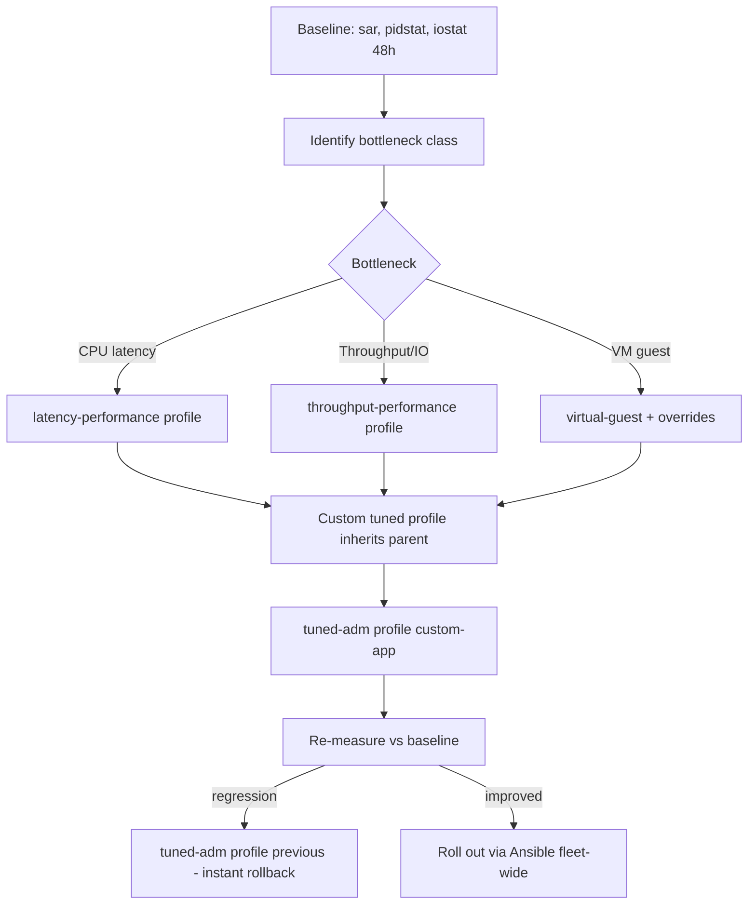

# Tuned Profiles and Kernel Tuning with sysctl

**Level:** Advanced
**Tree:** [Performance & Security](../README.md)
**Branch:** [Performance Tuning](README.md)
**Forest:** [Linux](../../../README.md)

## Explanation

## Declarative performance tuning

RHEL ships **tuned**, a daemon that applies coherent bundles of kernel and device settings called profiles. throughput-performance (the bare-metal server default) favors bandwidth: larger readahead, performance CPU governor, relaxed dirty-page flushing. latency-performance and network-latency pin CPUs at high frequency and disable deep C-states for trading systems and telco loads. virtual-guest (default in VMs) reduces swappiness and adjusts dirty ratios because the hypervisor already schedules I/O. Check with tuned-adm active, switch with tuned-adm profile, and validate a candidate with tuned-adm verify.

Under the hood most settings are **sysctl** keys. Runtime changes use sysctl -w; persistence belongs in /etc/sysctl.d/*.conf drop-ins (never edit /etc/sysctl.conf directly in a managed estate). The keys that matter most in practice: vm.swappiness (how aggressively anonymous memory is swapped - databases usually want 1-10), vm.dirty_ratio and vm.dirty_background_ratio (write-back pacing; lower them on machines with huge RAM to avoid multi-gigabyte flush storms), net.core.somaxconn and net.ipv4.tcp_max_syn_backlog (connection burst absorption on load balancers), and fs.file-max plus per-user ulimits for connection-heavy services.

The professional discipline is: measure, change one thing, re-measure. Capture a baseline with sar/pidstat before touching anything, express the change as a custom tuned profile (a directory under /etc/tuned that includes a parent profile and overrides), and roll it out via configuration management so every node in the tier is identical. A custom profile beats scattered sysctl files because it is versionable, verifiable (tuned-adm verify), and reversible in one command.

## Rollback

A tuned profile reverts with **tuned-adm profile <previous>**, and tuned-adm verify confirms the running values match the profile rather than something applied over it. That single-command reversion is the main operational argument for profiles over scattered sysctl.d files.

What does not revert cleanly is anything **applied at boot and depended upon since** - a hugepage reservation an application has already mapped, or an IO scheduler a database has tuned itself around. Changing those back is a second change with its own risk, not an undo.

## Security implications

A number of sysctl keys are **security controls rather than performance knobs** - reverse-path filtering, ICMP redirect acceptance, ptrace scope, kernel pointer exposure. A performance-oriented profile can relax one as a side effect, and nothing announces it.

Diff the effective values against the security baseline **after** applying a profile, not before. The profile documents intent; sysctl -a documents reality, and only the second is what an auditor or an attacker encounters.

## Monitoring

Monitor **effective values, not files**. The only trustworthy source is the live kernel via sysctl -n, because the value in any given file may have been overridden by another file or re-applied by tuned after boot.

Watch for **profile drift**: tuned-adm verify reports where the running configuration no longer matches the active profile, and a host failing verification has been hand-tuned by someone. That is worth knowing before an incident rather than during one.

## High availability and disaster recovery

Tuning must be **identical across a cluster or failover pair**. A standby tuned differently from production does not fail over cleanly, it fails over slowly - and the difference is usually discovered under the load that triggered the failover.

Because profiles are files, they belong in configuration management and in the build image. A rebuilt host with the default profile performs measurably differently from the one it replaced, and that gap is invisible until traffic arrives.

## Anti-patterns

**sysctl -w as a permanent fix.** It survives until the next reboot and leaves no record, so the machine is in a state nobody documented.

**Copying a vendor tuning guide wholesale.** Guides are written for a workload profile, and applying one whose assumptions do not hold trades one bottleneck for another.

**Both tuned and sysctl.d managing the same key.** The winner depends on ordering, which is why the symptom presents as intermittent and unreproducible.

## Change control

Most sysctl changes are **instant and instantly revertible**, so they do not need a window. The exceptions are the ones that require a restart to take effect for the workload - hugepages, IO scheduler, anything a database reads at startup - because the change and its effect are separated by an outage.

Record the **before value** in the change record, not just the after. Without it, reverting under pressure means guessing, and the default is often not what was there.

## Architecture and flow



## Commands

### Command 1

Show the active tuned profile and all available profiles

```text
tuned-adm active && tuned-adm list
```

### Command 2

Apply the throughput-oriented profile immediately and persistently

```text
tuned-adm profile throughput-performance
```

### Command 3

Read current values of key virtual-memory tunables

```text
sysctl vm.swappiness vm.dirty_ratio
```

### Command 4

Persist a sysctl override and reload all drop-ins

```text
echo 'vm.swappiness = 10' > /etc/sysctl.d/90-db.conf && sysctl --system
```

### Command 5

Check whether the system still matches the active profile (detects drift)

```text
tuned-adm verify
```

### Command 6

Sample CPU, memory and I/O rates every 5 seconds for a one-minute window

```text
sar -u -r -b 5 12
```

## Automation scripts

### tuned.conf (custom profile)

```yaml
# /etc/tuned/custom-db/tuned.conf
# Custom profile for PostgreSQL nodes - inherits throughput-performance.
[main]
summary=DB nodes: throughput base with low swappiness and tamed writeback
include=throughput-performance

[sysctl]
vm.swappiness=5
vm.dirty_ratio=10
vm.dirty_background_ratio=3
net.core.somaxconn=4096

[vm]
transparent_hugepages=never

# Apply with: tuned-adm profile custom-db
# Verify with: tuned-adm verify
```

## Lab

**Objective:** Build and apply a custom tuned profile for a database node, prove the sysctl values landed, and demonstrate one-command rollback.

### Steps

1. Record a baseline: sar -u -r 5 6 and sysctl vm.swappiness vm.dirty_ratio.
2. Create /etc/tuned/custom-db/tuned.conf including throughput-performance with vm.swappiness=5 and THP disabled.
3. Apply with tuned-adm profile custom-db.
4. Verify sysctl vm.swappiness returns 5 and cat /sys/kernel/mm/transparent_hugepage/enabled shows never.
5. Run tuned-adm verify and confirm success.
6. Roll back with tuned-adm profile throughput-performance and confirm swappiness reverted.

### Validation

tuned-adm active shows custom-db.,sysctl vm.swappiness returns 5 while the profile is active.,tuned-adm verify reports the system matches the profile.,After rollback, vm.swappiness returns to the parent profile value.

## Operational automation

### Automating kernel tuning

- **Ansible**: ansible.posix.sysctl sets and persists individual keys idempotently; better, template the whole custom tuned profile directory and notify a tuned restart handler.
- **RHEL system roles**: redhat.rhel_system_roles.kernel_settings expresses sysctl, sysfs and THP settings declaratively per host group.
- **Drift detection**: schedule tuned-adm verify across the fleet from AAP and alert on mismatch - catches manual midnight fixes that never made it to code.

## Troubleshooting

### Scenario 1: sysctl change disappears after reboot

**Likely cause:** Value set with sysctl -w only (runtime) and never persisted to /etc/sysctl.d, or tuned profile overrides it at boot

**Resolution:** Persist in a numbered drop-in and confirm the active tuned profile does not set the same key; profile values win when tuned starts

### Scenario 2: Periodic multi-second stalls on a large-memory server

**Likely cause:** Default dirty_ratio lets tens of GB of dirty pages accumulate, then flushes in a storm

**Resolution:** Lower vm.dirty_background_ratio (about 3) and vm.dirty_ratio (about 10), or use dirty_bytes for deterministic limits; re-test

### Scenario 3: Database latency spikes correlated with khugepaged CPU

**Likely cause:** Transparent hugepage compaction stalling allocations

**Resolution:** Set transparent_hugepages=never in the tuned profile (most databases recommend this) and restart the DB during a window

### Scenario 4: A tuned setting is correct in the configuration file and demonstrably not in effect on the running system

**Likely cause:** Something applied a value later and won. tuned re-applies its profile on start and on some events, so a manual sysctl -w is silently overwritten; equally a drop-in in /etc/sysctl.d can override /etc/sysctl.conf depending on lexical order

**Resolution:** Read the live value with sysctl -n rather than trusting any file, then find who set it - tuned-adm active shows the profile, and sysctl --system -a reports which file supplied each value. Put the setting where it will survive: a tuned profile include, or a numbered drop-in that sorts last

## Interview questions

### 1. What does vm.swappiness actually control, and why not always set it to 0?

It biases the kernel's reclaim between dropping page cache and swapping anonymous memory (0-200 on modern kernels). At 0 the kernel avoids swap until it is nearly out of memory, which can trigger abrupt OOM kills instead of gradual swapping. A low value like 1-10 keeps swap as a graceful safety valve for databases.

### 2. Why prefer a custom tuned profile over a pile of sysctl.d files?

One versionable artifact that inherits a vendor-maintained parent, applies atomically, is verifiable with tuned-adm verify, and rolls back in one command. Sysctl drop-ins scattered across hosts drift, conflict silently by ordering, and cover only sysctl - tuned also handles CPU governors, THP, disk readahead and scheduler knobs.

### 3. A load balancer drops connections during traffic bursts. Which kernel settings do you look at?

net.core.somaxconn (accept queue cap), net.ipv4.tcp_max_syn_backlog (half-open queue), the application's own listen backlog (min of app and somaxconn wins), net.core.netdev_max_backlog for packet ingress, and ephemeral port range plus tcp_tw_reuse for outbound connection churn. Confirm overflow with ss -lnt showing Recv-Q at the cap and netstat -s listen-queue overflow counters.

### 4. How do you prove a tuning change helped?

Fixed baseline first: same workload, sar/pidstat/application latency percentiles captured before. Change exactly one variable, run the same load, compare p95/p99 not averages, and keep the result with the change record. No baseline means no claim.

## Certification alignment

- RHCSA EX200 - Tune system performance: select a tuning profile with tuned-adm
- RHCSA EX200 - Manage kernel runtime parameters with sysctl
- RHCE EX294 - Apply kernel_settings via RHEL system roles

## References

- Red Hat Documentation: Monitoring and managing system status and performance (RHEL 9)
- man tuned.conf, man sysctl.d, man sar
- Red Hat Performance Tuning Guide - tuned profile reference

## Suggested video search

RHEL 9 tuned profiles sysctl kernel tuning performance deep dive

---

> Validate commands, versions, permissions, licensing, and rollback procedures in an isolated lab before production use.
