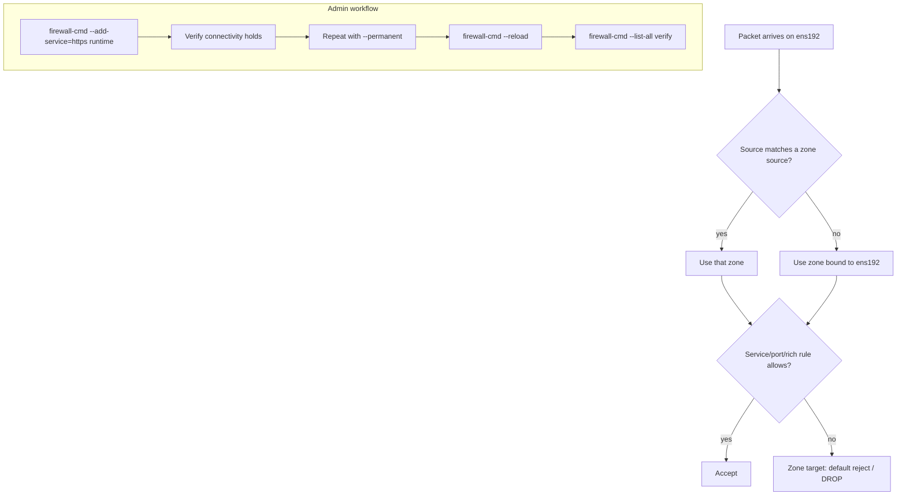

# Firewalld: Zones, Services and Rich Rules

**Level:** Intermediate
**Tree:** [Performance & Security](../README.md)
**Branch:** [SELinux & Firewalld](README.md)
**Forest:** [Linux](../../../README.md)

## Explanation

## Zone-based host firewalling

Firewalld is RHEL's dynamic firewall manager, driving nftables underneath while presenting a zone-based model. A **zone** is a trust level with its own rule set; interfaces and source ranges are assigned to zones, and traffic is evaluated by the zone of the interface (or matching source) it arrives on. Defaults ship sensibly: the public zone allows ssh and dhcpv6-client and drops the rest. Other built-ins (internal, dmz, trusted, drop) model common postures; enterprise practice is one custom zone per network segment - a mgmt zone for the admin VLAN, an app zone for service traffic.

The second abstraction is the **service**: an XML definition bundling ports and protocols under a name (https, ceph, kube-apiserver...). Allowing firewall-cmd --add-service=https reads better in an audit than a bare port number, and custom service files in /etc/firewalld/services make internal applications first-class citizens.

The operational discipline that separates professionals: runtime versus permanent configuration. Changes without --permanent apply instantly but vanish on reload; with --permanent they persist but do not apply until --reload. The safe workflow for remote work is deliberate: apply runtime-only first, verify you still have SSH, then make it permanent - a wrong rule then self-heals on reload instead of locking you out.

For precision beyond services, **rich rules** express source-scoped policies: allow PostgreSQL only from the app subnet, rate-limit new SSH connections, or log-and-drop a hostile range. For NAT and forwarding, masquerade and forward-ports handle edge cases without leaving firewalld. Panic mode (--panic-on) drops everything instantly - an incident-response big red button to know about, and to use only from a console.

## Rollback

The rollback is built in and under-used: **a change made without --permanent is discarded by firewall-cmd --reload**. That makes runtime-first the safe workflow - apply, verify from the far side, and only then commit with --permanent, so an untested change reverts by itself.

For a change already committed, --permanent --remove-* followed by --reload restores the previous state. What has no rollback is **a change that severed your own access**, which is why the runtime-first pattern matters more here than almost anywhere else in this forest.

## Security implications

A zone is a **trust boundary**, and the default zone is where anything unassigned lands. An interface added later - a new NIC, a bond, a VLAN - inherits the default rather than the zone its traffic belongs to, so segmentation silently weakens as the host changes.

Prefer **services over raw ports** where one exists: a service definition carries the related ports and helpers together, and it survives the application changing port. Rich rules with source addresses are the mechanism for genuine restriction, and they are evaluated ahead of interface bindings, which is both powerful and easy to get wrong.

## Monitoring

The useful signal is **what is being dropped**, and by default nothing records it. Enabling LogDenied gives evidence that a rule is blocking legitimate traffic, and without it a firewall fault is indistinguishable from an application fault from the client side.

Also monitor **configuration drift between permanent and runtime**. A host whose runtime configuration differs from its permanent one will change behaviour at the next reload or reboot, and that is a scheduled surprise rather than a current fault.

## High availability and disaster recovery

Firewall rules must be **identical across a failover pair**, and they frequently are not, because a rule added during an incident on one node rarely reaches the other. The failure appears only at failover, when the surviving node blocks traffic its partner allowed.

Rules belong in **configuration management, not on the host**. A rebuilt or DR-restored host with default zones is reachable in ways it should not be and unreachable in ways it must be, and neither is obvious from the outside.

## Anti-patterns

**Making a permanent change first and testing afterwards.** It removes the free rollback that a plain reload would have given.

**Disabling firewalld to prove it is the cause.** It proves only that something in the firewall is involved and leaves the host unprotected, sometimes permanently. Use LogDenied instead.

**Adding ports rather than services.** The port set drifts from what the application actually needs, and nobody remembers which of the accumulated ports is still required.

## Change control

Firewall changes on a remote host carry the same blast radius as network changes: **a mistake removes the path to fix it**. Console or out-of-band access should be confirmed before, not sought after.

A **timed automatic reload** is the equivalent safety net to the network one - schedule a plain reload a few minutes out, which discards any uncommitted change, and cancel it once access is confirmed. It costs one at job and converts a lockout into a short degradation.

## Architecture and flow



## Commands

### Command 1

Show which zones are active and which interfaces/sources they bind

```text
firewall-cmd --get-active-zones
```

### Command 2

Full rule listing for a zone: services, ports, rich rules, targets

```text
firewall-cmd --zone=public --list-all
```

### Command 3

Allow HTTPS now, then persist the verified runtime state

```text
firewall-cmd --add-service=https && firewall-cmd --runtime-to-permanent
```

### Command 4

Create a management zone scoped to the admin subnet

```text
firewall-cmd --permanent --new-zone=mgmt && firewall-cmd --permanent --zone=mgmt --add-source=10.10.50.0/24
```

### Command 5

Allow PostgreSQL only from the application subnet

```text
firewall-cmd --permanent --zone=app --add-rich-rule='rule family=ipv4 source address=10.20.0.0/24 port port=5432 protocol=tcp accept'
```

### Command 6

Activate permanent config and verify rich rules loaded

```text
firewall-cmd --reload && firewall-cmd --list-rich-rules
```

## Automation scripts

### firewall-baseline.sh

```bash
#!/usr/bin/env bash
# Apply a segmented firewall baseline: mgmt zone for SSH, app zone for service.
set -euo pipefail
MGMT_NET="10.10.50.0/24"; APP_NET="10.20.0.0/24"; APP_PORT="8443"
fc() { firewall-cmd --permanent "$@"; }
firewall-cmd --state >/dev/null
fc --new-zone=mgmt 2>/dev/null || true
fc --zone=mgmt --add-source="$MGMT_NET"
fc --zone=mgmt --add-service=ssh
fc --new-zone=app 2>/dev/null || true
fc --zone=app --add-source="$APP_NET"
fc --zone=app --add-port="${APP_PORT}/tcp"
# Remove ssh from public so only mgmt subnet reaches it
fc --zone=public --remove-service=ssh 2>/dev/null || true
firewall-cmd --reload
echo "== Active zones =="; firewall-cmd --get-active-zones
firewall-cmd --zone=mgmt --list-all
firewall-cmd --zone=app --list-all
```

## Lab

**Objective:** Segment a server's firewall into mgmt and app zones so SSH is reachable only from the admin subnet and the app port only from the app subnet, without ever losing your own session.

### Steps

1. From a client in the admin subnet, list current zones and rules.
2. Create the mgmt zone with your admin subnet as source and ssh allowed - runtime first, verify your session survives, then runtime-to-permanent.
3. Create the app zone allowing 8443/tcp from the app subnet only.
4. Remove ssh from the public zone and reload.
5. Test: SSH from admin subnet succeeds, from another subnet is rejected; port 8443 answers only from the app subnet.
6. Add a rich rule that logs and rate-limits new SSH connections to 3/minute.

### Validation

firewall-cmd --get-active-zones shows mgmt and app with correct sources.,SSH from a non-admin address is refused; admin subnet still connects.,nmap from the app subnet shows only 8443 open.,journalctl -k shows log entries from the SSH rate-limit rich rule when hammered.

## Operational automation

### Automating firewall policy

- **Ansible**: ansible.posix.firewalld manages zones, services, ports, sources and rich rules with permanent: true and immediate: true in one task - the canonical pattern.
- **RHEL system role**: redhat.rhel_system_roles.firewall expresses the entire policy as a variable list, ideal for a git-reviewed, fleet-wide standard.
- **Safety in pipelines**: apply runtime-only in the first play, run a connectivity assertion (wait_for on 22 from the controller), and only then persist - automating the same lockout-proof workflow used by hand.

## Troubleshooting

### Scenario 1: Firewall rule disappears after firewall-cmd --reload

**Likely cause:** Rule was added at runtime without --permanent

**Resolution:** Re-add with --permanent and --reload, or capture verified runtime state with firewall-cmd --runtime-to-permanent

### Scenario 2: Service unreachable although its port shows open in the zone

**Likely cause:** Traffic is arriving in a different zone - source-based zone match wins over interface binding

**Resolution:** Check firewall-cmd --get-active-zones and firewall-cmd --get-zone-of-source; add the rule to the zone that actually matches the client

### Scenario 3: Locked out of SSH after a firewall change on a remote host

**Likely cause:** Removed the ssh service or bound the interface to a restrictive zone permanently

**Resolution:** Use out-of-band console (iLO/iDRAC/hypervisor) to restore; adopt the runtime-first workflow so a plain reload reverts unverified changes

### Scenario 4: Traffic is blocked intermittently while firewall-cmd --list-all shows the rule present and correct

**Likely cause:** The connection is arriving on an interface in a different zone from the one being inspected. firewalld evaluates per-zone, and an interface with no explicit assignment lands in the default zone - so multi-homed hosts and newly added NICs are blocked by a zone nobody looked at

**Resolution:** Establish which zone the traffic actually lands in with firewall-cmd --get-active-zones, then inspect that zone rather than the assumed one. Confirm the source address is not matching a source-based zone binding, which takes precedence over the interface binding

## Interview questions

### 1. How does firewalld decide which zone handles a packet?

Source-based matching first: if the packet's source IP matches a zone's configured source range, that zone applies. Otherwise the zone bound to the ingress interface applies; if none, the default zone. This is why a host can serve different policies to admin and user subnets on one NIC.

### 2. Describe a change workflow that can never lock you out of a remote host.

Apply the change at runtime only, verify the management path still works (open a second SSH session), then persist with --runtime-to-permanent or repeat with --permanent and --reload. If the runtime change breaks access, the permanent config is untouched - a reboot or reload from console restores service.

### 3. Rich rule versus adding a port - when and why?

Adding a port opens it to every source the zone covers. A rich rule scopes by source address, adds logging, rate limiting, or reject-with behavior. Database ports, management interfaces and anything compliance-relevant should be rich rules or source-scoped zones, not blanket port opens.

### 4. What is firewalld actually programming underneath on RHEL 9?

nftables. Firewalld translates zones, services and rich rules into nftables rule sets (visible with nft list ruleset). That is why mixing hand-written nftables/iptables rules with firewalld on one host is discouraged - two managers fighting over one backend.

## Certification alignment

- RHCSA EX200 - Restrict network access using firewall-cmd/firewalld
- RHCE EX294 - Configure firewall rules with the firewalld module and firewall system role
- Red Hat RH415 Security hardening - network access control objectives

## References

- Red Hat Documentation: Configuring firewalls and packet filters (RHEL 9)
- man firewall-cmd, man firewalld.richlanguage, man firewalld.zone
- firewalld.org - documentation and concepts

## Suggested video search

firewalld zones rich rules RHEL 9 tutorial permanent vs runtime

---

> Validate commands, versions, permissions, licensing, and rollback procedures in an isolated lab before production use.
