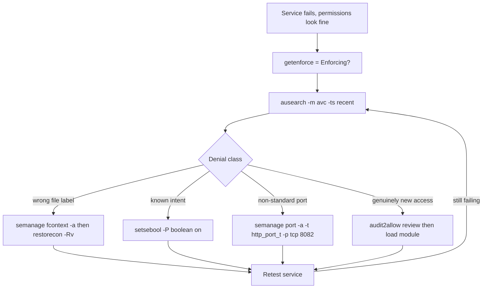

# SELinux: Contexts, Booleans and Troubleshooting

**Level:** Advanced
**Tree:** [Performance & Security](../README.md)
**Branch:** [SELinux & Firewalld](README.md)
**Forest:** [Linux](../../../README.md)

## Explanation

## Mandatory access control that ships enabled

SELinux enforces **mandatory access control**: every process runs in a domain (e.g. httpd_t) and every file carries a type (e.g. httpd_sys_content_t), and a compiled policy decides which domains may touch which types - regardless of Unix permissions. Root running a compromised web server still cannot read /etc/shadow, because httpd_t has no rule allowing shadow_t. That containment is why disabling SELinux is an anti-pattern, not a fix.

Modes: **enforcing** (denials blocked and logged), **permissive** (denials logged only - the diagnostic mode), **disabled** (no labeling at all; returning from it forces a full relabel). getenforce/setenforce toggle at runtime; /etc/selinux/config persists. The daily-work skill is label management: ls -Z and ps -eZ show contexts; the two classic failures are files moved (mv preserves the old label where cp inherits the target directory's) and services using non-default paths or ports. Fix labels the durable way: semanage fcontext -a to record the rule, then restorecon -Rv to apply. Fixing with chcon alone is temporary - a relabel reverts it.

**Booleans** are policy switches for common intents: httpd_can_network_connect for reverse proxies, and similar toggles for NFS home directories or database connections. Set persistently with setsebool -P. Non-standard ports need semanage port -a -t http_port_t -p tcp 8082.

Troubleshooting flow: reproduce, then ausearch -m avc -ts recent to see the denial, and sealert (setroubleshoot-server) to get a plain-English explanation with the exact fix command. Only as a last resort generate a custom module with audit2allow - and review what it allows before loading it.

## Rollback

Every persistent SELinux change has an inverse, and knowing it is what makes the change safe to attempt. A file-context rule is removed with **semanage fcontext -d** and then **restorecon** to reapply the default; a port assignment with **semanage port -d**; a boolean by setting it back with **setsebool -P**. A custom module from audit2allow is removed with **semodule -r** - the one people forget they can do, so a module loaded during an incident two years ago is still granting whatever it granted.

What cannot be rolled back cheaply is a **full relabel**. Once /.autorelabel triggers, the machine walks every inode; on a large filesystem that is a long, disruptive boot that cannot be aborted halfway without leaving mixed labels.

## Security implications

SELinux is a containment control, not an access control tuned for convenience. Its value is entirely in the case nobody anticipated: a compromised service confined to its domain cannot read what that domain has no rule for, regardless of Unix permissions or root.

The cost is that **a policy denial looks exactly like an application bug**, which is what drives teams to disable it. Permissive mode is the correct answer to that pressure - it logs what enforcing would block, so labels can be fixed with the service running. Permissive is a diagnostic state, never a deployment state, and that distinction is worth writing into a standard because it is the one that erodes.

## Monitoring

The signal is the **AVC denial rate in the audit log**, and it is most useful as a delta rather than a level. A spike immediately after a deployment means the new build touches something its domain has no rule for - a labelling problem rather than a code problem, and knowing which saves an argument.

The counter-intuitive signal is **zero AVCs on a busy, newly deployed service**. That can mean the policy fits perfectly, or that dontaudit rules are hiding the denials. If the service is failing and the log is clean, suspect the second.

## High availability and disaster recovery

Labels live in **extended attributes on the filesystem**, not in the policy, so they survive a restore only if the backup tool preserves xattrs. A restore from a tool that silently drops them produces a machine that boots, mounts everything, and fails almost every service - with no obvious cause, because every file is present and every permission is correct.

The fix is to touch /.autorelabel and reboot, so recovery time for an enforcing host includes a relabel pass. Budget the recovery window for it, and verify xattr preservation as part of backup validation rather than discovering it during a restore.

## Anti-patterns

**setenforce 0 as a fix.** It resolves the symptom and removes the containment the control existed for, and it lasts until the next reboot - leaving the machine in a state nobody documented.

**chcon instead of semanage fcontext.** chcon changes the label now and records nothing. The next restorecon or relabel reverts it, so the fault reappears weeks later with no change to blame.

**audit2allow piped straight into semodule.** It will stop the denial. It may also grant far more than the one access needed, and nobody reads the module afterwards. Generate it, read what it allows, then decide.

## Change control

Boolean and port changes are **low blast radius and instant** - one domain, revertible in seconds, no window needed. A **relabel is the opposite**: disruptive, duration proportional to inode count, and not safely abortable, so it belongs in a maintenance window with the time budgeted.

The change worth gating hardest is loading a custom policy module, because it widens what a domain may do permanently and quietly. Treat it like a firewall rule change - recorded, reviewed, and owned by someone.

## Architecture and flow



## Commands

### Command 1

Show the current SELinux mode and loaded policy details

```text
getenforce && sestatus
```

### Command 2

Inspect file and process security contexts

```text
ls -Z /var/www/html && ps -eZ | grep httpd
```

### Command 3

Persistently label a custom web root and apply it

```text
semanage fcontext -a -t httpd_sys_content_t '/srv/web(/.*)?' && restorecon -Rv /srv/web
```

### Command 4

Allow httpd to make outbound connections (reverse proxy), persistently

```text
setsebool -P httpd_can_network_connect on
```

### Command 5

Show recent denials with an explanation of why each was blocked

```text
ausearch -m avc -ts recent | audit2why
```

### Command 6

Register a non-standard port for the web server domain

```text
semanage port -a -t http_port_t -p tcp 8082
```

## Automation scripts

### selinux-web-fix.sh

```bash
#!/usr/bin/env bash
# Repair SELinux configuration for httpd on a custom root and port.
set -euo pipefail
WEBROOT="/srv/web"; PORT="8082"
echo "== Recent AVC denials =="
ausearch -m avc -ts recent 2>/dev/null | tail -20 || echo "none"
semanage fcontext -a -t httpd_sys_content_t "${WEBROOT}(/.*)?" 2>/dev/null   || semanage fcontext -m -t httpd_sys_content_t "${WEBROOT}(/.*)?"
restorecon -Rv "$WEBROOT"
if ! semanage port -l | grep http_port_t | grep -qw "$PORT"; then
  semanage port -a -t http_port_t -p tcp "$PORT"
fi
setsebool -P httpd_can_network_connect on
systemctl restart httpd
curl -fsS "http://localhost:${PORT}/" >/dev/null && echo "OK: site serving on ${PORT}"
```

## Lab

**Objective:** Break a web server three ways under SELinux (wrong label, wrong port, missing boolean) and repair each with the correct persistent fix - never by disabling SELinux.

### Steps

1. Install the SELinux management tooling first - it is NOT present on a minimal RHEL 9 or 10 install: dnf install -y policycoreutils-python-utils setroubleshoot-server. Without policycoreutils-python-utils the semanage command this lab depends on does not exist, and the temptation is then to reach for chcon, which is the anti-pattern this lab exists to teach against.
2. Install httpd, create content in /srv/web with mv from /root (inheriting admin_home_t), point DocumentRoot at it, and observe 403 errors.
3. Diagnose with ausearch -m avc -ts recent, fix with semanage fcontext + restorecon, confirm 200.
4. Change Listen to 8082; httpd fails to bind. Fix with semanage port -a -t http_port_t.
5. Configure a ProxyPass to a backend and observe denial; fix with setsebool -P httpd_can_network_connect on.
6. Reboot and confirm every fix survived (labels, port mapping, boolean).

### Validation

curl localhost:8082 returns the page with SELinux in enforcing mode.,ls -Z /srv/web shows httpd_sys_content_t on all files.,semanage port -l | grep http_port_t includes 8082.,getsebool httpd_can_network_connect shows on after reboot.

## Operational automation

### Automating SELinux management

- **Ansible**: ansible.posix.seboolean (persistent: true), community.general.sefcontext plus an explicit restorecon command task, and ansible.posix.selinux for mode enforcement across the fleet.
- **RHEL system role**: redhat.rhel_system_roles.selinux declares mode, booleans, fcontexts and port mappings in one variable structure - the cleanest fleet approach.
- **CI for policy modules**: keep custom .te files in git, build with checkmodule/semodule_package in a pipeline, and deploy the versioned .pp module - never audit2allow ad hoc on production."

## Troubleshooting

### Scenario 1: Web content returns 403 though file permissions are 644

**Likely cause:** Files were moved with mv and kept a non-web label such as admin_home_t or user_home_t

**Resolution:** semanage fcontext -a -t httpd_sys_content_t on the path, then restorecon -Rv; verify with ls -Z

### Scenario 2: Service cannot bind to its configured non-standard port

**Likely cause:** SELinux port type for that domain does not include the new port

**Resolution:** semanage port -a -t <domain>_port_t -p tcp <port> (or -m if the port is defined for another type)

### Scenario 3: No AVC denial logged but the action still fails under SELinux

**Likely cause:** The rule is marked dontaudit, hiding the denial

**Resolution:** semodule -DB to disable dontaudit rules, reproduce and capture the denial, fix properly, then re-enable with semodule -B

### Scenario 4: An application works after deployment and then fails days later, often after a reboot or a patch window

**Likely cause:** The label was applied with chcon, which sets the context now but records no rule. A restorecon, a relabel, or anything triggering /.autorelabel reverts it to the policy default

**Resolution:** Set the label the durable way - semanage fcontext -a -t <type> on the path expression, then restorecon -Rv to apply. Prove it survives by running restorecon again and confirming the context is unchanged

## Interview questions

### 1. Why is setenforce 0 not an acceptable production fix?

It removes mandatory access control for every process on the host to solve one mislabeled file - trading a scoped, diagnosable problem for a system-wide loss of containment. The correct fixes (fcontext, boolean, port mapping, or a reviewed custom module) are targeted and persistent. Permissive is acceptable only briefly, for diagnosis.

### 2. Explain the difference between chcon and semanage fcontext.

chcon changes the label on the inode immediately but records nothing in policy - a relabel (restorecon, autorelabel, or some updates) reverts it. semanage fcontext writes the rule into the policy's file-context database so restorecon applies and future relabels preserve it. Rule of thumb: semanage declares intent, restorecon applies it, chcon is for throwaway experiments.

### 3. How do SELinux booleans fit into least-privilege design?

They are vendor-audited, pre-scoped policy toggles for common legitimate needs - a reverse proxy connecting outbound, NFS home directories. Enabling one grants exactly the reviewed rule set, far narrower than a hand-rolled audit2allow module, and it is self-documenting in a compliance audit.

### 4. Walk through diagnosing a denial that produces no log entry.

Suspect a dontaudit rule: run semodule -DB to rebuild policy with dontaudit disabled, reproduce, capture the AVC with ausearch, design the proper fix, then semodule -B to restore silence. This is common with services probing paths they only optionally need.

## Certification alignment

- RHCSA EX200 - Set enforcing and permissive modes for SELinux
- RHCSA EX200 - Restore default file contexts and manage SELinux port labels
- RHCSA EX200 - Use boolean settings to modify system SELinux settings
- RHCE EX294 - Manage SELinux with the selinux system role

## References

- Red Hat Documentation: Using SELinux (RHEL 9)
- man semanage-fcontext, man restorecon, man ausearch, man audit2allow
- SELinux Coloring Book (Red Hat) - conceptual model

## Suggested video search

SELinux troubleshooting RHEL 9 ausearch audit2allow semanage contexts

---

> Validate commands, versions, permissions, licensing, and rollback procedures in an isolated lab before production use.
