# Linux lsof Open File Descriptors ulimit and systemd Resource Limit Troubleshooting

**Level:** Advanced
**Tree:** [Working Without Help: Documentation, Rescue and Diagnosis](../README.md)
**Branch:** [Self-Service Documentation, Boot Recovery and Descriptor Diagnostics](README.md)
**Forest:** [Linux](../../../README.md)

## Explanation

# Open File Descriptors, lsof and Resource Limits

Everything in Linux is a file descriptor — regular files, sockets, pipes, devices. That is why one tool answers a surprisingly wide range of questions, and why one limit causes a surprisingly wide range of outages.

## The disk that is full and is not

The most valuable single thing here: **df** reports the filesystem full, **du** disagrees, and the difference is **a deleted file still held open**.

When a process has a file open and the file is unlinked, the directory entry is gone but the inode and its blocks are not released until the last descriptor closes. **du** walks directory entries and does not see it. **df** reads the filesystem and does.

The usual cause is a log file rotated or deleted while the writing process kept its descriptor. Restarting the process frees the space instantly. **lsof +L1** lists exactly these — files with a link count of zero that are still open — and it turns a confusing capacity incident into a one-command diagnosis.

## What lsof answers

- **Who is using this mount point?** **lsof /mnt/data** — the answer to *device is busy* on unmount.
- **What is listening on this port?** **lsof -i :443**
- **What does this process have open?** **lsof -p <pid>**
- **Who has this file open?** **lsof /var/log/app.log**
- **Which deleted files are still consuming space?** **lsof +L1**

The same information is under **/proc/<pid>/fd**, which is worth knowing because a minimal container often has no lsof and **ls -l /proc/<pid>/fd** still works.

## The limit is layered, and people fix the wrong layer

A descriptor limit exists at several levels and raising the wrong one changes nothing:

**System-wide** — **fs.file-max**, rarely the binding constraint on a modern system.

**Per-user via PAM** — **/etc/security/limits.conf**. **This applies to login sessions and does not apply to systemd services**, which is the single most common mistake: the value is raised, the login shell shows the new limit, and the service is unaffected because it never went through PAM.

**Per-service via systemd** — **LimitNOFILE=** in the unit. For anything started by systemd, this is the layer that matters.

**Soft versus hard** — soft is the enforced value and can be raised by the process up to hard. **ulimit -n** shows soft; **ulimit -Hn** shows hard.

The reliable check is not what your shell reports. It is **/proc/<pid>/limits** for the actual running process, which is authoritative regardless of which layer set it.

## Descriptor exhaustion does not look like descriptor exhaustion

The error surfaces as whatever the application does when a syscall fails: *too many open files*, *cannot allocate memory*, connection failures, or nothing at all if the error is swallowed. In a network service it typically presents as **intermittent connection refusals under load**, which reads as a network problem.

The diagnosis is comparing open descriptors against the limit for that process — and the counting must be per-process, because the limit is per-process.

## Leaks versus load

A descriptor count that rises with load and falls after is normal. One that rises and never falls is a leak: sockets not closed, files opened in a loop. **The distinction is the trend after load drops**, which is why a single point-in-time count answers nothing useful.

## Architecture and flow

```mermaid
flowchart TD
    E["Everything is a FILE DESCRIPTOR"] --> E1["Files · sockets · pipes · devices"]
    E1 --> E2["One tool answers many questions"]
    E1 --> E3["One limit causes many outages"]
    D["The disk that is full and is not"] --> D1["df says full · du disagrees"]
    D1 --> D2["A DELETED FILE still held open"]
    D2 --> D3["Unlinked: directory entry gone"]
    D3 --> D4["Inode and blocks NOT released until last descriptor closes"]
    D4 --> D5["du walks directory entries - cannot see it"]
    D4 --> D6["df reads the filesystem - does see it"]
    D --> D7["Usual cause: log rotated while the writer kept its descriptor"]
    D7 --> D8["Restarting the process frees the space instantly"]
    D --> D9["lsof +L1 lists exactly these"]
    D9 --> D10["Turns a confusing capacity incident into one command"]
    L["What lsof answers"] --> L1["lsof /mnt/data - who is using this mount ('device is busy')"]
    L --> L2["lsof -i :443 - what is listening"]
    L --> L3["lsof -p PID - what this process has open"]
    L --> L4["lsof +L1 - deleted files still consuming space"]
    L --> L5["Same data under /proc/PID/fd"]
    L5 --> L6["Minimal containers have no lsof; ls -l /proc/PID/fd still works"]
    M["The limit is LAYERED - people fix the wrong layer"] --> M1["SYSTEM-WIDE fs.file-max - rarely the binding constraint"]
    M --> M2["PER-USER via PAM: /etc/security/limits.conf"]
    M2 --> M2a["Applies to LOGIN SESSIONS"]
    M2a --> M2b["Does NOT apply to systemd services"]
    M2b --> M2c["The most common mistake"]
    M2c --> M2d["Login shell shows the new limit; the service is unaffected"]
    M --> M3["PER-SERVICE via systemd: LimitNOFILE="]
    M3 --> M3a["For anything systemd starts, THIS is the layer"]
    M --> M4["SOFT vs HARD - soft enforced, raisable up to hard"]
    M --> M5["Reliable check: /proc/PID/limits for the RUNNING process"]
    M5 --> M6["Authoritative regardless of which layer set it"]
    X["Exhaustion does not look like exhaustion"] --> X1["Surfaces as whatever the app does on syscall failure"]
    X1 --> X2["'too many open files' · 'cannot allocate memory'"]
    X1 --> X3["Connection failures · or nothing if swallowed"]
    X --> X4["In a network service: intermittent refusals under load"]
    X4 --> X5["Reads as a NETWORK problem"]
    T{"Leak versus load"} --> T1["Rises with load, falls after = normal"]
    T --> T2["Rises and never falls = LEAK"]
    T2 --> T3["Sockets not closed · files opened in a loop"]
    T --> T4["The distinction is the TREND AFTER LOAD DROPS"]
    T4 --> T5["A point-in-time count answers nothing"]
```



## Commands

### Command 1

List deleted files still held open, which is the answer when df reports full and du disagrees

```text
lsof +L1 | head -20
```

### Command 2

Reproduce the discrepancy that indicates unlinked files are still holding blocks

```text
df -h /var; du -sh /var 2>/dev/null
```

### Command 3

Find what is using a mount point when unmount reports the device is busy

```text
lsof /mnt/data
```

### Command 4

Read the authoritative limit for a running process rather than trusting what a shell reports

```text
cat /proc/$(pgrep -f myservice | head -1)/limits | grep -i "open files"
```

### Command 5

Count open descriptors per process, which works in minimal containers with no lsof installed

```text
ls -l /proc/$(pgrep -f myservice | head -1)/fd | wc -l
```

### Command 6

Compare the systemd unit limit against the shell limits to see which layer actually applies

```text
systemctl show myservice -p LimitNOFILE; ulimit -n; ulimit -Hn
```

### Command 7

Count established connections against the descriptor budget when a service refuses connections under load

```text
lsof -i :443 -sTCP:ESTABLISHED | wc -l; ss -s
```

## Automation scripts

### diagnose-descriptor-pressure.sh

```bash
#!/usr/bin/env bash
# Diagnoses file descriptor pressure and the two failures it is most often mistaken for.
#
#   1. THE DISK THAT IS FULL AND IS NOT. df reports the filesystem full, du disagrees, and
#      the difference is a deleted file still held open. When a file is unlinked its
#      directory entry goes but the inode and blocks are not released until the last
#      descriptor closes - du walks directory entries and cannot see it, df reads the
#      filesystem and can. Usually a log rotated while the writer kept its descriptor.
#      Restarting that process frees the space instantly.
#
#   2. DESCRIPTOR EXHAUSTION THAT LOOKS LIKE A NETWORK PROBLEM. The failure surfaces as
#      whatever the application does when a syscall fails - intermittent connection
#      refusals under load being the common presentation. The limit is per-process, so the
#      count has to be per-process too.
#
# It also checks the LAYER people usually get wrong: /etc/security/limits.conf applies to
# login sessions via PAM and does NOT apply to systemd services. The value gets raised, the
# login shell shows it, and the service is unaffected because it never went through PAM.

set -o nounset
set -o pipefail

threshold=${1:-80}
findings=0

printf 'FILE DESCRIPTOR DIAGNOSIS\n\n'

# --- 1. deleted-but-open files ---------------------------------------------------------
printf 'DELETED FILES STILL HELD OPEN\n'
if command -v lsof >/dev/null 2>&1; then
    deleted=$(lsof +L1 2>/dev/null | awk 'NR > 1 { print }')
    if [ -n "$deleted" ]; then
        printf '%s\n' "$deleted" | head -15 | sed 's/^/  /'
        bytes=$(printf '%s\n' "$deleted" | awk '{ s += $8 } END { print s+0 }')
        printf '  approximately %s MB held by unlinked files\n' "$((bytes / 1024 / 1024))"
        printf '  This is why df and du disagree. Restart the holding process to release it.\n'
        findings=$((findings + 1))
    else
        printf '  none\n'
    fi
else
    printf '  lsof not installed - checking /proc directly\n'
    for fd in /proc/[0-9]*/fd/*; do
        [ -L "$fd" ] || continue
        target=$(readlink "$fd" 2>/dev/null) || continue
        case $target in
            *' (deleted)')
                pid=${fd#/proc/}; pid=${pid%%/*}
                printf '  pid %s holds %s\n' "$pid" "$target"
                findings=$((findings + 1))
                ;;
        esac
    done 2>/dev/null | head -15
fi

# --- 2. per-process descriptor usage against limit --------------------------------------
printf '\nPER-PROCESS USAGE AGAINST LIMIT (threshold %s%%)\n' "$threshold"
for pdir in /proc/[0-9]*; do
    pid=${pdir#/proc/}
    [ -r "$pdir/limits" ] || continue
    soft=$(awk '/Max open files/ { print $4 }' "$pdir/limits" 2>/dev/null)
    case $soft in ''|*[!0-9]*) continue;; esac
    [ "$soft" -eq 0 ] && continue
    count=$(ls -1 "$pdir/fd" 2>/dev/null | wc -l)
    [ "$count" -eq 0 ] && continue
    pct=$((count * 100 / soft))
    if [ "$pct" -ge "$threshold" ]; then
        name=$(tr -d '\0' < "$pdir/comm" 2>/dev/null)
        printf '  pid %-7s %-20s %6s / %-8s (%s%%)\n' "$pid" "${name:-?}" "$count" "$soft" "$pct"
        findings=$((findings + 1))
    fi
done

# --- 3. which layer is actually in force ------------------------------------------------
printf '\nLIMIT LAYERS\n'
printf '  fs.file-max (system-wide)     %s\n' "$(cat /proc/sys/fs/file-max 2>/dev/null)"
printf '  shell soft / hard             %s / %s\n' "$(ulimit -n)" "$(ulimit -Hn)"
if [ -s /etc/security/limits.conf ]; then
    conf=$(grep -E '^[^#].*nofile' /etc/security/limits.conf 2>/dev/null | head -5)
    if [ -n "$conf" ]; then
        printf '  limits.conf declares:\n'
        printf '%s\n' "$conf" | sed 's/^/    /'
        printf '  WARNING: limits.conf applies to LOGIN SESSIONS via PAM. It does NOT apply\n'
        printf '  to systemd services. If the process you care about is a service, set\n'
        printf '  LimitNOFILE= in its unit instead - this is the layer people raise and then\n'
        printf '  wonder why nothing changed.\n'
    fi
fi

printf '\n  The authoritative value for any running process is /proc/PID/limits, regardless\n'
printf '  of which layer set it. What your shell reports is not evidence about a service.\n'

printf '\nA count rising with load and falling after is normal. One that rises and never\n'
printf 'falls is a leak - sockets not closed, files opened in a loop. The distinction is\n'
printf 'the trend AFTER load drops, so re-run this once the system is quiet.\n'

[ "$findings" -gt 0 ] && exit 1
exit 0
```

## Lab

**Objective:** Reproduce the deleted-file capacity incident and the per-service limit trap, and prove which configuration layer actually applies.

### Steps

1. Write a large file, open it from a running process, then delete it.
2. Compare filesystem usage against directory usage and record the discrepancy.
3. Locate the unlinked file with the deleted-files listing.
4. Restart the holding process and confirm the space returns immediately.
5. Raise the descriptor limit in the PAM limits configuration and open a new login shell.
6. Confirm the shell shows the raised limit.
7. Read the authoritative limit for a running systemd service and compare it against the shell value.
8. Explain why the service was unaffected by the PAM change.
9. Set the limit in the unit file, restart the service, and confirm the process limit changed.
10. Generate load, count descriptors during and after, and classify the pattern as load or leak.

### Validation

Deleted-but-open files are shown to explain the df and du discrepancy, and the space returns on restart.,The PAM change is demonstrated to affect the login shell and not the systemd service.,The unit file change is confirmed in the running process limits rather than in a shell.,The descriptor trend after load drops is used to distinguish a leak from normal load.

## Operational automation

## Automating descriptor monitoring

**Alert on descriptors as a percentage of the per-process limit, not on an absolute count.** The limit is per-process and varies by unit, so an absolute threshold is meaningful for one service and noise for another.

**Monitor the trend after load drops rather than the peak.** Rising during load is normal; failing to fall is a leak, and only the post-load trend distinguishes them.

**Check for deleted-but-open files as part of capacity alerting.** A filesystem-full alert with no matching directory usage is a specific, one-command diagnosis, and treating it as ordinary capacity growth leads to pointless expansion.

**Assert unit limits in configuration management.** The PAM layer is the one most often raised and it does not apply to services, so the check that matters is what the running process reports rather than what a shell does.

## Troubleshooting

### Scenario 1: A filesystem reports full but directory usage does not account for it

**Likely cause:** Deleted files are still held open, so their blocks are not released until the last descriptor closes

**Resolution:** List unlinked open files and restart the holding process; expanding the filesystem treats a symptom that would have cleared on restart

### Scenario 2: A raised descriptor limit had no effect on a service

**Likely cause:** The limit was set in the PAM limits configuration, which applies to login sessions and not to systemd services

**Resolution:** Set LimitNOFILE in the unit file and verify through the running process limits rather than through a shell

### Scenario 3: A network service intermittently refuses connections under load

**Likely cause:** Descriptor exhaustion presents as whatever the application does on syscall failure, and in a network service that reads as a network problem

**Resolution:** Compare open descriptors against the per-process limit during load rather than investigating the network path first

### Scenario 4: A filesystem cannot be unmounted because the device is busy

**Likely cause:** A process still holds a file or working directory on that mount

**Resolution:** List what is using the mount point to identify the holder rather than forcing the unmount

### Scenario 5: Descriptor counts look fine but the service still fails

**Likely cause:** The count was taken system-wide or on the wrong process, and the limit is per-process

**Resolution:** Count per process against that process own limit, since a system-wide figure hides a single process at its ceiling

### Scenario 6: lsof is unavailable on a container host

**Likely cause:** Minimal images commonly exclude it

**Resolution:** Read the descriptor directory under proc for the process directly, which gives the same information without the tool

## Interview questions

### 1. df says the disk is full and du disagrees. What is happening?

Almost always a deleted file still held open. When a process has a file open and something unlinks it, the directory entry disappears but the inode and its blocks are not released until the last descriptor closes. du walks directory entries so it cannot see the file at all; df reads the filesystem and can. The usual cause is a log file rotated or deleted while the writing process kept its descriptor — the rotation tool moved on and the application never reopened. Restarting the holding process frees the space instantly, and lsof with the plus-L1 flag lists exactly these files, so it turns what looks like a confusing capacity incident into a one-command diagnosis. The failure mode I would warn against is treating it as ordinary growth and expanding the filesystem, which spends money on something a restart would have cleared.

### 2. Why does raising a descriptor limit often not work?

Because the limit is layered and people raise the wrong layer. There is a system-wide value, which is rarely the binding constraint on a modern machine. There is the per-user value in the PAM limits configuration, which applies to login sessions — and crucially does not apply to systemd services, because those never go through PAM. And there is the per-service value, LimitNOFILE in the unit file, which is the one that matters for anything systemd starts. The characteristic mistake is raising the PAM value, opening a new login shell, seeing the higher number, and concluding it is fixed while the service is entirely unaffected. That is why the reliable check is not what a shell reports — it is the limits file under proc for the actual running process, which is authoritative regardless of which layer set it.

### 3. How does descriptor exhaustion present?

Rarely as itself, which is what makes it worth recognising. The syscall fails and the application surfaces whatever it does with that — sometimes a clear too many open files, sometimes cannot allocate memory, sometimes just a connection failure, and sometimes nothing at all if the error is swallowed. In a network service the common presentation is intermittent connection refusals under load, which reads as a network problem and sends people to the wrong place entirely. The diagnosis is comparing open descriptors against the limit for that specific process, and it has to be per-process because the limit is per-process — a system-wide count looks healthy while one process sits at its ceiling.

### 4. How do you tell a descriptor leak from normal load?

By the trend after load drops, not by the peak. A count that rises with traffic and falls back when traffic subsides is exactly what you expect. A count that rises and never comes back down is a leak — sockets that are not being closed, files opened inside a loop, connections that are not returned to a pool. That means a single point-in-time measurement answers nothing useful, which is a common mistake when someone checks during an incident and reports a high number as if it were the finding. It also means the monitoring should be a percentage of the per-process limit rather than an absolute threshold, since the limit varies per unit and an absolute number that is meaningful for one service is noise for another.

## Certification alignment

- Red Hat RHCSA (EX200) — process and resource management
- Linux Foundation LFCS — troubleshooting and system monitoring
- LPIC-1 — 103.5 create, monitor and kill processes
- CompTIA Linux+ — system troubleshooting and resource limits

## References

- lsof(8) manual page
- proc(5): /proc/[pid]/limits and /proc/[pid]/fd
- systemd.exec(5): LimitNOFILE and resource control
- limits.conf(5) and pam_limits(8)

## Suggested video search

lsof deleted files still open df du discrepancy ulimit nofile systemd LimitNOFILE proc pid limits file descriptor leak

---

> Validate commands, versions, permissions, licensing, and rollback procedures in an isolated lab before production use.
