# Linux Man Pages Bash Help and systemd Documentation for Self-Service Troubleshooting

**Level:** Beginner
**Tree:** [Working Without Help: Documentation, Rescue and Diagnosis](../README.md)
**Branch:** [Self-Service Documentation, Boot Recovery and Descriptor Diagnostics](README.md)
**Forest:** [Linux](../../../README.md)

## Explanation

# Man Pages, Shell Help and Self-Service Documentation

The documentation ships with the machine. That matters far more in practice than it sounds, because the environments where you most need an answer — an air-gapped estate, a production host with no internet route, a recovery shell — are exactly the ones with no search engine.

## The manual is sectioned, and the section is the point

Man pages are divided into numbered sections, and the same name can exist in several:

- **1** user commands · **2** system calls · **3** library functions
- **4** device files · **5** file formats and configuration · **8** administration commands

**man printf** gives the shell command; **man 3 printf** gives the C function. **Section 5 is the one administrators underuse** — **man 5 crontab** documents the file format while **man 1 crontab** documents the command, and the file format is usually what you actually wanted.

**man -k** (or **apropos**) searches descriptions when you know what you want to do but not what it is called. This is the single highest-value command in this topic and the least used.

## Reading a man page efficiently

They are reference documents, not tutorials, and reading top to bottom is the wrong approach. **EXAMPLES** — where present — is usually the fastest route to an answer, and it sits near the bottom. **SEE ALSO** is how you find the related tool you did not know existed.

Inside the pager, **/pattern** searches and **n** repeats. Knowing that turns a 900-line page into a lookup.

## Not everything has a man page

**Shell builtins do not.** **man cd** fails, because **cd** is part of bash rather than a program. The answer is **help cd** — and **type cd** is what tells you it is a builtin in the first place, which is the more generally useful habit.

**GNU tools often have fuller info pages** than man pages; **info coreutils** is more complete than the individual man pages for the same tools.

**systemd documents itself heavily** — **man systemd.unit**, **man systemd.service**, **man systemd.exec** are the authoritative reference for unit files, and they are more reliable than most published examples because they match the version installed.

## Version-matched documentation is the real argument

An answer from the internet is written against some version. The man page on the machine describes **the binary that is actually there**. When a flag does not behave as documented online, the local man page is usually right and the article is describing a different release.

This is why the habit matters beyond convenience: it is the only documentation guaranteed to match what you are running.

## Where the answer is not the manual

**/usr/share/doc/<package>** holds README files, changelogs and worked examples that were shipped with the package and never made it into the man page. **rpm -qd** or **dpkg -L** lists them. For anything with a non-obvious configuration file, that directory is frequently where the working example lives.

## Architecture and flow

```mermaid
flowchart TD
    W["The documentation SHIPS WITH THE MACHINE"] --> W1["Matters most where you need it most"]
    W1 --> W2["Air-gapped estate · no internet route · recovery shell"]
    W2 --> W3["Exactly the places with no search engine"]
    S["The manual is SECTIONED"] --> S1["1 user commands · 2 system calls · 3 library functions"]
    S --> S2["4 device files · 5 FILE FORMATS · 8 administration"]
    S --> S3["Same name can exist in several sections"]
    S3 --> S4["man printf = shell command"]
    S3 --> S5["man 3 printf = C function"]
    S --> S6["SECTION 5 is the one administrators underuse"]
    S6 --> S7["man 5 crontab = the file format"]
    S7 --> S8["man 1 crontab = the command"]
    S8 --> S9["The file format is usually what you wanted"]
    K["man -k / apropos searches DESCRIPTIONS"] --> K1["For when you know the goal, not the name"]
    K1 --> K2["Highest-value command here, and the least used"]
    R["Reading one efficiently"] --> R1["Reference documents, not tutorials"]
    R1 --> R2["Top to bottom is the wrong approach"]
    R --> R3["EXAMPLES is the fastest route - and sits near the BOTTOM"]
    R --> R4["SEE ALSO finds the tool you did not know existed"]
    R --> R5["/pattern searches, n repeats"]
    R5 --> R6["Turns a 900-line page into a lookup"]
    N["Not everything has a man page"] --> N1["SHELL BUILTINS do not"]
    N1 --> N2["man cd FAILS - cd is part of bash, not a program"]
    N2 --> N3["Use help cd"]
    N3 --> N4["type cd tells you it is a builtin - the better habit"]
    N --> N5["GNU tools often have fuller INFO pages"]
    N5 --> N6["info coreutils beats the individual man pages"]
    N --> N7["systemd documents itself heavily"]
    N7 --> N8["man systemd.unit / .service / .exec"]
    N8 --> N9["More reliable than published examples - matches the installed version"]
    V{"The real argument: VERSION-MATCHED"} --> V1["An internet answer is written against SOME version"]
    V --> V2["The local man page describes the binary that is ACTUALLY THERE"]
    V2 --> V3["When a flag misbehaves, the man page is usually right"]
    V3 --> V4["The article is describing a different release"]
    D["When the answer is not the manual"] --> D1["/usr/share/doc/<package>"]
    D1 --> D2["READMEs · changelogs · worked examples never in the man page"]
    D2 --> D3["rpm -qd or dpkg -L lists them"]
    D3 --> D4["Where the working config example frequently lives"]
```



## Commands

### Command 1

Search manual descriptions when you know what you want to do but not what the tool is called

```text
man -k "resource limit"; apropos socket | head -20
```

### Command 2

Compare the file-format section against the command section, since section 5 is what administrators usually need

```text
man 5 crontab; man 1 crontab
```

### Command 3

List every section a name appears in before assuming the default one is the right one

```text
man -f printf; whatis printf
```

### Command 4

Identify a shell builtin, which has no man page, and read its documentation from bash instead

```text
type cd; help cd | head -20
```

### Command 5

Navigate a long systemd reference page by section heading rather than reading it linearly

```text
man systemd.exec | grep -n "^   [A-Z]" | head -30
```

### Command 6

Read the fuller GNU info documentation, which is more complete than the man page for coreutils

```text
info coreutils "ls invocation" 2>/dev/null | head -40
```

### Command 7

List shipped documentation files, where worked configuration examples often live

```text
rpm -qd openssh-server 2>/dev/null || dpkg -L openssh-server | grep /usr/share/doc
```

## Automation scripts

### find-local-docs.sh

```bash
#!/usr/bin/env bash
# Finds every piece of documentation available LOCALLY for a topic or command, across the
# sources people forget exist.
#
# This matters because the environments where you most need an answer - an air-gapped
# estate, a production host with no internet route, a recovery shell - are exactly the ones
# with no search engine. And local documentation has a property no article has: it
# describes the binary that is actually installed, not some version the author had.
#
# Searched, in the order they are usually forgotten:
#   1. every man SECTION, not just the default one. Section 5 (file formats) is the one
#      administrators underuse - man 5 crontab documents the file, man 1 the command.
#   2. apropos, for when you know the goal but not the tool name.
#   3. bash help, because shell builtins have no man page at all.
#   4. info, which for GNU tools is frequently fuller than the man page.
#   5. /usr/share/doc, where READMEs and worked examples ship and never reach the manual.

set -o nounset
set -o pipefail

if [ "$#" -ne 1 ]; then
    printf 'usage: %s <command-or-topic>\n' "${0##*/}" >&2
    exit 2
fi

topic=$1
found=0

printf '=== %s ===\n\n' "$topic"

# --- 1. every man section -------------------------------------------------------------
printf 'MAN SECTIONS\n'
if sections=$(man -f "$topic" 2>/dev/null) && [ -n "$sections" ]; then
    printf '%s\n' "$sections" | sed 's/^/  /'
    found=1
    if printf '%s' "$sections" | grep -q '(5)'; then
        printf '  NOTE: a section 5 page exists. That documents the FILE FORMAT, which is\n'
        printf '        usually what you actually wanted - section 1 documents the command.\n'
    fi
else
    printf '  none\n'
fi

# --- 2. description search ------------------------------------------------------------
printf '\nAPROPOS (description search)\n'
if hits=$(apropos "$topic" 2>/dev/null | head -8) && [ -n "$hits" ]; then
    printf '%s\n' "$hits" | sed 's/^/  /'
    found=1
else
    printf '  none\n'
fi

# --- 3. shell builtin -----------------------------------------------------------------
printf '\nSHELL BUILTIN\n'
kind=$(type -t "$topic" 2>/dev/null || true)
if [ "${kind:-}" = 'builtin' ]; then
    printf '  %s is a bash builtin - it has NO man page. Use: help %s\n' "$topic" "$topic"
    help "$topic" 2>/dev/null | head -6 | sed 's/^/    /'
    found=1
elif [ -n "${kind:-}" ]; then
    printf '  type says: %s\n' "$kind"
else
    printf '  not a shell builtin\n'
fi

# --- 4. info --------------------------------------------------------------------------
printf '\nINFO\n'
if command -v info >/dev/null 2>&1 && info -w "$topic" >/dev/null 2>&1; then
    printf '  info page available: info %s\n' "$topic"
    printf '  For GNU tools this is frequently fuller than the man page.\n'
    found=1
else
    printf '  none\n'
fi

# --- 5. shipped package documentation --------------------------------------------------
printf '\nSHIPPED DOCUMENTATION\n'
pkg=''
if command -v rpm >/dev/null 2>&1; then
    path=$(command -v "$topic" 2>/dev/null || true)
    [ -n "$path" ] && pkg=$(rpm -qf "$path" 2>/dev/null || true)
    if [ -n "$pkg" ]; then
        docs=$(rpm -qd "$pkg" 2>/dev/null | head -10)
        [ -n "$docs" ] && { printf '  package %s:\n' "$pkg"; printf '%s\n' "$docs" | sed 's/^/    /'; found=1; }
    fi
elif command -v dpkg >/dev/null 2>&1; then
    path=$(command -v "$topic" 2>/dev/null || true)
    [ -n "$path" ] && pkg=$(dpkg -S "$path" 2>/dev/null | cut -d: -f1 || true)
    if [ -n "$pkg" ]; then
        docs=$(dpkg -L "$pkg" 2>/dev/null | grep '/usr/share/doc' | head -10)
        [ -n "$docs" ] && { printf '  package %s:\n' "$pkg"; printf '%s\n' "$docs" | sed 's/^/    /'; found=1; }
    fi
fi
[ -z "$pkg" ] && printf '  package not identified\n'

printf '\n'
if [ "$found" -eq 0 ]; then
    printf 'Nothing found locally. Before searching online, try apropos with a DIFFERENT word\n'
    printf 'for the same goal - the manual describes what a tool does, not what you call it.\n'
    exit 1
fi

printf 'Read EXAMPLES first where it exists - it is near the bottom and it is usually the\n'
printf 'fastest route to an answer. Then SEE ALSO, which is how you find the related tool\n'
printf 'you did not know existed. Inside the pager, /pattern searches and n repeats.\n'
exit 0
```

## Lab

**Objective:** Answer real questions using only documentation present on the machine, and demonstrate that local documentation matches the installed binary when an online answer does not.

### Steps

1. Disconnect the machine from any network route to the internet.
2. Use a description search to find a tool for a task without knowing its name.
3. List every manual section a given name appears in.
4. Read the section 5 page for a configuration file and compare it against the section 1 command page.
5. Find the EXAMPLES section of a long man page without reading the page linearly.
6. Attempt to read a man page for a shell builtin and record what happens.
7. Read the same builtin documentation through the shell instead.
8. Compare the info documentation for a coreutils tool against its man page.
9. Locate the shipped documentation directory for an installed package and find a worked example there.
10. Find one flag whose local documentation differs from an online article you remember, and record which describes the installed version.

### Validation

A tool is located by description search without prior knowledge of its name.,The section 5 and section 1 pages for the same name are shown to document different things.,The builtin is correctly identified as having no man page and documented via the shell instead.,A worked example is found in shipped package documentation rather than in the manual.

## Operational automation

## Automating documentation availability

**Verify the documentation packages are actually installed in your images.** Minimal container and cloud images frequently strip man pages and **/usr/share/doc** to save space, which removes the only version-matched documentation at exactly the moment someone needs it on a production host.

**Include a local documentation check in build validation.** A base image that cannot answer **man 5 crontab** has a gap that is invisible until an incident.

**Ship the manual database rebuilt.** **mandb** needs to have run for description search to work, and an image where **apropos** returns nothing has the pages without the index.

**Do not automate reading.** The habit being built here is a human one, and the reason it matters is that the local page describes the binary that is installed rather than the one an article was written against.

## Troubleshooting

### Scenario 1: A man page exists for a name but documents the wrong thing

**Likely cause:** The name exists in several manual sections and the default section was returned

**Resolution:** List every section with the whatis lookup and choose deliberately; section 5 documents file formats and is usually what an administrator wanted

### Scenario 2: A man page request for a common shell command fails

**Likely cause:** The command is a shell builtin rather than a program, so there is no manual page for it

**Resolution:** Identify it with type, then read the documentation through the shell help builtin instead

### Scenario 3: Description search returns nothing on a freshly built host

**Likely cause:** The manual database has never been generated, so the index apropos reads does not exist

**Resolution:** Run mandb during image build and validate that description search works before shipping the image

### Scenario 4: A documented flag behaves differently from an online article

**Likely cause:** The article was written against a different release, and the local manual describes the installed binary

**Resolution:** Trust the local page — this is the specific reason the habit is worth building rather than a matter of convenience

### Scenario 5: No documentation is available at all on a production container host

**Likely cause:** The base image stripped manual pages and shipped documentation to reduce size

**Resolution:** Validate documentation presence as part of image build, since the hosts most likely to be stripped are the ones with no internet route

### Scenario 6: A configuration file has no clear example anywhere in the manual

**Likely cause:** Worked examples often ship in the package documentation directory rather than in the man page

**Resolution:** List the package documentation files and look there; that directory is frequently where the usable example lives

## Interview questions

### 1. Why do man pages still matter?

Two reasons, and the second is the real one. The obvious one is availability — the environments where you most need an answer are an air-gapped estate, a production host with no internet route, or a recovery shell, and those are exactly the environments with no search engine. The better reason is that the man page describes the binary that is actually installed. Any answer from the internet was written against some version, and when a flag does not behave the way an article says, the local page is usually right and the article is describing a different release. That makes it the only documentation guaranteed to match what you are running. The habit I would actually push is description search — apropos, or man -k — because it answers the case where you know what you want to do but not what the tool is called, and it is the single most useful and least used thing here.

### 2. What do the manual sections mean and why does it matter?

Section 1 is user commands, 2 is system calls, 3 is library functions, 4 is device files, 5 is file formats and configuration, and 8 is administration commands. It matters because the same name exists in several sections and the default is not always what you want. The classic example is crontab: section 1 documents the command and section 5 documents the file format, and an administrator almost always wants section 5. Section 5 in general is the one that gets underused — it is where the configuration file syntax lives, which is the thing people go looking for online. So the habit worth building is checking which sections a name appears in first, rather than reading whatever the default gave you and concluding the documentation is unhelpful.

### 3. How do you read a long man page efficiently?

Not linearly, because they are reference documents rather than tutorials. Two sections carry most of the value and both are near the bottom. EXAMPLES, where it exists, is usually the fastest route to a working answer. And SEE ALSO is how you find the related tool you did not know existed — a lot of the time the thing you need is not the page you are on. Inside the pager, slash searches and n repeats, which turns a nine-hundred-line page like systemd.exec into a lookup rather than a read. For systemd specifically the reference pages are worth knowing by name — systemd.unit, systemd.service, systemd.exec — because they are more reliable than most published examples, again for the version-matching reason.

### 4. What has no man page?

Shell builtins, most obviously. Trying to read a man page for cd fails, because cd is part of bash rather than a program on disk — the documentation is in the shell, through help. The generally useful habit there is running type first, because that tells you whether you are dealing with a builtin, an alias, a function or a binary, and each has a different place to look. Beyond that, GNU tools often have info pages that are considerably fuller than their man pages — info coreutils tells you more than the individual pages do. And a lot of practical material never reaches the manual at all: the package documentation directory holds READMEs, changelogs and worked configuration examples that shipped with the package. For anything with a non-obvious config file, that directory is frequently where the example that actually works lives.

## Certification alignment

- CompTIA Linux+ — system documentation and help
- LPIC-1 — 103.1 work on the command line, finding help
- Red Hat RHCSA (EX200) — locating documentation on the system
- Linux Foundation LFCS — essential commands

## References

- man-pages(7): overview of manual sections
- GNU coreutils manual and info documentation
- systemd.unit(5), systemd.service(5), systemd.exec(5)
- Filesystem Hierarchy Standard: /usr/share/doc

## Suggested video search

Linux man pages sections apropos man -k info pages bash help builtin systemd.unit documentation usr share doc

---

> Validate commands, versions, permissions, licensing, and rollback procedures in an isolated lab before production use.
