# Linux Rescue Mode Emergency Boot Recovery and initramfs Repair

**Level:** Advanced
**Tree:** [Working Without Help: Documentation, Rescue and Diagnosis](../README.md)
**Branch:** [Self-Service Documentation, Boot Recovery and Descriptor Diagnostics](README.md)
**Forest:** [Linux](../../../README.md)

## Explanation

# Rescue Mode, Emergency Boot and initramfs Repair

Boot recovery is a decision tree, and choosing the wrong branch wastes the outage. The question that orders everything is **how far does it get before failing**, because that tells you which layer is broken.

## Where it stopped tells you what to do

**No bootloader** — firmware finds nothing bootable. GRUB is damaged or the boot entry is gone. Needs external media.

**GRUB loads, kernel does not start** — a broken GRUB configuration or a missing kernel. Often fixable from the GRUB prompt itself without any media.

**Kernel panics before mounting root** — almost always **initramfs**: a missing storage or RAID driver, an LVM volume it cannot assemble, a stale image after a kernel update.

**Root mounts, boot stops afterwards** — a failing unit or a bad **/etc/fstab** entry. This is the friendliest case, because you can usually get a shell.

## The two systemd targets are not the same thing

**rescue.target** — single user, local filesystems mounted, no network. Enough of a system to fix most configuration problems.

**emergency.target** — root mounted **read-only**, almost nothing started. This is where you go when rescue itself fails, and the first thing you do is remount read-write, because otherwise every edit fails confusingly.

Both are reached by editing the kernel command line at GRUB — **e** to edit, append the target, boot. **Editing GRUB at boot is not persistent**, which is the property that makes it safe to experiment with.

**systemd.unit=emergency.target** and the older **single** or **init=/bin/bash** all get you a shell, and **init=/bin/bash** is the most aggressive: no systemd at all, root read-only, no services.

## The fstab trap

A bad **/etc/fstab** entry stops boot, and it is the most common self-inflicted cause. **nofail** on any non-essential mount prevents this entirely, and adding it after the incident is the standard lesson.

When a filesystem cannot be mounted at boot, systemd drops to emergency, and because root is read-only you cannot edit fstab until you remount. That sequence is worth having done once before doing it under pressure.

## initramfs is the layer people skip

The initramfs contains the drivers needed to reach the real root filesystem. It is regenerated on kernel updates, and if that regeneration was incomplete — or a storage driver was excluded — the kernel panics unable to find root.

**Rebuild it** with **dracut -f** or **update-initramfs -u**, from a chroot when booted from external media. The characteristic symptom is a system that booted fine until a kernel update, and a previous kernel entry in GRUB that still works — which is also the fastest workaround.

## Chroot is the general-purpose repair

Boot from external media, mount the real root, bind-mount **/dev**, **/proc** and **/sys**, then **chroot**. You are now operating as though the installed system were running: you can rebuild initramfs, reinstall GRUB, reset a password, fix fstab.

**Forgetting the bind mounts is the classic error** — the chroot appears to work and then tools fail in ways that make no sense, because they cannot see device nodes or the process table.

## LUKS and SELinux complicate it

An encrypted root must be unlocked before it can be mounted, so recovery needs the passphrase or key file — which is why storing it only inside the encrypted system is a real risk.

And changing files from a rescue environment can leave wrong SELinux labels, so a **relabel on next boot** (**touch /.autorelabel**) is often the difference between a repaired system and one that boots and then denies everything.

## Architecture and flow

```mermaid
flowchart TD
    Q{"How far does it get before failing?"} --> Q1["That tells you which LAYER is broken"]
    Q1 --> A["No bootloader - firmware finds nothing"]
    A --> A1["GRUB damaged or boot entry gone"]
    A1 --> A2["Needs EXTERNAL MEDIA"]
    Q1 --> B["GRUB loads, kernel does not start"]
    B --> B1["Broken GRUB config or missing kernel"]
    B1 --> B2["Often fixable from the GRUB prompt, no media"]
    Q1 --> C["Kernel panics BEFORE mounting root"]
    C --> C1["Almost always INITRAMFS"]
    C1 --> C2["Missing storage or RAID driver"]
    C1 --> C3["LVM volume it cannot assemble"]
    C1 --> C4["Stale image after a kernel update"]
    Q1 --> D["Root mounts, boot stops after"]
    D --> D1["Failing unit or bad /etc/fstab"]
    D1 --> D2["Friendliest case - you can usually get a shell"]
    T["Two systemd targets, not the same"] --> T1["rescue.target - single user, local FS mounted, NO network"]
    T1 --> T1a["Enough system to fix most config problems"]
    T --> T2["emergency.target - root READ-ONLY, almost nothing started"]
    T2 --> T2a["Where you go when rescue itself fails"]
    T2a --> T2b["FIRST remount read-write, or every edit fails confusingly"]
    T --> T3["Reached by editing the kernel command line at GRUB"]
    T3 --> T4["Not persistent - which is what makes it safe to experiment"]
    T --> T5["init=/bin/bash is most aggressive: no systemd, no services"]
    F["The fstab trap"] --> F1["A bad entry stops boot - most common self-inflicted cause"]
    F1 --> F2["systemd drops to emergency, root read-only"]
    F2 --> F3["Cannot edit fstab until you remount"]
    F --> F4["nofail on any non-essential mount prevents it entirely"]
    F4 --> F5["Adding it AFTER the incident is the standard lesson"]
    I["initramfs - the layer people skip"] --> I1["Holds the drivers needed to REACH the real root"]
    I --> I2["Regenerated on kernel updates"]
    I2 --> I3["Incomplete regeneration = panic, cannot find root"]
    I --> I4["Rebuild: dracut -f or update-initramfs -u, from a chroot"]
    I --> I5["Symptom: booted fine until a kernel update"]
    I5 --> I6["Previous kernel entry still works - fastest workaround"]
    H["CHROOT is the general-purpose repair"] --> H1["Boot external media, mount real root"]
    H1 --> H2["Bind-mount /dev /proc /sys, then chroot"]
    H2 --> H3["Now operating as though the system were running"]
    H3 --> H4["Rebuild initramfs · reinstall GRUB · reset password · fix fstab"]
    H --> H5["CLASSIC ERROR: forgetting the bind mounts"]
    H5 --> H6["Appears to work, then tools fail nonsensically"]
    H6 --> H7["They cannot see device nodes or the process table"]
    X["Complications"] --> X1["LUKS root must be UNLOCKED before mounting"]
    X1 --> X2["Storing the passphrase only inside the encrypted system is a real risk"]
    X --> X3["SELinux labels can be left wrong by rescue edits"]
    X3 --> X4["touch /.autorelabel - difference between repaired and denying everything"]
```



## Commands

### Command 1

Switch a running system to rescue mode to see what the target actually provides before needing it

```text
systemctl rescue
```

### Command 2

Remount root read-write, which is the first action in emergency mode or every edit fails confusingly

```text
mount -o remount,rw /
```

### Command 3

Enter a chroot with the bind mounts that make tools inside it work correctly

```text
mount /dev/mapper/vg-root /mnt && for d in dev proc sys run; do mount --bind /$d /mnt/$d; done && chroot /mnt
```

### Command 4

Rebuild the initramfs, which is the fix when the kernel panics before mounting root

```text
dracut -f --kver $(uname -r) || update-initramfs -u -k all
```

### Command 5

Inspect which storage drivers are present in the initramfs, since a missing one is the usual cause

```text
lsinitrd /boot/initramfs-$(uname -r).img | grep -iE "megaraid|nvme|virtio|dm-" | head
```

### Command 6

Reinstall the bootloader and regenerate its configuration from inside a chroot

```text
grub2-install /dev/sda && grub2-mkconfig -o /boot/grub2/grub.cfg
```

### Command 7

Validate fstab before rebooting, and schedule an SELinux relabel so rescue edits do not leave wrong labels

```text
findmnt --verify --verbose; touch /.autorelabel
```

## Automation scripts

### prepare-boot-recovery.sh

```bash
#!/usr/bin/env bash
# Checks whether a host can actually be recovered if it stops booting, and fixes the one
# cause that is both most common and entirely preventable.
#
# Boot recovery is a decision tree ordered by HOW FAR IT GETS before failing, because that
# tells you which layer is broken. This script cannot run during an outage - it exists to
# be run before one, since almost everything that makes recovery slow is decided in advance:
#
#   FSTAB       A bad entry stops boot and is the most common self-inflicted cause. systemd
#               drops to emergency with root READ-ONLY, so you cannot even edit fstab until
#               you remount. Adding nofail to non-essential mounts prevents the whole class,
#               and it is invariably added after the incident rather than before.
#   INITRAMFS   Holds the drivers needed to reach the real root. Regenerated on kernel
#               updates; an incomplete regeneration panics the kernel. A retained previous
#               kernel entry is the fastest workaround, so keeping more than one matters.
#   LUKS        An encrypted root must be unlocked before it can be mounted. A passphrase
#               stored only inside the encrypted system is not available during recovery.
#   SELINUX     Files changed from a rescue environment can be left mislabelled, which
#               produces a system that boots and then denies everything.

set -o nounset
set -o pipefail

findings=0

printf 'BOOT RECOVERY READINESS\n\n'

# --- fstab ----------------------------------------------------------------------------
printf 'FSTAB\n'
if ! findmnt --verify --verbose >/dev/null 2>&1; then
    printf '  fstab FAILS verification - this host may not boot. Details:\n'
    findmnt --verify --verbose 2>&1 | sed 's/^/    /'
    findings=$((findings + 1))
else
    printf '  fstab verifies clean\n'
fi

risky=$(awk '$1 !~ /^#/ && NF >= 4 && $2 != "/" && $2 != "none" && $4 !~ /nofail/ { print $2 }' \
        /etc/fstab 2>/dev/null)
if [ -n "$risky" ]; then
    printf '  mounts WITHOUT nofail (any of these failing stops boot):\n'
    printf '%s\n' "$risky" | sed 's/^/    /'
    printf '  Add nofail to every non-essential mount. When one of these fails, systemd\n'
    printf '  drops to emergency with root read-only, and you cannot edit fstab until you\n'
    printf '  run: mount -o remount,rw /\n'
    findings=$((findings + 1))
else
    printf '  every non-root mount carries nofail\n'
fi

# --- kernels and initramfs -------------------------------------------------------------
printf '\nKERNELS AND INITRAMFS\n'
kernels=$(ls -1 /boot/vmlinuz-* 2>/dev/null | wc -l)
printf '  installed kernels: %s\n' "$kernels"
if [ "$kernels" -lt 2 ]; then
    printf '  ONLY ONE KERNEL. The characteristic initramfs failure is a system that booted\n'
    printf '  fine until a kernel update, and the fastest workaround is selecting the\n'
    printf '  previous kernel entry in GRUB. With one kernel that option does not exist.\n'
    findings=$((findings + 1))
fi

for img in /boot/initramfs-*.img /boot/initrd.img-*; do
    [ -e "$img" ] || continue
    kv=${img##*initramfs-}; kv=${kv%.img}
    if command -v lsinitrd >/dev/null 2>&1; then
        drivers=$(lsinitrd "$img" 2>/dev/null | grep -cE 'megaraid|nvme|virtio_blk|virtio_scsi|dm-mod|mpt3sas' || true)
        if [ "${drivers:-0}" -eq 0 ]; then
            printf '  %s contains NO recognised storage driver - kernel may panic before\n' "${img##*/}"
            printf '    mounting root. Rebuild with: dracut -f --kver %s\n' "$kv"
            findings=$((findings + 1))
        fi
    fi
done

# --- encrypted root ---------------------------------------------------------------------
printf '\nENCRYPTED ROOT\n'
if [ -s /etc/crypttab ]; then
    printf '  crypttab present:\n'
    sed 's/^/    /' /etc/crypttab
    printf '  An encrypted root must be unlocked BEFORE it can be mounted, so recovery needs\n'
    printf '  the passphrase or key file. Confirm it is held somewhere OUTSIDE this system -\n'
    printf '  a passphrase stored only inside the encrypted volume is not a passphrase you\n'
    printf '  have during a recovery.\n'
    findings=$((findings + 1))
else
    printf '  no encrypted volumes declared\n'
fi

# --- selinux ----------------------------------------------------------------------------
printf '\nSELINUX\n'
if command -v getenforce >/dev/null 2>&1; then
    printf '  mode: %s\n' "$(getenforce)"
    printf '  If you edit files from a rescue environment, schedule a relabel before booting:\n'
    printf '    touch /.autorelabel\n'
    printf '  Without it you can produce a system that boots and then denies everything.\n'
else
    printf '  SELinux tooling not present\n'
fi

printf '\n'
if [ "$findings" -gt 0 ]; then
    printf '%d finding(s). Each is cheap to fix now and expensive to discover during an outage.\n' "$findings"
    exit 1
fi
printf 'No readiness findings.\n'
exit 0
```

## Lab

**Objective:** Break a system deliberately at each boot layer, recover it, and demonstrate that the failure point determines the recovery route.

### Steps

1. Add an invalid entry to fstab for a non-essential mount and reboot.
2. Observe which target the system drops into and whether root is writable.
3. Remount root read-write, repair fstab and boot normally.
4. Add nofail to the same entry, break it again, and record the different outcome.
5. Boot to rescue mode by editing the kernel command line at GRUB and confirm the change is not persistent.
6. Boot to emergency mode and record what is different from rescue.
7. Corrupt or remove the current initramfs and reboot.
8. Recover using the previous kernel entry, then rebuild the initramfs.
9. Boot from external media, mount the root filesystem, bind-mount dev, proc and sys, and chroot in.
10. Repeat the chroot without the bind mounts and record how the failures differ.

### Validation

The nofail entry is shown to prevent the boot failure the same broken mount caused without it.,Emergency mode is demonstrated to have root read-only, and the remount is required before editing.,The system is recovered from a missing initramfs using the previous kernel entry.,The chroot without bind mounts produces failures that the correct chroot does not.

## Operational automation

## Automating boot recovery readiness

**Verify fstab before every reboot, not after.** A bad entry is the most common self-inflicted boot failure and **findmnt --verify** catches it while the system is still up and editable.

**Enforce **nofail** on non-essential mounts as a configuration standard.** It removes an entire class of outage, and it is invariably added after the first incident rather than before it.

**Retain more than one kernel and verify the initramfs contains the storage drivers.** The previous kernel entry is the fastest recovery from a bad initramfs, and it only exists if retention allows it.

**Check that encryption passphrases are held outside the encrypted system.** This is verifiable now and unverifiable at the moment it matters.

## Troubleshooting

### Scenario 1: A system dropped to emergency mode and every edit failed

**Likely cause:** Emergency mode mounts root read-only, so file changes are rejected

**Resolution:** Remount root read-write first; this is the single most common source of confusion in emergency mode

### Scenario 2: Boot stops because a data filesystem is unavailable

**Likely cause:** The fstab entry lacks nofail, so systemd treats a non-essential mount as fatal

**Resolution:** Add nofail to every non-essential mount; validate with findmnt --verify before rebooting

### Scenario 3: The kernel panics unable to find the root filesystem after an update

**Likely cause:** The initramfs was regenerated incompletely or lacks the required storage driver

**Resolution:** Boot the previous kernel entry as an immediate workaround, then rebuild the initramfs from a chroot

### Scenario 4: Tools inside a chroot behave incorrectly or fail with strange errors

**Likely cause:** The dev, proc and sys filesystems were not bind-mounted, so the chroot cannot see device nodes or the process table

**Resolution:** Bind-mount them before chrooting; the chroot appears to work without them, which is why the failures are confusing

### Scenario 5: A repaired system boots and then denies almost everything

**Likely cause:** Files edited from a rescue environment were left with incorrect SELinux labels

**Resolution:** Create the autorelabel flag file before rebooting so labels are corrected on the next boot

### Scenario 6: An encrypted system could not be recovered

**Likely cause:** The passphrase or key file was stored only inside the encrypted volume

**Resolution:** Hold recovery keys outside the system they unlock; this is verifiable in advance and impossible to fix during the incident

## Interview questions

### 1. How do you approach a system that will not boot?

By establishing how far it gets, because that tells you which layer is broken and the recovery route is completely different for each. If the firmware finds nothing bootable, the bootloader is gone and you need external media. If GRUB loads but the kernel never starts, it is usually a GRUB configuration or a missing kernel, and that is often fixable from the GRUB prompt with no media at all. If the kernel panics before mounting root, it is almost always the initramfs — a missing storage driver, an LVM volume it cannot assemble, or a stale image after a kernel update. And if root mounts and boot stops afterwards, it is a failing unit or a bad fstab entry, which is the friendliest case because you can generally get a shell. Getting that classification right first is what stops an outage being spent on the wrong branch.

### 2. What is the difference between rescue and emergency targets?

Rescue is single-user with local filesystems mounted and no network — enough of a system to fix most configuration problems comfortably. Emergency is much more minimal: root mounted read-only and almost nothing started, which is where you go when rescue itself will not come up. The practical detail that catches people is the read-only root. In emergency mode every edit fails, and the failure messages do not obviously say why, so the first command is always remounting root read-write. Both are reached by editing the kernel command line at GRUB, and the useful property there is that the edit is not persistent — you can experiment freely because a reboot returns you to the normal configuration. If both fail, init=/bin/bash is the most aggressive option: no systemd at all.

### 3. What causes most self-inflicted boot failures?

A bad fstab entry, by a distance. Someone adds a mount for a data volume or an NFS share, the device is not present at boot, and systemd treats it as fatal and drops to emergency. What makes it particularly unpleasant is the sequence: root is read-only in emergency, so you cannot edit the file that caused the problem until you remount. The prevention is a single option — nofail on every non-essential mount — which means a missing filesystem produces a degraded system rather than no system. It is one of those settings that is invariably added after the first incident rather than before it, and the reason to add it in advance is that verifying fstab with findmnt while the machine is still running costs nothing.

### 4. How does chroot repair work and what goes wrong with it?

You boot from external media, mount the real root filesystem, bind-mount dev, proc and sys into it, then chroot in. At that point you are operating as though the installed system were running, so you can rebuild the initramfs, reinstall GRUB, reset a password or fix fstab using the installed system own tools and configuration. The classic error is forgetting the bind mounts. The chroot appears to work — you get a shell, commands run — and then tools fail in ways that make no sense, because they cannot see device nodes or the process table. Two complications worth planning for: an encrypted root has to be unlocked before it can be mounted at all, so the passphrase must be held outside the system, and on an SELinux system files edited from rescue can be left mislabelled, so touching the autorelabel flag before rebooting is often the difference between a repaired system and one that boots and denies everything.

## Certification alignment

- Red Hat RHCSA (EX200) — boot systems into different targets and reset root password
- CompTIA Linux+ — boot process and recovery
- LPIC-1 — 101.2 boot the system, 102.2 install and configure a boot manager
- Linux Foundation LFCS — system startup and troubleshooting

## References

- systemd.special(7): rescue.target and emergency.target
- dracut(8) and initramfs regeneration
- Red Hat: Recovering a system using rescue mode
- fstab(5): the nofail mount option

## Suggested video search

Linux rescue target emergency target GRUB edit kernel command line initramfs dracut chroot bind mount fstab nofail autorelabel

---

> Validate commands, versions, permissions, licensing, and rollback procedures in an isolated lab before production use.
