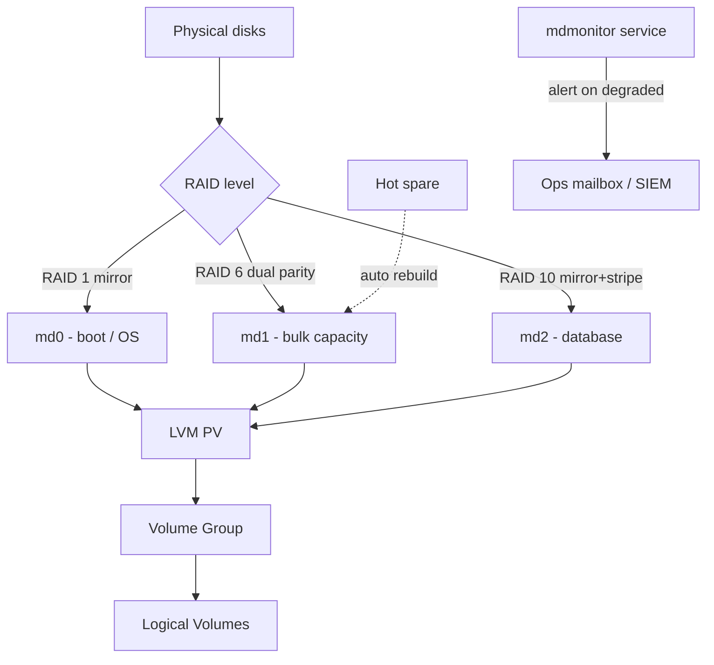

# Software RAID with mdadm

**Level:** Intermediate
**Tree:** [Storage & Filesystems in Depth](../README.md)
**Branch:** [Advanced Local Storage](README.md)
**Forest:** [Linux](../../../README.md)

## Explanation

# Software RAID with mdadm

Hardware RAID controllers hide disk state behind vendor tooling and a battery-backed cache. Linux software RAID (md) puts the same redundancy in the kernel, visible and scriptable, and on modern NVMe it is frequently faster because there is no controller bottleneck.

## Choosing a level

**RAID 1** mirrors: capacity halves, reads scale, a single disk loss is survivable. Use it for boot and for small OS volumes.

**RAID 5** stripes with one parity block: n-1 usable, survives one failure. Avoid it on large modern disks - a rebuild reads every remaining disk in full, and the window where a second failure kills the array is measured in hours.

**RAID 6** carries two parity blocks: survives two failures and is the honest minimum for arrays built from multi-terabyte disks.

**RAID 10** mirrors then stripes: half the capacity, but rebuilds copy from one surviving mirror rather than recomputing parity across the whole set, so rebuild time and risk drop sharply. For databases this is usually the correct answer.

## The parts that bite

An array is not protected until a **spare** exists and **monitoring** actually reaches a human. mdadm can email on failure, but on a system with no configured MTA that mail goes nowhere and the array quietly runs degraded for months.

The **write-intent bitmap** matters: without it, a dirty shutdown forces a full resync of the entire array; with it, only the regions marked dirty are resynced. The cost is a small write penalty, and it is almost always worth paying.

Finally, **/etc/mdadm.conf must be regenerated and the initramfs rebuilt** after creating an array that hosts the root filesystem, or the system will not assemble it at boot.

## Rollback

Creating an array is **destructive to its members** and does not roll back - mdadm --create writes superblocks over whatever was there. The reversible operations are the incremental ones: a device added with --add can be removed with --fail then --remove once the array has finished rebuilding.

Stopping an array with --stop is safe and reversible; **zeroing a superblock is not**. mdadm --zero-superblock removes the array membership permanently, and doing it to the wrong device is how a degraded array becomes a lost one.

## Security implications

RAID is **availability, not confidentiality**, and conflating the two is the risk. A mirrored disk leaving the building for RMA carries a complete readable copy of the data, so disk-level encryption underneath the array is what makes disposal safe.

Layer order matters: **LUKS beneath the array** encrypts each member, so a removed disk is useless on its own. Encrypting above the array protects the volume but leaves each member device holding plaintext extents.

## Monitoring

The signal is **array state and rebuild progress**, and it must be pushed rather than polled by a human. mdadm --monitor with a mail or script action reports a failed member; /proc/mdstat shows the rebuild and its estimated completion.

The state that matters most is **degraded**, because a degraded array still serves data and looks healthy to anything checking mounts. A mirror running on one disk has no redundancy left and is one failure from total loss, which is precisely when nobody notices.

## High availability and disaster recovery

Software RAID protects against **disk failure and nothing else** - not controller failure, not host failure, not corruption, and not deletion. It is not a backup, and it is worth stating plainly because it is routinely treated as one.

Rebuild time is the real exposure window. A large array can take hours to days, and during a rebuild the surviving disks are under sustained read load - which is exactly when a second, correlated failure occurs in disks of the same age and batch. Plan the rebuild window into the recovery model.

## Anti-patterns

**Forgetting the initramfs rebuild after creating a root array.** The system will not assemble it at boot, and the failure appears at the next reboot rather than at change time.

**Building an array from disks of one make, model and batch.** They tend to fail together, and the second failure lands during the rebuild of the first.

**Treating RAID as backup.** It replicates deletion and corruption faithfully and instantly.

## Change control

Adding a spare or replacing a failed member is **routine and low risk**. Creating an array over existing devices is neither, because it is destructive and unrecoverable, so it belongs in a window with the device identity independently verified.

The specific check worth gating is **device identity by serial or WWN, not by /dev/sdX**. Enumeration order is not stable, and the consequence of acting on the wrong device here is total data loss on that device.

## Architecture and flow



## Commands

### Command 1

Create a RAID 10 array from four devices

```text
mdadm --create /dev/md0 --level=10 --raid-devices=4 /dev/sd{b,c,d,e}
```

### Command 2

Full array state: level, devices, sync status and any failed member

```text
mdadm --detail /dev/md0
```

### Command 3

Live view of all arrays and rebuild progress with an ETA

```text
cat /proc/mdstat
```

### Command 4

Add a hot spare so rebuild starts automatically on failure

```text
mdadm --add /dev/md0 /dev/sdf
```

### Command 5

Deliberately fail and remove a member - how you rehearse a disk swap

```text
mdadm --fail /dev/md0 /dev/sdb --remove /dev/md0 /dev/sdb
```

### Command 6

Persist the array definition and rebuild initramfs so it assembles at boot

```text
mdadm --detail --scan >> /etc/mdadm.conf; dracut -f
```

### Command 7

Enable the write-intent bitmap to avoid full resyncs after a dirty shutdown

```text
mdadm --grow /dev/md0 --bitmap=internal
```

### Command 8

Start a consistency scrub to surface latent bad blocks before a rebuild needs them

```text
echo check > /sys/block/md0/md/sync_action
```

## Automation scripts

### RAID health report with degraded-array alerting

```bash
#!/usr/bin/env bash
# Reports every md array and exits non-zero if any is not clean.
set -euo pipefail

rc=0
for md in /dev/md[0-9]*; do
  [ -b "$md" ] || continue
  state=$(mdadm --detail "$md" | awk -F: '/State :/{gsub(/^ +/,"",$2); print $2}')
  spares=$(mdadm --detail "$md" | awk -F: '/Spare Devices/{gsub(/ /,"",$2); print $2}')
  printf '%-12s state=%-28s spares=%s\n' "$md" "$state" "$spares"
  case "$state" in
    *degraded*|*FAILED*|*inactive*) echo "  ALERT: $md needs attention"; rc=1 ;;
  esac
  if [ "${spares:-0}" -eq 0 ]; then
    echo "  WARN: $md has no hot spare - rebuild will not start automatically"
  fi
done
exit $rc
```

## Lab

**Objective:** Build a RAID 10 array, rehearse a disk failure end to end, and prove the array survives a reboot.

### Steps

1. Attach five 2 GiB disks to the VM and confirm them with lsblk.
2. Create a RAID 10 array from four of them and watch the initial sync in /proc/mdstat.
3. Add the fifth disk as a hot spare and confirm it appears in mdadm --detail.
4. Create an LVM PV/VG/LV on top of the array, format XFS and mount it with data on it.
5. Fail one member deliberately and observe the spare take over and rebuild automatically.
6. Persist the config to /etc/mdadm.conf, rebuild the initramfs and reboot.

### Validation

After reboot the array assembles automatically, mdadm --detail reports a clean state, and the data written before the simulated failure is intact and readable.

## Operational automation

## Automating RAID at fleet scale

**Build arrays from a partitioning template, never by hand.** Kickstart can express md arrays directly, which means every host in a build wave gets the identical layout and the layout is reviewable in git.

**Monitor centrally, not by mail.** The mdmonitor service can run an arbitrary program on a state change - point it at a script that writes to your metrics endpoint or opens a ticket, rather than relying on local mail nobody reads.

**Scrub on a schedule.** A monthly consistency check finds latent bad sectors while the array is still redundant. Discovering them during a rebuild is how single-disk failures become data loss.

**Alert on the spare count, not just on failure.** An array running with zero spares is one failure away from degraded with no automatic recovery; that state deserves a warning of its own.

## Troubleshooting

### Scenario 1: Array does not assemble after reboot and the system drops to emergency mode

**Likely cause:** /etc/mdadm.conf was never updated, or the initramfs was not rebuilt after the array was created

**Resolution:** Boot from rescue media, run mdadm --detail --scan >> /etc/mdadm.conf, then dracut -f and reboot

### Scenario 2: Rebuild is extremely slow and hurts application performance

**Likely cause:** Rebuild speed limits are conservative by default, or the array is competing with production IO

**Resolution:** Tune /proc/sys/dev/raid/speed_limit_min and speed_limit_max, and schedule rebuilds outside peak windows where possible

### Scenario 3: A disk was replaced but the array still shows degraded

**Likely cause:** The new device was added as a spare but never triggered a rebuild, or it was added to the wrong array

**Resolution:** Confirm with mdadm --detail which slot is missing, then mdadm --add the device to that specific array

### Scenario 4: Full resync runs after every unclean shutdown

**Likely cause:** No write-intent bitmap is configured, so md cannot tell which regions were dirty

**Resolution:** Enable it with mdadm --grow /dev/mdX --bitmap=internal

## Interview questions

### 1. Why is RAID 5 discouraged on large modern disks?

Because a rebuild must read every remaining disk in the array in full. On multi-terabyte drives that takes many hours, and the array is non-redundant for the whole window. The probability of hitting an unrecoverable read error or a second disk failure during that window is no longer negligible, and either one loses the array. RAID 6 or RAID 10 keeps redundancy during the rebuild.

### 2. What is a write-intent bitmap and what does it cost?

It is a record of which regions of the array have outstanding writes. After an unclean shutdown md resyncs only those regions instead of the entire array, turning a multi-hour resync into seconds. The cost is a small additional write to the bitmap on each write, which is usually a very good trade.

### 3. RAID gives you redundancy. Does it give you backup?

No, and conflating the two is a common and expensive mistake. RAID protects against a device failing. It does nothing about deletion, corruption, ransomware or a bad change, because every one of those is faithfully replicated to all members instantly. You still need backups with a tested restore and an immutable copy.

## Certification alignment

- RHCSA EX200 - manage local storage and create/configure filesystems
- RHCE EX294 - automate storage configuration with Ansible
- CompTIA Linux+ XK0-005 - manage storage and RAID
- LFCS - operation of running systems and storage management

## References

- Red Hat documentation - Managing RAID (Configuring and managing storage devices)
- man 8 mdadm and man 4 md - authoritative behaviour and options
- Linux RAID wiki - RAID level selection and recovery procedures
- Vendor guidance on rebuild times and unrecoverable read error rates for the disks in use

## Suggested video search

Linux mdadm software RAID create rebuild monitoring tutorial

---

> Validate commands, versions, permissions, licensing, and rollback procedures in an isolated lab before production use.
