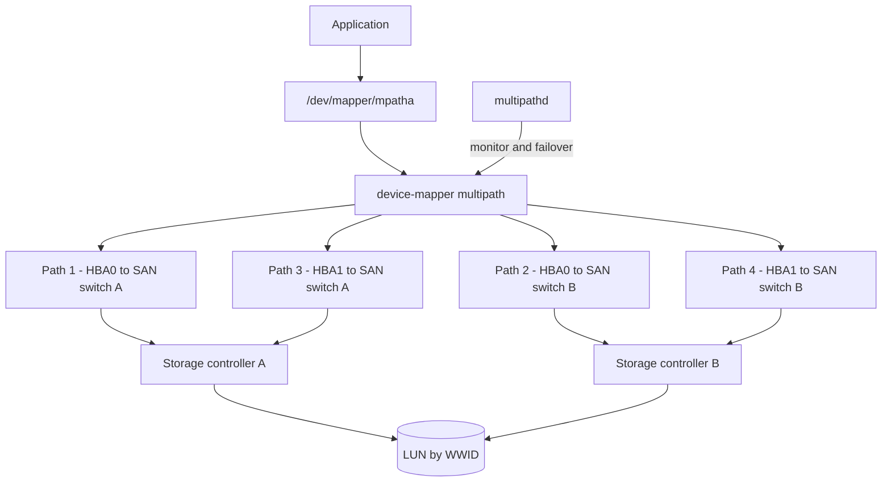

# Multipath, Fibre Channel and NVMe over Fabrics

**Level:** Advanced
**Tree:** [Storage & Filesystems in Depth](../README.md)
**Branch:** [Advanced Local Storage](README.md)
**Forest:** [Linux](../../../README.md)

## Explanation

# Multipath, Fibre Channel and NVMe over Fabrics

Enterprise storage is reached over more than one path so that a failed HBA, cable, or switch does not take the LUN away. Without multipath configured, Linux presents the same LUN once per path - /dev/sdb, /dev/sdc, /dev/sdd, /dev/sde for one LUN over four paths - and writing to any of them individually risks corruption.

## What device-mapper multipath does

The **multipathd** daemon groups those duplicate block devices into a single /dev/mapper device identified by the LUN WWID, and handles path failure, restoration and IO scheduling across paths. Applications address the mapper device and never see path churn.

**Path grouping** matters on active/passive arrays: paths to the non-owning controller are higher priority cost, and sending IO down them causes a LUN trespass and a performance collapse. The prio setting and the array vendor device stanza exist to get this right.

## Fibre Channel specifics

FC zoning happens on the switch, not on the host. A LUN that does not appear is far more often a zoning or LUN-masking problem than a Linux problem - check that the host WWPN is in the zone and in the array host group before touching multipath.conf.

## NVMe over Fabrics

NVMe/TCP and NVMe/FC replace SCSI semantics with NVMe queues and dramatically lower latency. Multipathing moves into the NVMe subsystem itself (native ANA multipathing) rather than device-mapper, which is why nvme list-subsys rather than multipath -ll is the tool that tells you the truth.

## Architecture and flow



## Commands

### Command 1

Show every multipath device, its WWID, path groups and per-path status

```text
multipath -ll
```

### Command 2

Verbose discovery output - the fastest way to see why a device was rejected or blacklisted

```text
multipath -v3 2>&1 | less
```

### Command 3

Create a baseline /etc/multipath.conf and start the daemon

```text
mpathconf --enable --with_multipathd y
```

### Command 4

Read local HBA WWPNs and link state - what the SAN team needs for zoning

```text
systool -c fc_host -v | grep -E "port_name|port_state"
```

### Command 5

Force a loop initialisation to rescan the fabric after a zoning change

```text
echo "1" > /sys/class/fc_host/host0/issue_lip
```

### Command 6

Discover newly presented LUNs without rebooting

```text
/usr/bin/rescan-scsi-bus.sh -a
```

### Command 7

Show NVMe subsystems and their ANA path state - the NVMe equivalent of multipath -ll

```text
nvme list-subsys
```

### Command 8

Attach an NVMe/TCP namespace over the network

```text
nvme connect -t tcp -a 10.0.0.10 -s 4420 -n nqn.2024-01.com.example:target
```

## Automation scripts

### Multipath path-count auditor

```bash
#!/usr/bin/env bash
# Flags any multipath device running with fewer active paths than expected.
set -euo pipefail
EXPECTED="${1:-4}"

rc=0
while read -r name; do
  [ -n "$name" ] || continue
  active=$(multipath -ll "$name" | grep -c "active ready running" || true)
  failed=$(multipath -ll "$name" | grep -c "failed faulty" || true)
  printf '%-16s active=%-3s failed=%-3s\n' "$name" "$active" "$failed"
  if [ "$active" -lt "$EXPECTED" ]; then
    echo "  ALERT: $name has $active/$EXPECTED active paths"
    rc=1
  fi
done < <(multipath -l -v1)
exit $rc
```

## Lab

**Objective:** Present a LUN over multiple paths, prove that pulling a path does not interrupt IO, and identify the device by WWID rather than by /dev/sdX.

### Steps

1. Install the storage inspection tooling first - none of it is default on a minimal RHEL 9 or 10: dnf install -y device-mapper-multipath sysfsutils sg3_utils. sysfsutils provides systool for reading FC host state and sg3_utils provides rescan-scsi-bus.sh, both used later in this lab.
2. Present one iSCSI or FC LUN to the host over at least two paths and confirm duplicate /dev/sdX devices appear.
3. Enable multipath with mpathconf and confirm a single /dev/mapper device now represents the LUN.
4. Record the WWID and confirm it is stable across a reboot, unlike the /dev/sdX names.
5. Start a sustained write to a filesystem on the mapper device.
6. Disable one path (offline the port or block it on the switch) and confirm IO continues while multipath -ll shows the path failed.
7. Restore the path and confirm it returns to active ready running without intervention.

### Validation

A sustained write continues without error for the whole duration of a deliberate path failure - not merely completing afterwards, but never reporting an IO error at the application,multipath -ll shows the failed path move to failed faulty running and then return to active ready on its own, with no manual intervention,The mount and any fstab entry reference the /dev/mapper WWID device, and no /dev/sdX name appears anywhere in the storage configuration,Path failure and recovery are both visible in the journal, so the event can be evidenced after the fact rather than only observed live

## Operational automation

## Automating multipath safely

**Never let a host address /dev/sdX for SAN storage.** Those names are discovery-order dependent and will change. Use the /dev/mapper WWID device or a multipath alias, and set the alias in configuration management so it is identical on every cluster node.

**Ship one multipath.conf per array model.** The vendor stanza controls path priority, failback and no_path_retry; getting it wrong on an active/passive array causes LUN trespass storms that look like a storage problem but are a host configuration problem.

**Alert on degraded path count, not just on total loss.** A LUN running on one of four paths is working perfectly and is one failure from an outage - only a path-count check catches it.

**Automate LUN discovery, but gate the filesystem step.** Rescanning is safe and idempotent; creating filesystems is not, so keep that behind an explicit approval.

## Troubleshooting

### Scenario 1: A newly presented LUN does not appear on the host at all

**Likely cause:** Zoning or LUN masking on the SAN side, not a Linux issue

**Resolution:** Confirm the host WWPN from systool is in the zone and in the array host group, then rescan with rescan-scsi-bus.sh

### Scenario 2: multipath -ll shows the device but with only half the expected paths

**Likely cause:** One HBA, cable or fabric is down, or one path is blacklisted in multipath.conf

**Resolution:** Check port_state per fc_host, and run multipath -v3 to see whether a device was explicitly rejected

### Scenario 3: IO pauses for tens of seconds when a path fails

**Likely cause:** no_path_retry and fast_io_fail_tmo are at conservative defaults for the array model

**Resolution:** Apply the vendor device stanza; set fast_io_fail_tmo and dev_loss_tmo per vendor guidance

### Scenario 4: Performance collapses intermittently on an active/passive array

**Likely cause:** IO is being sent down paths to the non-owning controller, causing repeated LUN trespass

**Resolution:** Set the correct prio and path_grouping_policy for the array so only owning-controller paths are in the active group

## Interview questions

### 1. Why must you never mount /dev/sdb directly on a SAN-attached host?

Because with multiple paths the same LUN appears as several /dev/sdX devices, and those names are assigned in discovery order so they change between boots. Writing through a single path bypasses multipath failover, and if two paths are used independently you can corrupt the filesystem. Always address the /dev/mapper WWID device.

### 2. How does multipathing differ for NVMe over Fabrics?

NVMe has native multipathing through ANA (Asymmetric Namespace Access) built into the NVMe subsystem, rather than relying on device-mapper. The kernel presents a single namespace device and handles path state itself, so nvme list-subsys shows the path topology rather than multipath -ll. It is lower overhead and lower latency than the SCSI plus dm-multipath stack.

### 3. A LUN is visible but performance is poor and inconsistent. Where do you look?

First check whether the array is active/passive and whether IO is going to the non-owning controller - that causes trespass and is the classic cause. Verify path_grouping_policy and prio match the vendor stanza. Then check path count and queue depth, and confirm the scheduler and rq_affinity settings are appropriate. Only after that would I suspect the array itself.

## Certification alignment

- RHCSA EX200 - configure and manage storage
- Red Hat EX358 - services management and automation
- SNIA storage networking fundamentals
- Vendor storage administration certifications (Dell, NetApp, Pure)

## References

- Red Hat documentation - Configuring device mapper multipath
- man 5 multipath.conf - every option and its default
- NVM Express specification - Asymmetric Namespace Access
- Storage vendor host connectivity guide for the specific array model

## Suggested video search

Linux device mapper multipath fibre channel NVMe over fabrics configuration

---

> Validate commands, versions, permissions, licensing, and rollback procedures in an isolated lab before production use.
