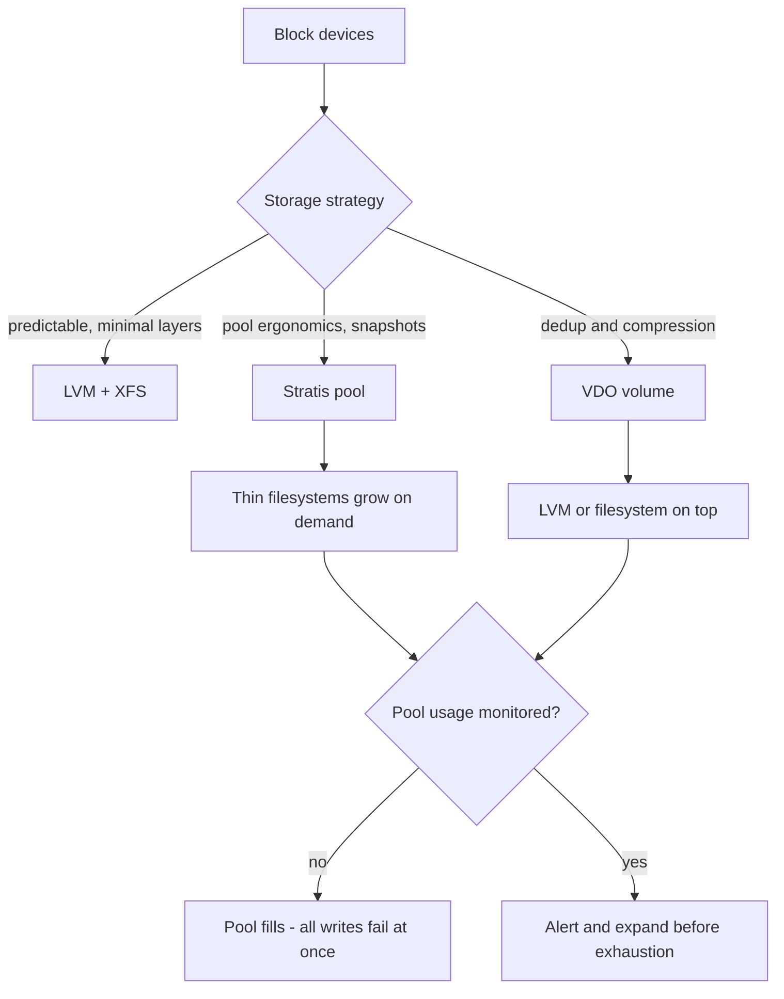

# Stratis, VDO and Modern Storage Efficiency

**Level:** Intermediate
**Tree:** [Storage & Filesystems in Depth](../README.md)
**Branch:** [Advanced Local Storage](README.md)
**Forest:** [Linux](../../../README.md)

## Explanation

# Stratis, VDO and Modern Storage Efficiency

LVM plus XFS is powerful but verbose: creating a thin-provisioned, snapshot-capable pool is several commands and a good deal of knowledge. Two Red Hat technologies address different parts of that.

## Stratis

**Stratis** is a management layer that sits on top of device-mapper and XFS and presents a simple pool-and-filesystem model, closer to ZFS or Btrfs in ergonomics while reusing components that are already proven in production. You create a pool from block devices, then create filesystems in it; both grow on demand and snapshots are one command.

Stratis filesystems are thin-provisioned by design, which means the pool can be over-committed. That is a feature until the pool fills, at which point every filesystem in it stops accepting writes at once. **Monitoring pool usage is not optional.**

## VDO

**VDO** (Virtual Data Optimizer) provides inline deduplication and compression as a block layer. Its wins are dramatic for workloads with genuine redundancy - VM images, container registries, backup targets - and close to zero for already-compressed data such as video or encrypted blobs, where it costs CPU for nothing.

The critical operational fact is the same as Stratis: VDO presents more logical space than exists physically. You must monitor physical usage and understand that a full VDO volume is an outage, not a warning.

## Choosing

Use plain LVM+XFS when you want predictability and minimal layers. Use Stratis when you want snapshots and growth ergonomics. Use VDO when the data genuinely deduplicates and you have measured that it does.

## Architecture and flow



## Commands

### Command 1

Create a Stratis pool from two block devices

```text
stratis pool create data /dev/sdb /dev/sdc
```

### Command 2

Create a thin, auto-growing filesystem inside the pool

```text
stratis filesystem create data shared
```

### Command 3

Take an instant snapshot before a risky change

```text
stratis filesystem snapshot data shared shared-before-upgrade
```

### Command 4

Show physical usage versus logical size - the number that matters is physical

```text
stratis pool list; stratis filesystem list
```

### Command 5

Create a VDO volume presenting 500G logical over 100G physical

```text
lvcreate --type vdo -n vdolv -L 100G -V 500G vg0
```

### Command 6

Report physical usage, space savings and dedup/compression ratios

```text
vdostats --human-readable
```

### Command 7

Expand a pool online by adding another device

```text
stratis pool add-data data /dev/sdd
```

### Command 8

Confirm the underlying XFS geometry Stratis created

```text
xfs_info /mnt/shared
```

## Automation scripts

### Thin-pool exhaustion early warning

```bash
#!/usr/bin/env bash
# Warns before a Stratis pool or VDO volume runs out of PHYSICAL space.
# Thin provisioning fails hard: at 100% every filesystem stops writing at once.
set -euo pipefail
WARN="${1:-75}"
CRIT="${2:-90}"
rc=0

if command -v stratis >/dev/null 2>&1; then
  stratis --unhyphenated-uuids pool list 2>/dev/null | tail -n +2 | while read -r name total used rest; do
    [ -n "${name:-}" ] || continue
    echo "stratis pool $name used=$used of $total"
  done
fi

if command -v vdostats >/dev/null 2>&1; then
  vdostats --verbose 2>/dev/null | awk -F: '/used percent/{gsub(/ /,"",$2); print "vdo used percent: " $2}'
  pct=$(vdostats --verbose 2>/dev/null | awk -F: '/used percent/{gsub(/ /,"",$2); print $2; exit}')
  if [ -n "${pct:-}" ]; then
    if [ "$pct" -ge "$CRIT" ]; then echo "CRITICAL: VDO physical usage ${pct}%"; rc=2
    elif [ "$pct" -ge "$WARN" ]; then echo "WARNING: VDO physical usage ${pct}%"; rc=1; fi
  fi
fi
exit $rc
```

## Lab

**Objective:** Build a Stratis pool and a VDO volume, measure real space savings, and deliberately exhaust a thin pool to see how it fails.

### Steps

1. Create a Stratis pool from two disks and a filesystem inside it; mount it and write data.
2. Snapshot the filesystem, change the data, then confirm the snapshot still holds the original.
3. Expand the pool online by adding a third device and confirm capacity grows with no downtime.
4. Create a VDO volume with logical size well above physical, and copy the same file into it many times.
5. Run vdostats and record the actual dedup and compression ratio achieved.
6. Deliberately fill the VDO volume past physical capacity and observe exactly how writes fail.

### Validation

You can state the measured space-saving ratio for your test data, and you have seen first-hand that a full thin pool fails writes abruptly rather than degrading gracefully - which is why physical-usage alerting is mandatory.

## Operational automation

## Automating thin storage responsibly

**Alert on physical usage, always.** The single most important automation here is a check on physical consumption with a threshold well below 100 percent. Thin provisioning does not degrade gracefully; it stops.

**Measure dedup before deploying VDO.** Run a sample of the real data through and read vdostats. If the ratio is close to 1.0 - already-compressed media, encrypted data - VDO is pure CPU cost with no benefit and should not be used.

**Automate snapshot lifecycle.** Stratis snapshots are cheap to create and easy to forget; without an expiry job they accumulate and consume the pool they were meant to protect.

**Codify pool creation.** Pool and filesystem creation belongs in Ansible so that the layout is identical across hosts and reviewable, rather than typed once and undocumented.

## Troubleshooting

### Scenario 1: All filesystems in a Stratis pool suddenly stop accepting writes

**Likely cause:** The pool exhausted physical space - thin provisioning over-committed and the backing devices filled

**Resolution:** Add a device with stratis pool add-data immediately, then free space; put a physical-usage alert in place so this cannot recur silently

### Scenario 2: VDO shows almost no space saving

**Likely cause:** The data is already compressed or encrypted, so there is nothing to deduplicate or compress

**Resolution:** Measure with vdostats on representative data before committing; if the ratio is near 1.0, use plain LVM instead and save the CPU

### Scenario 3: Stratis pool does not come back after reboot

**Likely cause:** The stratisd service is not enabled, or a member device changed name and the pool metadata was not re-read

**Resolution:** Enable and start stratisd, then confirm with stratis pool list; Stratis identifies devices by signature, so re-scan rather than editing fstab

### Scenario 4: Write performance on VDO is much worse than the underlying disks

**Likely cause:** Deduplication and compression are CPU-bound, and the index may not fit in memory for the volume size

**Resolution:** Check CPU saturation during writes and size the UDS index memory appropriately for the volume; consider disabling compression if only dedup is wanted

## Interview questions

### 1. What is the operational risk of thin provisioning, and how do you manage it?

The logical space presented exceeds the physical space available, so the system can promise more than it can deliver. When physical space runs out, every filesystem in the pool stops accepting writes simultaneously - it is an abrupt outage, not a gradual degradation. The management is non-negotiable monitoring of physical usage with alerting well below 100 percent, plus a rehearsed procedure to add capacity online.

### 2. When would you choose VDO, and when is it a bad idea?

VDO earns its CPU cost where data genuinely repeats - virtual machine images, container layers, backup repositories - where ratios of 3:1 or better are realistic. It is a bad idea for already-compressed or encrypted data such as media files or encrypted backups, where the ratio approaches 1:1 and you pay CPU and latency for no benefit. The correct approach is to measure with vdostats on real sample data before committing.

### 3. How does Stratis differ from LVM plus XFS, given it is built on them?

It is a management layer, not a new storage engine. Stratis uses device-mapper and XFS underneath but presents a pool-and-filesystem model where filesystems are thin and grow automatically, and snapshots are a single command. You trade some explicit control for much better ergonomics. If you need precise control over layout and predictable allocation, plain LVM is still the right tool.

## Certification alignment

- RHCSA EX200 - configure and manage local storage
- RHCE EX294 - automate storage tasks with Ansible
- Red Hat storage administration curriculum
- CompTIA Linux+ XK0-005 - storage management concepts

## References

- Red Hat documentation - Managing file systems and Managing storage devices
- Stratis project documentation - pool and filesystem model
- VDO documentation - sizing the UDS index and measuring savings
- man 8 vdostats and man 8 stratis

## Suggested video search

Red Hat Stratis VDO deduplication compression storage tutorial RHEL

---

> Validate commands, versions, permissions, licensing, and rollback procedures in an isolated lab before production use.
