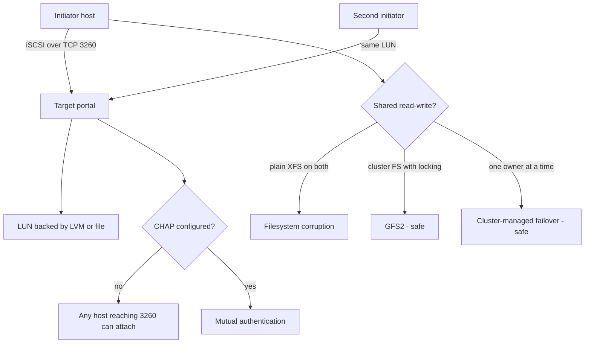

# iSCSI Target and Initiator Configuration

**Level:** Intermediate
**Tree:** [Storage & Filesystems in Depth](../README.md)
**Branch:** [Network & Shared Storage](README.md)
**Forest:** [Linux](../../../README.md)

## Explanation

# iSCSI Target and Initiator Configuration

iSCSI carries SCSI commands over TCP/IP, giving block storage over ordinary Ethernet without the cost of a Fibre Channel fabric. To the initiator the result is indistinguishable from a local disk - which is exactly the point, and also the source of most mistakes.

## Block, not file

An iSCSI LUN is a **block device**, so unlike NFS it cannot be safely mounted read-write by two hosts at once. Doing so corrupts the filesystem almost immediately, because each host caches metadata independently. Shared access requires a cluster filesystem such as GFS2 with proper locking, or the LUN must be owned by one node at a time under cluster control.

## Naming and discovery

Everything is identified by **IQN** - a structured name like iqn.2024-01.com.example:storage.disk1. The target exposes LUNs; the initiator has its own IQN in /etc/iscsi/initiatorname.iscsi, and access control on the target is usually based on that IQN. Changing an initiator IQN silently breaks access.

Discovery uses **sendtargets** against the portal, then login establishes the session. Sessions can be marked to start automatically at boot, which is normally what you want for persistent storage - but the filesystem mount must then use _netdev in fstab so it is not attempted before the network and session exist.

## Making it production-grade

Use a **dedicated storage network or VLAN**, ideally with jumbo frames end to end. Use **CHAP** authentication at minimum - without it, any host that can reach the portal and guess or read an IQN can attach the LUN. And use **multipath** over at least two portals so a single network path failure does not take the storage away.

## Architecture and flow



## Commands

### Command 1

Interactive shell to define backstores, targets, LUNs and ACLs on the target side

```text
targetcli
```

### Command 2

Read this host IQN - the identity the target grants access to

```text
cat /etc/iscsi/initiatorname.iscsi
```

### Command 3

Discover targets offered by a portal

```text
iscsiadm -m discovery -t sendtargets -p 10.0.0.10
```

### Command 4

Log in and attach the LUN as a local block device

```text
iscsiadm -m node -T iqn.2024-01.com.example:disk1 -p 10.0.0.10 --login
```

### Command 5

Detailed session state including the mapped device names

```text
iscsiadm -m session -P 3
```

### Command 6

Make the session reconnect automatically at boot

```text
iscsiadm -m node -T <iqn> -p <portal> --op update -n node.startup -v automatic
```

### Command 7

Confirm which block devices arrived over iSCSI transport

```text
lsscsi; lsblk -o NAME,SIZE,TYPE,TRAN
```

### Command 8

Cleanly detach - always do this before removing the LUN on the target

```text
iscsiadm -m node -T <iqn> -p <portal> --logout
```

## Automation scripts

### iSCSI session and multipath verifier

```bash
#!/usr/bin/env bash
# Confirms every configured iSCSI node has a live session and redundant paths.
set -uo pipefail
rc=0

mapfile -t nodes < <(iscsiadm -m node 2>/dev/null | awk '{print $2}' | sort -u)
if [ "${#nodes[@]}" -eq 0 ]; then
  echo "No iSCSI nodes configured"; exit 0
fi

for iqn in "${nodes[@]}"; do
  sessions=$(iscsiadm -m session 2>/dev/null | grep -c "$iqn" || true)
  printf '%-52s sessions=%s\n' "$iqn" "$sessions"
  if [ "$sessions" -eq 0 ]; then
    echo "  ALERT: no active session for $iqn"
    rc=1
  elif [ "$sessions" -lt 2 ]; then
    echo "  WARN: only one path to $iqn - no redundancy"
  fi
done

if command -v multipath >/dev/null 2>&1; then
  echo "== multipath =="
  multipath -ll 2>/dev/null | grep -E "^mpath|status=" || echo "  no multipath devices"
fi
exit $rc
```

## Lab

**Objective:** Serve a LUN with targetcli, attach it from two initiators, and demonstrate why shared block access without a cluster filesystem destroys data.

### Steps

1. On the target host, create a backstore and target with targetcli and grant access to a specific initiator IQN.
2. From the first initiator, discover and log in, then confirm a new block device appeared.
3. Create an XFS filesystem, mount it, write files and confirm they read back.
4. Grant the same LUN to a second initiator, log in, and mount the same filesystem read-write on both.
5. Write from both hosts simultaneously, then unmount and run xfs_repair to observe the damage.
6. Reconfigure with CHAP authentication and confirm an initiator without credentials is refused.

### Validation

The same LUN mounted read-write on two hosts produces observable corruption - inconsistent directory listings or filesystem errors in dmesg - rather than the two hosts simply disagreeing,The cause can be stated precisely: each host cached metadata independently because nothing coordinated the two, which is why a cluster filesystem or single-owner control is required,The target rejects an initiator whose IQN is not in the ACL, and the refusal is visible in the initiator log rather than presenting as a generic connection failure,The iSCSI mount carries _netdev in fstab and the host reboots cleanly, proving the boot does not wait on a block device the network has not yet provided

## Operational automation

## Automating iSCSI

**Pin the initiator IQN in configuration management.** It is generated at install time and is the identity the target authorises; a rebuilt host with a new IQN silently loses access to its storage.

**Always use _netdev in fstab for iSCSI-backed filesystems**, or the boot will attempt the mount before the network and session exist and drop to emergency mode. This is the most common iSCSI boot failure.

**Automate session verification, not just session creation.** A configured node with no active session looks fine in configuration and is completely broken in reality.

**Treat CHAP secrets as secrets.** They belong in a vault and should be templated in at deploy time, never committed alongside the target definition.

## Troubleshooting

### Scenario 1: System drops to emergency mode at boot after adding iSCSI storage

**Likely cause:** The fstab entry lacks _netdev so systemd attempted the mount before networking and the iSCSI session were available

**Resolution:** Add _netdev (and x-systemd.requires=iscsi.service if needed) to the fstab options and reboot

### Scenario 2: Filesystem corruption appears on an iSCSI LUN used by two hosts

**Likely cause:** The same block device was mounted read-write on both, and each cached metadata independently

**Resolution:** This is a design error, not a bug: use a cluster filesystem such as GFS2 with proper locking, or ensure only one node mounts the LUN at a time under cluster control

### Scenario 3: Initiator can discover the target but login is refused

**Likely cause:** The initiator IQN is not in the target ACL, or CHAP credentials are wrong or one-way where mutual is required

**Resolution:** Confirm the IQN in /etc/iscsi/initiatorname.iscsi matches the ACL on the target, and verify CHAP settings on both sides

### Scenario 4: IO stalls for a long time when a network path fails

**Likely cause:** Single path with default replacement timeout, so the initiator waits before giving up

**Resolution:** Configure at least two portals with multipath, and tune node.session.timeo.replacement_timeout to fail over faster

## Interview questions

### 1. What is the fundamental difference between iSCSI and NFS from a design perspective?

iSCSI presents a raw block device; NFS presents a filesystem. That difference determines everything else. Because NFS is a filesystem with a server arbitrating access, many clients can safely share it concurrently. Because iSCSI is a block device, the client owns the filesystem and its cache, so two clients mounting the same LUN read-write will corrupt it almost immediately unless a cluster filesystem with distributed locking is used. Choose iSCSI when you need block semantics such as for a database or a VM datastore, and NFS when you need shared file access.

### 2. How do you secure iSCSI?

The transport carries SCSI commands in the clear over TCP by default, so start with network isolation: a dedicated storage VLAN that is not routable from general user networks. Then use CHAP authentication, preferably mutual so the initiator also verifies the target, and use ACLs on the target restricted to specific initiator IQNs. For data in transit on an untrusted network, IPsec is the supported option. And treat the storage network as in-scope for the same hardening and monitoring as any other production network.

### 3. Why does an iSCSI-backed filesystem need _netdev in fstab?

Because the block device does not exist until the network is up and the iSCSI session has logged in. Without _netdev, systemd treats it as local storage and tries to mount it early in boot, the device is absent, the mount fails and the system drops to emergency mode. _netdev tells systemd this mount depends on the network, so it is ordered after network and remote-fs targets.

## Certification alignment

- RHCSA EX200 - configure and manage storage including network block storage
- RHCE EX294 - automate storage provisioning
- LFCS - storage management and system configuration
- Storage networking fundamentals (SNIA)

## References

- Red Hat documentation - Configuring iSCSI target and initiator (Managing storage devices)
- man 8 targetcli and man 8 iscsiadm
- RFC 7143 - Internet Small Computer System Interface (iSCSI) protocol
- Open-iSCSI project documentation on session and timeout tuning

## Suggested video search

Linux iSCSI targetcli initiator CHAP multipath configuration tutorial

---

> Validate commands, versions, permissions, licensing, and rollback procedures in an isolated lab before production use.
