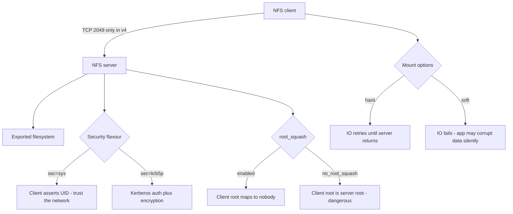

# NFS Server and Client at Enterprise Scale

**Level:** Intermediate
**Tree:** [Storage & Filesystems in Depth](../README.md)
**Branch:** [Network & Shared Storage](README.md)
**Forest:** [Linux](../../../README.md)

## Explanation

# NFS Server and Client at Enterprise Scale

NFS remains the default way Linux hosts share a filesystem, and NFSv4 changed enough that habits from v3 are actively harmful.

## Why v4 matters

**NFSv4 uses a single port (2049)** for everything - no separate portmapper, mountd and lockd ports to open. This alone simplifies firewalling enormously and is reason enough to stop deploying v3.

v4 is **stateful**, so the server tracks client opens and locks. Recovery after a server restart involves a grace period during which clients reclaim state; this is why a server reboot causes a brief pause rather than instant resumption.

**Identity mapping** changes: v4 exchanges user@domain strings rather than raw UIDs. If the NFSv4 domain does not match between client and server, files appear owned by nobody:nobody even though permissions are technically correct. This is the single most common NFSv4 support call.

## Getting the mount options right

**hard versus soft** is a correctness decision, not a performance one. With soft, an IO times out and returns an error to the application, which for most applications means silent data corruption because they do not check. Use hard, and use intr semantics so processes can be interrupted.

**sync versus async on the export** determines whether the server acknowledges writes before they are durable. async is faster and will lose data on server power loss. Know which one you have chosen and why.

## Security

Default NFS trusts the client to assert user identity, which means root on any client that can reach the export can read anything. **root_squash** is the minimum. For anything sensitive, Kerberos (sec=krb5p) provides real authentication and encryption.

## Architecture and flow



## Commands

### Command 1

Show every active export with its full option set as the kernel sees it

```text
exportfs -v
```

### Command 2

Re-read /etc/exports and apply changes without restarting the server

```text
exportfs -ra
```

### Command 3

Mount with explicit version and Kerberos privacy

```text
mount -t nfs4 -o hard,vers=4.2,sec=krb5p server:/export /mnt
```

### Command 4

Client and server operation counters - where retransmits and errors show up

```text
nfsstat -c; nfsstat -s
```

### Command 5

List exports offered by a server (v3 style; may be blocked in v4-only setups)

```text
showmount -e server
```

### Command 6

Per-mount latency and retransmission statistics - the real performance diagnostic

```text
mountstats /mnt
```

### Command 7

Check identity mapping when files show as nobody:nobody

```text
systemctl status nfs-idmapd; cat /etc/idmapd.conf
```

### Command 8

See which clients currently hold NFS connections

```text
ss -tnp state established "( dport = :2049 or sport = :2049 )"
```

## Automation scripts

### NFS mount health and stale-handle detector

```bash
#!/usr/bin/env bash
# Detects stale NFS handles and mounts that are hung, without hanging itself.
set -uo pipefail
rc=0

while read -r _ mp type _; do
  case "$type" in nfs|nfs4) ;; *) continue ;; esac
  # timeout is essential: a hung NFS mount will block stat() forever
  if ! timeout 5 stat -f "$mp" >/dev/null 2>&1; then
    echo "ALERT: $mp is not responding (hung or stale handle)"
    rc=1
    continue
  fi
  owner=$(timeout 5 stat -c %U "$mp" 2>/dev/null || echo unknown)
  if [ "$owner" = "nobody" ]; then
    echo "WARN: $mp owned by nobody - NFSv4 idmap domain mismatch likely"
    rc=1
  fi
  echo "OK: $mp responding, owner=$owner"
done < /proc/mounts
exit $rc
```

## Lab

**Objective:** Export a filesystem over NFSv4, reproduce the nobody:nobody identity problem and fix it, and prove the difference between hard and soft mounts.

### Steps

1. Install nfs-utils on BOTH hosts before starting: dnf install -y nfs-utils. It provides exportfs and nfsstat on the server and mountstats on the client, and on a minimal install neither side has it.
2. Configure an NFSv4 export with root_squash and mount it from a second host.
3. Deliberately set a mismatched NFSv4 domain on the client and observe files becoming nobody:nobody.
4. Correct the idmap domain on both sides, restart nfs-idmapd and confirm ownership resolves correctly.
5. Mount the same export twice - once hard, once soft - and start a write to each.
6. Stop the NFS server and observe the difference: the soft mount errors, the hard mount waits.
7. Restart the server and confirm the hard mount resumes cleanly with no data loss.

### Validation

A soft-mounted client returns an IO error to the application when the server is stopped, and the hard-mounted client blocks instead - the difference observed directly, not inferred,Files on the NFSv4 mount show as nobody:nobody with the domain deliberately mismatched, and show the correct owner once the domain agrees on both sides,The identity mapping fix is verified after restarting nfs-idmapd and remounting, so it is proven persistent rather than only current,A single firewall rule for port 2049 is sufficient for the v4 mount to work, demonstrating that the v3 portmapper and mountd ports are genuinely not required

## Operational automation

## Automating NFS

**Put exports in configuration management, and use exportfs -ra to apply.** Editing /etc/exports by hand on many servers guarantees drift; a change that is not applied is invisible until a client fails to mount.

**Use autofs for client mounts rather than fstab where mounts are many or intermittent.** A dead server referenced in fstab can block boot; autofs mounts on demand and times out cleanly.

**Monitor for nobody:nobody explicitly.** It is a silent misconfiguration - permissions look plausible and applications fail confusingly. A scripted ownership check catches it immediately.

**Alert on retransmissions.** Rising retransmits in nfsstat almost always mean a network or server capacity problem developing, well before users report slowness.

## Troubleshooting

### Scenario 1: All files on an NFSv4 mount are owned by nobody:nobody

**Likely cause:** NFSv4 idmap domain differs between client and server, so user@domain strings do not resolve

**Resolution:** Set the same Domain in /etc/idmapd.conf on both, restart nfs-idmapd, and clear the idmap cache; remount to confirm

### Scenario 2: Commands touching an NFS mount hang forever and cannot be killed

**Likely cause:** The server is unreachable and the mount is hard, so IO retries indefinitely by design

**Resolution:** Restore the server or network; use timeout in scripts that touch NFS, and consider mounting with a bounded retry for non-critical data

### Scenario 3: Stale file handle errors after the server was rebuilt

**Likely cause:** The exported filesystem was recreated so its file handles changed, while clients still cache the old ones

**Resolution:** Unmount and remount on the clients; use fsid= in the export to keep handles stable across server rebuilds

### Scenario 4: Write performance is poor despite a fast network

**Likely cause:** The export is sync and every write waits for server durability, or rsize/wsize are small

**Resolution:** Measure with mountstats; consider async only if the data loss risk on server power failure is acceptable, and tune rsize/wsize

## Interview questions

### 1. Why should you almost never use soft NFS mounts?

A soft mount returns an IO error to the application when the server does not respond in time. Most applications do not check every write return code, so the practical result is silent data corruption or truncated files rather than a clean failure. A hard mount blocks until the server returns, which is inconvenient but preserves correctness. The right answer to slow NFS is to fix the server or network, not to make failures silent.

### 2. What changed about identity handling in NFSv4?

v3 sent raw numeric UIDs and GIDs, so consistent numbering between hosts was sufficient. v4 exchanges user@domain strings and maps them through idmapd, so both ends must agree on the NFSv4 domain and be able to resolve the names. When they do not agree, everything maps to the anonymous user and files display as nobody:nobody even though the underlying permissions are unchanged.

### 3. How do you secure NFS properly?

Default sec=sys trusts whatever UID the client asserts, so anyone with root on a machine that can reach the export can impersonate any user. Minimum hygiene is root_squash and exporting only to specific hosts or networks, with the export network segmented. For genuinely sensitive data, use Kerberos: sec=krb5 authenticates, krb5i adds integrity, and krb5p adds encryption in transit. Firewalling to port 2049 with v4 makes the network controls straightforward.

## Certification alignment

- RHCSA EX200 - configure and manage network file systems
- RHCE EX294 - deploy NFS with Ansible roles
- LFCS - networking and service configuration
- CompTIA Linux+ XK0-005 - network file sharing

## References

- Red Hat documentation - Configuring and using network file services (NFS)
- RFC 8881 - Network File System version 4 protocol
- man 5 exports and man 5 nfs - export and mount option reference
- nfsstat and mountstats output interpretation guides

## Suggested video search

NFSv4 server client configuration idmapd Kerberos performance tuning Linux

---

> Validate commands, versions, permissions, licensing, and rollback procedures in an isolated lab before production use.
