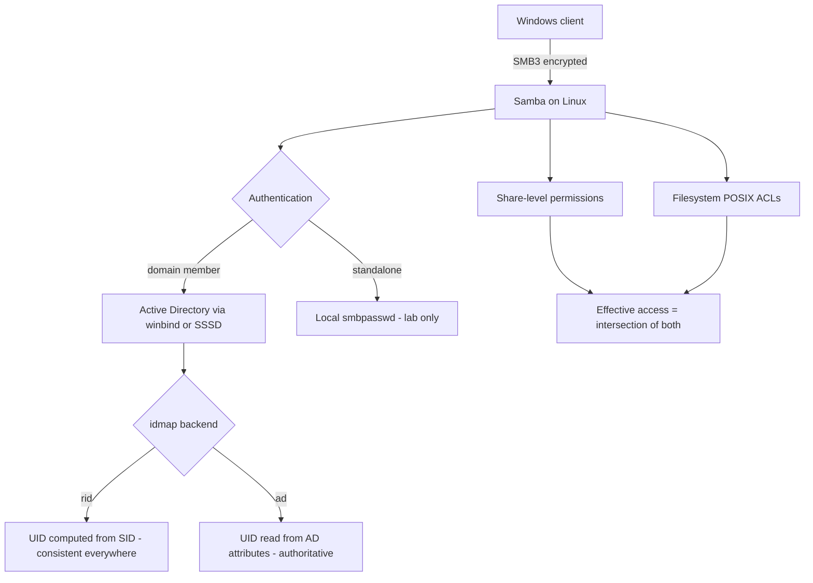

# Samba File Services and Active Directory Integration

**Level:** Intermediate
**Tree:** [Storage & Filesystems in Depth](../README.md)
**Branch:** [Network & Shared Storage](README.md)
**Forest:** [Linux](../../../README.md)

## Explanation

# Samba File Services and Active Directory Integration

Samba lets Linux serve SMB shares that Windows clients treat as native, and it is how most enterprises expose Linux-hosted storage to a Windows desktop estate.

## Domain member, not standalone

In an enterprise the interesting mode is **domain member**: the Linux host joins Active Directory, and users authenticate with their existing AD credentials while file permissions map to AD SIDs. Standalone Samba with local accounts is a lab configuration; it does not scale and it duplicates identity.

Joining is done with **realm join** or **net ads join**, and the identity plumbing is provided by **winbind** (or SSSD). Getting this right means AD users appear as real POSIX users on the Linux host, with consistent UIDs across every server - which is why the **idmap backend choice matters enormously**. The rid backend computes UIDs deterministically from the SID, so every server agrees without a database. The ad backend reads UID attributes from AD itself, which is authoritative but requires AD to be populated.

## Permissions are two layers

SMB share permissions and filesystem ACLs both apply, and the effective permission is the intersection. A user denied at either layer is denied. Most confusing Samba permission problems are someone looking at only one of the two.

Linux extended ACLs (setfacl) map reasonably to Windows ACLs, but not perfectly - inheritance semantics differ, and Samba has options to control the translation.

## Protocol versions

**SMB1 must be disabled.** It is the protocol WannaCry spread over. Modern Samba defaults to SMB2/3 and SMB3 provides encryption in transit, which should be enabled for anything sensitive.

## Architecture and flow



## Commands

### Command 1

Join the host to Active Directory and configure identity plumbing

```text
realm join --user=Administrator ad.example.com
```

### Command 2

Confirm the machine account and trust relationship are healthy

```text
net ads testjoin
```

### Command 3

List AD users and groups as winbind resolves them

```text
wbinfo -u | head; wbinfo -g | head
```

### Command 4

Prove an AD user maps to a POSIX identity on this host

```text
id "AD\\jdoe"
```

### Command 5

Validate smb.conf and show the effective configuration including defaults

```text
testparm -s
```

### Command 6

List shares as a client sees them

```text
smbclient -L //localhost -U%
```

### Command 7

Inspect and set the POSIX ACL layer that sits under the share

```text
getfacl /srv/share; setfacl -m "g:AD\\finance:rwx" /srv/share
```

### Command 8

Show active sessions, locked files and which user holds what

```text
smbstatus
```

## Automation scripts

### Samba domain-membership health check

```bash
#!/usr/bin/env bash
# Verifies the AD trust, identity resolution and that SMB1 is disabled.
set -uo pipefail
rc=0

echo "== domain trust =="
if net ads testjoin >/dev/null 2>&1; then
  echo "OK: machine account trust is valid"
else
  echo "ALERT: net ads testjoin failed - machine password may have expired"
  rc=1
fi

echo "== identity resolution =="
if wbinfo -u >/dev/null 2>&1; then
  echo "OK: winbind resolving domain users"
else
  echo "ALERT: winbind cannot enumerate domain users"
  rc=1
fi

echo "== protocol versions =="
min=$(testparm -s --parameter-name="server min protocol" 2>/dev/null | tr -d " ")
echo "server min protocol = ${min:-unset}"
case "${min:-}" in
  SMB2*|SMB3*) echo "OK: SMB1 disabled" ;;
  *) echo "ALERT: SMB1 may be enabled - set server min protocol = SMB2_10 or higher"; rc=1 ;;
esac

exit $rc
```

## Lab

**Objective:** Join a Linux host to Active Directory, serve an SMB share to AD users, and prove that share permissions and POSIX ACLs combine.

### Steps

1. Join the host to an AD domain with realm join and verify with net ads testjoin.
2. Confirm an AD user resolves to a POSIX identity with id and wbinfo.
3. Create a share in smb.conf, validate with testparm, and mount it from a Windows or smbclient session.
4. Grant access at the share level but deny it in the POSIX ACL, and confirm the user is denied.
5. Align both layers and confirm access now works, demonstrating the intersection rule.
6. Set server min protocol to SMB2_10 or higher and confirm SMB1 clients are refused.

### Validation

An AD user can read and write the share using their domain credentials, you can articulate which of the two permission layers denied access in the failing case, and SMB1 is provably disabled.

## Operational automation

## Automating Samba

**Automate the join, but treat the machine account password as a secret with a lifecycle.** Machine passwords rotate; a host whose account has expired stops authenticating users with confusing errors, so monitor net ads testjoin rather than assuming a successful join is permanent.

**Choose one idmap backend and apply it identically everywhere.** Inconsistent idmap configuration means the same AD user gets different UIDs on different servers, which breaks any shared storage underneath and produces permission errors that look random.

**Template smb.conf and validate with testparm in CI.** testparm -s exits non-zero on a broken config, so it makes a good gate before deployment.

**Audit for SMB1 continuously.** It should never come back, and a configuration drift that re-enables it is a serious security regression.

## Troubleshooting

### Scenario 1: AD users cannot authenticate although the join succeeded originally

**Likely cause:** The machine account password expired or was reset in AD, breaking the trust

**Resolution:** Run net ads testjoin to confirm, then rejoin with realm join; monitor testjoin so this is detected before users are affected

### Scenario 2: Users appear with numeric IDs instead of names, or IDs differ between servers

**Likely cause:** idmap backend is inconsistent or unconfigured across hosts

**Resolution:** Standardise on one backend (rid for deterministic mapping, ad when AD carries UID attributes) and apply the identical idmap ranges everywhere

### Scenario 3: A user has full share permissions but still gets access denied

**Likely cause:** The POSIX ACL or SELinux context on the underlying directory denies them - effective access is the intersection

**Resolution:** Check getfacl on the path and the SELinux context; set samba_share_t or the appropriate boolean, and align the ACL

### Scenario 4: Windows clients cannot connect at all after hardening

**Likely cause:** server min protocol was raised above what an old client supports, or SMB signing requirements changed

**Resolution:** Confirm the client SMB version; keep SMB2_10 as the floor for legacy clients rather than dropping back to SMB1

## Interview questions

### 1. Why does the idmap backend choice matter so much in a multi-server Samba estate?

Because it determines whether the same AD user gets the same POSIX UID on every server. With the rid backend the UID is computed deterministically from the SID, so all servers agree without coordination. With the ad backend the UID comes from AD attributes, which is authoritative but requires AD to be populated. If different servers use different backends or ranges, the same user has different UIDs, and any shared filesystem underneath will show wrong ownership and deny access unpredictably.

### 2. A user has been granted access to a share but still cannot write. Where do you look?

There are at least three layers and access requires all of them. First the Samba share-level permissions in smb.conf, second the POSIX or extended ACL on the underlying directory, and third SELinux context and booleans on a system with SELinux enforcing. Effective access is the intersection, so I would check getfacl, testparm for the share definition, and the SELinux denials in the audit log before concluding anything.

### 3. What is your position on SMB1?

It should be disabled everywhere without exception. It lacks meaningful integrity protection and is the protocol EternalBlue and WannaCry exploited. Modern Samba defaults to SMB2 as a minimum, and SMB3 additionally offers encryption in transit which should be enabled for sensitive shares. If a legacy device genuinely requires SMB1, it belongs on an isolated segment with compensating controls and a decommissioning date, not on the main file server.

## Certification alignment

- RHCSA EX200 - configure network file services
- RHCE EX294 - automate service deployment
- Microsoft AD integration fundamentals
- CompTIA Linux+ XK0-005 - file sharing services and permissions

## References

- Samba official documentation - Setting up Samba as a domain member
- Red Hat documentation - Using Samba as a server
- man 5 smb.conf - the complete parameter reference
- Microsoft guidance on disabling SMB1 and SMB signing requirements

## Suggested video search

Samba Active Directory domain member winbind idmap SMB3 configuration Linux

---

> Validate commands, versions, permissions, licensing, and rollback procedures in an isolated lab before production use.
