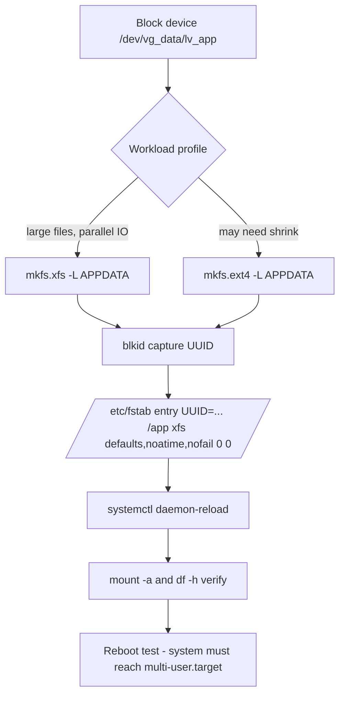

# Filesystems: XFS, ext4 and Persistent Mounts

**Level:** Intermediate
**Tree:** [System Administration](../README.md)
**Branch:** [Storage Management](README.md)
**Forest:** [Linux](../../../README.md)

## Explanation

## Choosing and operating enterprise filesystems

RHEL defaults to **XFS**: a 64-bit, journaled, extent-based filesystem tuned for large files, parallel I/O and multi-terabyte volumes. **ext4** remains supported and is occasionally preferred for workloads with huge numbers of small files or where shrink capability matters. The operational differences drive real decisions: XFS cannot shrink; ext4 can (offline). XFS repairs with xfs_repair (never fsck), ext4 with e2fsck. XFS scales metadata across allocation groups, so parallel writes from many threads perform better on large arrays.

Persistent mounting is governed by /etc/fstab or, increasingly, by systemd mount units. Always mount by **UUID or filesystem label**, never by /dev/sdX names, because device enumeration order is not stable across reboots or HBA changes. A wrong fstab line is the most common cause of a server dropping to emergency mode - mitigate with the nofail option for non-critical data volumes and always run mount -a (or on RHEL 9, systemctl daemon-reload followed by mount -a) before rebooting to test the file syntactically and functionally.

Mount options matter at enterprise scale: noatime removes an inode write per read on busy content stores; the discard option or a periodic fstrim.timer keeps SSD/thin-provisioned storage reclaiming blocks; _netdev delays network filesystems (iSCSI, NFS) until networking is up. For NFS client mounts prefer the automounter (autofs or systemd automount units) so hung servers do not block boot. Quotas (xfs_quota with uquota/pquota mount options) enforce multi-tenant limits on shared filesystems.

## Rollback

Mount options and fstab entries roll back trivially - restore the line, run **mount -a**, verify with **findmnt**. Keep a copy of fstab before editing; it is two lines of protection against the most common cause of an unbootable host.

What does not roll back is **mkfs**. Creating a filesystem destroys what was there, and no option reverses it. Nor does XFS shrink: an over-sized XFS volume cannot be reduced, only recreated and restored. That asymmetry is the reason to size conservatively and grow later, and it is the single most consequential fact in this leaf.

## Security implications

Mount options are an access control surface. **nosuid** stops setuid binaries taking effect on a filesystem, **nodev** prevents device nodes being honoured, and **noexec** blocks execution - the standard hardening set for /tmp, /var/tmp and any filesystem holding user-supplied content.

The operational cost is real: noexec on /tmp breaks installers and some package post-install scripts that stage executables there, and the failure is an obscure permission denied rather than a clear message. Apply it deliberately, and expect to grant exceptions for build hosts rather than discovering the breakage in production.

## Monitoring

Free space is the obvious signal and the incomplete one. **Inode exhaustion** presents identically to a full disk - writes fail with no space left on device - while df shows plenty of space free. Monitor **df -i** alongside df, or the alert will point at the wrong thing during the incident.

The second is **read-only remount**. XFS and ext4 remount read-only on metadata error to protect the filesystem, and applications then fail in confusing ways while the mount still appears present. Alert on the mount option changing to ro, and on filesystem errors in dmesg, rather than waiting for an application to notice.

## High availability and disaster recovery

Mount by **UUID or label, never /dev/sdX** - enumeration order is not stable across reboots, HBA changes or a restore onto different hardware, and this is precisely the case where a DR restore lands on a machine whose disks enumerate differently.

For clustered filesystems, the rule is that a non-cluster filesystem must be mounted on **exactly one node at a time**; mounting XFS read-write on two nodes corrupts it in seconds because each caches metadata independently. Cluster resource managers exist to enforce that, and **nofail** plus the automounter keep a hung remote filesystem from blocking boot on the surviving node.

## Anti-patterns

**Running fsck on XFS.** The tool is xfs_repair, and reaching for fsck out of habit wastes time during an incident. Always run xfs_repair -n first to see what it would do before letting it write.

**Editing fstab and rebooting to test.** A syntax error drops the host to emergency mode. Run mount -a, and on RHEL 9 systemctl daemon-reload first, so the file is proven before the reboot.

**Allocating 100% of a volume group.** Snapshots need free extents, so a fully allocated VG cannot take a snapshot at the moment a backup or a risky change most needs one.

## Change control

Adding a mount is low risk and immediately testable. **Changing mount options on an existing filesystem** is not, because the effect appears only on remount or reboot - so the change and its consequence are separated, sometimes by months.

Anything involving mkfs, resize or repair belongs in a window with a verified backup, and the verification that matters is a **test restore**, not a successful backup job. The distinction is worth stating because a backup that has never been restored is an assumption, and a filesystem repair is exactly when the assumption gets tested.

## Architecture and flow



## Commands

### Command 1

Create an XFS filesystem with a human-readable label

```text
mkfs.xfs -L APPDATA /dev/vg_data/lv_app
```

### Command 2

Show the UUID and label used for persistent fstab mounting

```text
blkid /dev/vg_data/lv_app
```

### Command 3

Test all fstab entries and confirm the mount landed with correct options

```text
mount -a && findmnt /app
```

### Command 4

Dry-run consistency check on an unmounted XFS filesystem

```text
xfs_repair -n /dev/vg_data/lv_app
```

### Command 5

Enable weekly TRIM for SSD and thin-provisioned volumes

```text
systemctl enable --now fstrim.timer
```

## Automation scripts

### provision-fs.sh

```bash
#!/usr/bin/env bash
# Format an LV with XFS and add a UUID-based fstab entry idempotently.
set -euo pipefail
DEV="/dev/vg_data/lv_app"; MP="/app"; LABEL="APPDATA"
if ! blkid "$DEV" >/dev/null 2>&1; then
  mkfs.xfs -L "$LABEL" "$DEV"
fi
UUID=$(blkid -s UUID -o value "$DEV")
mkdir -p "$MP"
if ! grep -q "$UUID" /etc/fstab; then
  cp -a /etc/fstab "/etc/fstab.bak.$(date +%F-%H%M%S)"
  echo "UUID=${UUID} ${MP} xfs defaults,noatime,nofail 0 0" >> /etc/fstab
fi
systemctl daemon-reload
mount -a
findmnt "$MP" && echo "Mounted OK"
```

## Lab

**Objective:** Provision a new XFS filesystem, mount it persistently by UUID with safe options, and prove the server survives a reboot with a deliberately broken second entry protected by nofail.

### Steps

1. Create lv_test (1 GiB) in vg_data and format with mkfs.xfs -L TESTFS.
2. Add a UUID-based fstab entry for /test with defaults,noatime,nofail.
3. Run mount -a and verify with findmnt /test.
4. Add a second fstab line pointing at a non-existent UUID with the nofail option.
5. Reboot and confirm the system boots normally and /test is mounted.

### Validation

findmnt /test shows fstype xfs and the noatime option.,blkid UUID matches the fstab entry exactly.,System reaches multi-user.target despite the bogus nofail entry.,journalctl -b shows no emergency-mode escalation.

## Operational automation

### Automating filesystem provisioning

- **Ansible**: community.general.filesystem creates the FS only if absent; ansible.posix.mount manages the fstab line and the live mount in one task - fully idempotent.
- **Kickstart**: declare the whole storage layout (part, volgroup, logvol with --fstype xfs) so machines are born correct instead of fixed later.
- **Compliance**: run a scheduled AAP job that diffs findmnt output against a CMDB-defined mount standard and reports drift (wrong options, /dev/sdX-based entries).

## Troubleshooting

### Scenario 1: Server drops to emergency mode on boot

**Likely cause:** A non-nofail fstab entry references a missing or renamed device

**Resolution:** From the emergency shell, mount / read-write (mount -o remount,rw /), fix or comment the fstab line, add nofail for data volumes, reboot

### Scenario 2: mount: unknown filesystem type

**Likely cause:** Device was never formatted, or the wrong fstype is declared in fstab

**Resolution:** Check blkid for the real TYPE, correct fstab or run the appropriate mkfs (only if the device is confirmed empty)

### Scenario 3: XFS filesystem shows corruption messages in dmesg

**Likely cause:** Unclean shutdown or underlying storage fault

**Resolution:** Unmount, run xfs_repair (replay log first by mounting once if possible), check storage-layer health before returning to service

### Scenario 4: Writes fail with no space left on device, but df reports the filesystem has ample free space

**Likely cause:** Inode exhaustion. The filesystem has free blocks but no free inodes, typically from a very large number of small files - a mail spool, a session directory, or an unrotated cache

**Resolution:** Confirm with df -i, then find the directory holding the file count. On ext4 the inode count is fixed at mkfs time, so the fix is deleting files or recreating the filesystem with a higher inode density; XFS allocates inodes dynamically and is far less prone to this

## Interview questions

### 1. Why mount by UUID instead of device path in fstab?

Kernel device names depend on probe order - adding a disk or changing an HBA can shift /dev/sdb to /dev/sdc, silently mounting the wrong volume or failing boot. UUIDs and labels live inside the filesystem metadata and are stable regardless of enumeration.

### 2. When would you still choose ext4 over XFS on RHEL?

When offline shrink capability is required, for very small volumes, or for legacy tooling that expects ext4 semantics. Also some small-file-heavy workloads benchmark comparably, so operational familiarity can decide. Otherwise XFS is the default for scale and parallelism.

### 3. What does the nofail mount option actually change?

It tells systemd not to fail the local-fs.target dependency chain if the device is absent at boot, so the system continues to multi-user instead of dropping to emergency mode. Boot continues; the mount simply does not happen. Use it for non-critical data volumes, never for filesystems the OS needs.

### 4. How do you check and repair an XFS filesystem?

Unmount it, then xfs_repair -n for a read-only assessment and xfs_repair to fix. If the log is dirty, mount and unmount once to replay it; xfs_repair -L (zeroing the log) is a last resort that can lose recent transactions.

## Certification alignment

- RHCSA EX200 - Create, mount, unmount and use xfs and ext4 file systems
- RHCSA EX200 - Mount file systems at boot by UUID or label
- RHCE EX294 - Manage mounts with ansible.posix.mount

## References

- Red Hat Documentation: Managing file systems (RHEL 9)
- man fstab, man xfs_repair, man mount
- XFS.org FAQ - design and administration notes

## Suggested video search

XFS vs ext4 RHEL 9 fstab UUID persistent mount tutorial

---

> Validate commands, versions, permissions, licensing, and rollback procedures in an isolated lab before production use.
