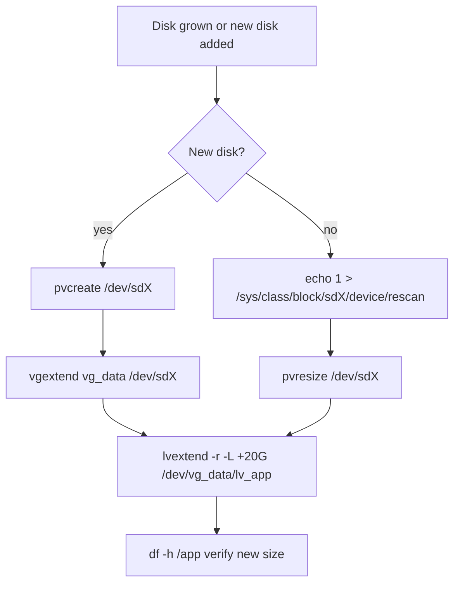

# LVM: Online Volume Extension

**Level:** Intermediate
**Tree:** [System Administration](../README.md)
**Branch:** [Storage Management](README.md)
**Forest:** [Linux](../../../README.md)

## Explanation

## Logical Volume Manager growth workflow

LVM abstracts physical disks into a three-layer stack: **Physical Volumes (PV)** are initialized block devices, **Volume Groups (VG)** pool PV extents, and **Logical Volumes (LV)** carve usable space from the pool. Because extents are the allocation unit (4 MiB by default), an LV can be grown online without downtime as long as free extents exist in the VG.

The production workflow has three stages. First, add capacity: either extend an existing virtual disk and rescan the SCSI bus, or attach a new disk and run pvcreate. Second, extend the VG with vgextend if a new PV was added. Third, grow the LV with lvextend and resize the filesystem. On RHEL 8/9 the -r flag on lvextend calls the correct filesystem resizer automatically (xfs_growfs for XFS, resize2fs for ext4), which removes the most common human error - forgetting the filesystem step and wondering why df shows no change.

Key operational rules: XFS can only grow, never shrink, so plan sizing conservatively. Always check vgs for free extents before promising capacity. Use lvextend -l +100%FREE only when you deliberately want to consume the whole VG. In virtualized estates, prefer extending the existing PV (pvresize after a disk grow) over adding many small disks, which fragments the VG and complicates DR replication. Snapshot-based backups need free VG space reserved, so never allocate 100% by default in enterprise standards.

## Rollback

Extension is **one-way for XFS**. lvextend adds extents and xfs_growfs consumes them, and neither reverses - XFS cannot shrink at all, and shrinking ext4 requires unmounting and is risky enough that restore-from-backup is usually the better answer. Size conservatively and grow again, because growing is cheap and ungrowing is not.

Where rollback does exist is **before the filesystem step**: an lvextend that has not yet been followed by a resize can be reversed with lvreduce, since the filesystem never learned about the new extents. That window closes the moment the resizer runs, which is the argument for doing the two steps deliberately rather than reflexively with -r.

## Security implications

Free extents in a volume group are a **security capability, not just capacity**. Without them no snapshot can be taken, so there is no clean point-in-time copy to preserve before a risky change and nothing to hand an investigator after an incident.

A volume group allocated to 100% therefore removes forensic capability quietly, months before it is needed. Reserving space is the control, and it is cheaper than the alternative in exactly the situation where it matters.

## Monitoring

Monitor the **volume group free extent count**, not only filesystem usage. A filesystem at 60% on a VG with zero free extents cannot be grown at all, so the reassuring number hides the constraint.

The second signal is **snapshot fill percentage**. A snapshot that reaches 100% is invalidated - silently, and the space it consumed is not returned until it is removed. lvs reports Data% and it is worth alerting on well before it saturates.

## High availability and disaster recovery

LVM metadata is the map. A volume group whose metadata is lost presents as **disks full of data nobody can assemble**, which is why vgcfgbackup output belongs with the backup rather than only in /etc/lvm/backup on the host that failed.

For clustered storage, a volume group must be active on **one node at a time** unless it is explicitly clustered. Two nodes activating the same VG read-write corrupt it, and the failure looks like filesystem damage rather than the LVM misconfiguration it actually is.

## Anti-patterns

**Allocating 100% of the volume group on build.** It reads as efficient and removes snapshot capability permanently.

**Adding many small disks instead of extending the existing one.** It fragments the VG, complicates DR replication, and multiplies the number of devices that must all be present to assemble.

**Extending without checking free extents first.** vgs answers in one second; discovering the shortfall halfway through a change window does not.

## Change control

Online extension is genuinely low risk and revertible-until-resized, so it rarely needs a window. What needs one is anything at the **hypervisor or SAN layer** - a virtual disk grow or a LUN expansion - because that is where the blast radius is and where the rescan happens.

The item worth gating is a **pvresize onto a disk that was grown incorrectly**. Growing the wrong disk is not detectable from inside the guest, so the verification belongs on the storage side before the Linux side proceeds.

## Architecture and flow



## Commands

### Command 1

Inventory the full LVM stack and see which devices back each LV

```text
pvs; vgs; lvs -a -o +devices
```

### Command 2

Initialize a new disk and add it to the volume group

```text
pvcreate /dev/sdb && vgextend vg_data /dev/sdb
```

### Command 3

Grow the LV by 20 GiB and resize the filesystem in one step

```text
lvextend -r -L +20G /dev/vg_data/lv_app
```

### Command 4

Re-read a grown physical disk so LVM sees the new capacity

```text
pvresize /dev/sda3
```

### Command 5

Manually grow an XFS filesystem to fill its LV (mountpoint, not device)

```text
xfs_growfs /app
```

## Automation scripts

### extend-lv-safe.sh

```bash
#!/usr/bin/env bash
# Safely extend an LV with pre-checks. Usage: extend-lv-safe.sh VG LV SIZE_GIB
set -euo pipefail
VG="$1"; LV="$2"; ADD_GIB="$3"
FREE=$(vgs --noheadings --units g -o vg_free --nosuffix "$VG" | tr -d ' ')
echo "Free space in $VG: ${FREE}G, requested: ${ADD_GIB}G"
if [ "$(printf '%.0f' "$FREE")" -lt "$ADD_GIB" ]; then
  echo "ERROR: not enough free extents in $VG" >&2
  exit 1
fi
lvextend -r -L "+${ADD_GIB}G" "/dev/${VG}/${LV}"
lvs "/dev/${VG}/${LV}"
echo "Done. Verify with: df -h"
```

## Lab

**Objective:** Extend a nearly-full XFS filesystem on LVM by 2 GiB online, without unmounting, using a newly attached disk.

### Steps

1. Attach a 5 GiB disk to the VM and confirm it appears with lsblk (e.g. /dev/sdb).
2. Run pvcreate /dev/sdb, then vgextend vg_data /dev/sdb.
3. Check free extents with vgs vg_data.
4. Run lvextend -r -L +2G /dev/vg_data/lv_app while a file copy is writing to /app.
5. Confirm the copy never paused and df -h /app shows the new size.

### Validation

vgs vg_data shows the new PV counted in VSize.,df -h /app reports 2 GiB more capacity.,dmesg shows no I/O errors during the resize.,lvs -o +devices shows lv_app spanning both PVs.

## Operational automation

### Automating LVM growth

- **Ansible**: the community.general.lvg and community.general.lvol modules are idempotent - declare "lv_app is 40g" and repeated runs converge. Pair with ansible.posix.mount and the filesystem module (resizefs: true).
- **Monitoring-driven**: alert at 80% usage from node_exporter, trigger an AAP job template that grows the LV by a fixed step with a hard ceiling per VG, and open a change record automatically.
- **Cloud/virtual**: grow the virtual disk via the hypervisor API (govc, Prism REST) first, then run a rescan + pvresize handler in the same playbook.

## Troubleshooting

### Scenario 1: lvextend succeeds but df shows the old size

**Likely cause:** Filesystem was never resized - only the block device grew

**Resolution:** Run xfs_growfs <mountpoint> for XFS or resize2fs <device> for ext4, or use lvextend -r next time

### Scenario 2: Insufficient free space: N extents needed

**Likely cause:** VG has no free extents left

**Resolution:** Add a PV with vgextend, or grow the backing disk and run pvresize

### Scenario 3: New disk size not visible after hypervisor grow

**Likely cause:** Kernel has stale SCSI geometry

**Resolution:** echo 1 > /sys/class/block/sdX/device/rescan, then pvresize /dev/sdX

### Scenario 4: A filesystem fills again within days of being extended, and the growth is not explained by the application data

**Likely cause:** Space was consumed by something that does not appear in a du of the mount - most often deleted files still held open by a running process, or an LVM snapshot filling as its origin changes

**Resolution:** Compare df against du: a large gap means open deleted files, found with lsof +L1 and released by restarting the holder. If a snapshot exists, check lvs for its Data% - a snapshot at 100% is invalidated, and until it is removed it keeps consuming extents

## Interview questions

### 1. Why can an XFS filesystem be grown online but not shrunk?

XFS metadata (allocation groups) is laid out across the whole device at mkfs time and the design has no reverse-relocation path; shrinking would require moving AG headers and inodes, which XFS deliberately does not implement. Shrink requires backup, re-mkfs, restore - so size conservatively and grow on demand.

### 2. What is the difference between pvresize and vgextend?

pvresize re-reads an existing PV whose underlying disk grew, updating its extent count in place. vgextend adds an entirely new PV to a VG. Use pvresize after growing a virtual disk; use vgextend when attaching a new device.

### 3. What does the -r flag on lvextend do and why is it best practice?

It invokes fsadm to resize the filesystem immediately after the LV grows, choosing the right tool for the detected filesystem. It removes the classic failure mode of a grown LV with an unresized filesystem and makes the operation a single atomic-feeling change.

### 4. How would you extend the root LV when the disk itself was grown?

Grow partition 3 (or whichever holds the PV) with growpart /dev/sda 3, run pvresize /dev/sda3, then lvextend -r -l +100%FREE /dev/rhel/root. All of this is online on RHEL.

## Certification alignment

- RHCSA EX200 - Configure and manage logical volumes
- RHCSA EX200 - Extend existing logical volumes
- RHCE EX294 - Automate storage tasks with Ansible modules

## References

- Red Hat Documentation: Configuring and managing logical volumes (RHEL 9)
- man lvextend, man pvresize, man xfs_growfs
- Red Hat KB: How to extend a logical volume and its filesystem online

## Suggested video search

RHEL 9 LVM extend logical volume online xfs_growfs deep dive

---

> Validate commands, versions, permissions, licensing, and rollback procedures in an isolated lab before production use.
