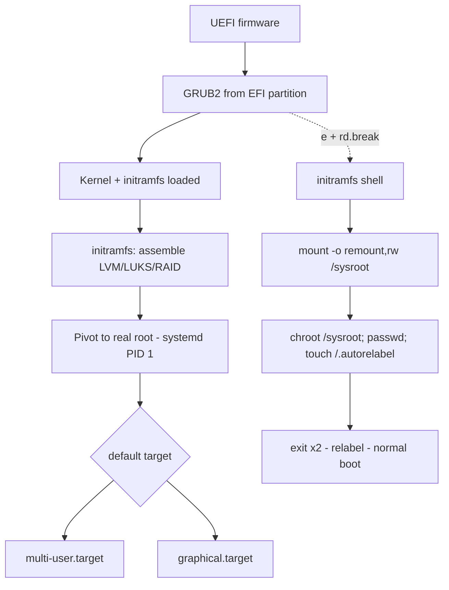

# Boot Process, Targets and Root Password Recovery

**Level:** Intermediate
**Tree:** [System Administration](../README.md)
**Branch:** [Systemd & Boot](README.md)
**Forest:** [Linux](../../../README.md)

## Explanation

## From firmware to login prompt

The RHEL boot chain is: firmware (UEFI) loads **GRUB2** from the EFI System Partition; GRUB loads the kernel and initramfs; the kernel unpacks initramfs, whose job is to assemble whatever the real root filesystem needs (LVM, RAID, LUKS, multipath) and pivot to it; then systemd runs as PID 1 and walks the dependency graph up to the **default target** - normally multi-user.target (text) or graphical.target. Understanding each hand-off tells you where to intervene when boot breaks.

**Targets** replace SysV runlevels. rescue.target brings up a root shell with local filesystems mounted and few services; emergency.target is more austere - root filesystem read-only, nearly nothing started. Select them per-boot by appending systemd.unit=rescue.target to the kernel line in GRUB, or persistently with systemctl set-default.

The exam-classic and real-world-critical skill is **root password recovery** on RHEL 9: interrupt GRUB, edit the linux line and append rd.break, which stops execution inside the initramfs before the pivot. The real root is at /sysroot, mounted read-only: remount it (mount -o remount,rw /sysroot), chroot /sysroot, passwd root, and - the step everyone forgets - touch /.autorelabel so SELinux relabels the shadow file on next boot; otherwise login fails even with the right password. Exit twice and let the relabel run.

For kernel problems, GRUB retains previous kernels: boot an older entry, then investigate with journalctl -b -1 (previous boot's log) and grubby --info=ALL. Regenerate a broken initramfs with dracut -f after driver or storage-layout changes.

## Rollback

GRUB keeps previous kernels, and that is the rollback path for most boot breakage: select an older entry at the menu, confirm the system is usable, then make it durable with **grubby --set-default**. A bad initramfs is regenerated with **dracut -f**; a bad default target with **systemctl set-default**.

What cannot be rolled back from the running system is a change that prevents GRUB loading at all - a corrupted EFI System Partition or a removed boot entry. That requires installation media or console access, which is why any change touching the ESP belongs in a window where someone can reach the console.

## Security implications

The recovery procedure that makes this leaf useful is also an **attack path**: anyone with console or virtual-console access can append rd.break and obtain a root shell without a password. Physical or out-of-band access is therefore equivalent to root on an unprotected host.

The control is a **GRUB password** (grub2-setpassword) to require authentication before editing kernel arguments, and restricting who can reach the console, iDRAC or vCenter console at all. Applying it has a real operational cost - it also blocks legitimate emergency recovery - so the decision is a genuine trade rather than an obvious hardening win, and it should be recorded with whoever accepts the risk.

## Monitoring

The signal worth alerting on is **boot target reached**, not host reachable. A machine that boots to emergency.target answers ping and SSH may be up, while multi-user.target was never reached and half the services are absent. **systemctl is-system-running** returns degraded or maintenance, and that is the honest check.

The second signal is **boot duration**. systemd-analyze reports total time; a jump usually means a unit is timing out and waiting the full ninety seconds before the boot continues. Treat a growing boot time as a fault in progress rather than a nuisance.

## High availability and disaster recovery

A host that fails to boot cleanly is worse than one that is down, because clustering and load balancers often see it as present. In an HA pair, confirm that fencing acts on **boot state** and not merely on network reachability, or a node stuck in emergency.target can hold a resource it cannot actually serve.

For recovery, the practical requirement is that **root password recovery and console access are proven before they are needed**. A documented procedure nobody has executed on this estate is a procedure that will be attempted for the first time during an outage, and the SELinux relabel step is exactly the kind of detail that is missed under pressure.

## Anti-patterns

**Skipping touch /.autorelabel after rd.break.** The password is changed, the login still fails, and the cause looks like the recovery not working. It is SELinux refusing the relabelled shadow file, and the fix is another reboot.

**Editing /boot/grub2/grub.cfg directly.** It is generated; the next grub2-mkconfig or kernel update overwrites it. Change /etc/default/grub or use grubby.

**Testing an fstab change by rebooting.** A wrong entry drops the machine to emergency mode, and on a remote host with no console that is an outage. Run mount -a first, and use nofail on non-critical volumes.

## Change control

Kernel arguments, default target and initramfs regeneration all share one property: **nothing proves them until the next reboot**, which may be a patch window months later. That gap between change and consequence is what makes boot changes worth gating harder than their apparent risk suggests.

The safe pattern is per-boot first, persistent second - test with a one-off kernel argument at the GRUB menu, confirm behaviour, then commit it with grubby. And never make a boot-affecting change on a remote host without confirmed console or out-of-band access, because the recovery for a mistake is physical.

## Architecture and flow



## Commands

### Command 1

Show and set the default boot target persistently

```text
systemctl get-default && systemctl set-default multi-user.target
```

### Command 2

Switch the running system to rescue mode immediately

```text
systemctl isolate rescue.target
```

### Command 3

Show the default kernel and all GRUB boot entries

```text
grubby --default-kernel && grubby --info=ALL
```

### Command 4

Add a kernel argument to every boot entry the supported way

```text
grubby --update-kernel=ALL --args='console=ttyS0,115200'
```

### Command 5

Rebuild the initramfs for the running kernel after storage/driver changes

```text
dracut -f /boot/initramfs-$(uname -r).img $(uname -r)
```

### Command 6

Show errors from the previous boot when diagnosing a crash

```text
journalctl -b -1 -p err
```

## Automation scripts

### boot-audit.sh

```bash
#!/usr/bin/env bash
# Boot health audit: default target, kernel entries, failed units, boot time.
set -euo pipefail
echo "== Default target =="; systemctl get-default
echo "== Default kernel =="; grubby --default-kernel
echo "== Kernel cmdline =="; cat /proc/cmdline
echo "== Failed units ==";  systemctl --failed --no-pager
echo "== Boot blame (top 10) =="
systemd-analyze blame --no-pager | head -10
echo "== Last boot errors =="
journalctl -b -p err --no-pager | tail -20
```

## Lab

**Objective:** Recover root access on a RHEL 9 VM with an unknown root password, then prove SELinux relabeling occurred and the system boots to the correct target.

### Steps

1. Reboot the VM and press e at the GRUB menu to edit the default entry.
2. Append rd.break to the end of the linux line and boot with Ctrl-x.
3. In the initramfs shell run: mount -o remount,rw /sysroot then chroot /sysroot.
4. Set a new password with passwd root, then touch /.autorelabel.
5. Exit twice, wait for the SELinux relabel, and log in as root.
6. Set the default target to multi-user.target and reboot to confirm.

### Validation

Login succeeds with the new root password after relabel.,ls -Z /etc/shadow shows shadow_t context (correct label).,systemctl get-default returns multi-user.target.,journalctl -b | grep -i relabel shows the autorelabel ran.

## Operational automation

### Automating boot configuration

- **grubby via Ansible**: manage kernel arguments fleet-wide with ansible.builtin.command grubby --update-kernel=ALL guarded by a check of /proc/cmdline for idempotence, or use the redhat.rhel_system_roles.bootloader system role declaratively.
- **Kdump**: enable crash capture everywhere with the kdump system role so kernel panics produce vmcores automatically.
- **Console access**: standardize serial console kernel args (console=ttyS0) via image build (Kickstart bootloader --append) so out-of-band recovery never depends on a GUI.

## Troubleshooting

### Scenario 1: New root password rejected after rd.break recovery

**Likely cause:** SELinux relabel skipped - /etc/shadow has a wrong context after being edited from initramfs

**Resolution:** Repeat the procedure and touch /.autorelabel before exiting, or boot with enforcing=0 once and run restorecon /etc/shadow

### Scenario 2: System hangs in initramfs with dracut timeout waiting for device

**Likely cause:** Root LV/UUID referenced on the kernel line does not exist - storage renamed or initramfs missing a driver

**Resolution:** Boot a previous kernel, verify /etc/default/grub and lsblk, rebuild initramfs with dracut -f, regenerate grub config

### Scenario 3: Server boots to emergency.target unexpectedly

**Likely cause:** A required mount in fstab failed, or local-fs.target has a failed dependency

**Resolution:** Run journalctl -xb to find the failing unit, fix or nofail the fstab entry, then systemctl default to continue boot

### Scenario 4: A host reboots successfully for months, then fails to boot after an unrelated patch window

**Likely cause:** A boot-affecting change - a kernel argument, an fstab entry, or a regenerated initramfs - was made long ago and never tested with a reboot. The patch window is simply the first reboot since

**Resolution:** Boot the previous kernel from the GRUB menu to get a usable system, then compare the current boot entry and fstab against the last known-good. journalctl -b -1 -p err shows what the failed boot was waiting for

## Interview questions

### 1. Walk through what rd.break actually does.

It sets a breakpoint in dracut's initramfs sequence just before switch_root, so you get a shell in the initramfs environment with the real root mounted read-only at /sysroot. Because this runs before the root pivot, no root password is needed - which is also why console access must be physically protected and GRUB can be password-protected.

### 2. Difference between rescue.target and emergency.target?

rescue.target starts basic.target plus a root shell - local filesystems mounted, most services stopped; good for maintenance. emergency.target is minimal: root mounted read-only, virtually no units started; used when even mounting filesystems is suspect. Both require the root password at the console, unlike rd.break.

### 3. A server fails to boot after a kernel update. What is your sequence?

At GRUB, boot the previous kernel entry (they are retained). Once up, check journalctl -b -1 for the failure, verify the new kernel's initramfs exists and rebuild with dracut -f if needed, check for missing drivers or incompatible kernel modules (dkms/third-party), and pin the working kernel with grubby --set-default while investigating.

### 4. Why must you not edit grub.cfg directly?

grub.cfg is generated (grub2-mkconfig) and overwritten on kernel updates. Persistent changes belong in /etc/default/grub or via grubby, which edits BLS entries on RHEL 8/9 and survives regeneration.

## Certification alignment

- RHCSA EX200 - Interrupt the boot process in order to gain access to a system
- RHCSA EX200 - Boot systems into different targets manually
- RHCSA EX200 - Manage default boot target

## References

- Red Hat Documentation: Managing, monitoring and updating the kernel (RHEL 9)
- man dracut.cmdline, man grubby, man systemd.special
- Red Hat KB: How to reset the root password on RHEL 9

## Suggested video search

RHEL 9 boot process rd.break root password reset GRUB2 targets

---

> Validate commands, versions, permissions, licensing, and rollback procedures in an isolated lab before production use.
