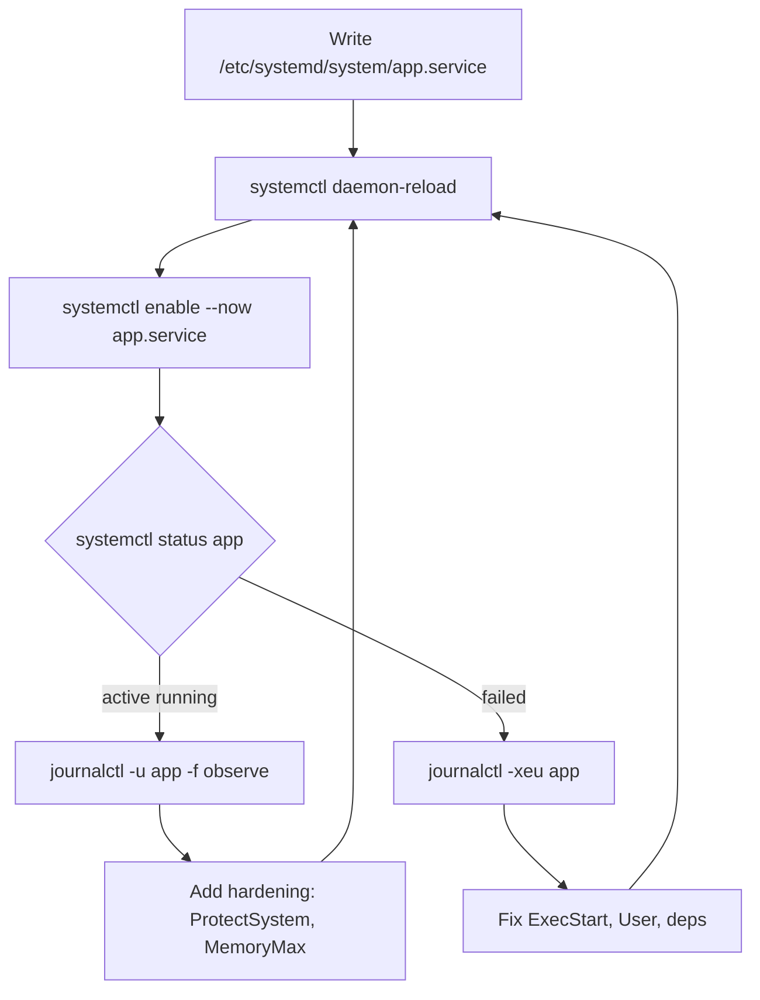

# Systemd Units and Custom Services

**Level:** Intermediate
**Tree:** [System Administration](../README.md)
**Branch:** [Systemd & Boot](README.md)
**Forest:** [Linux](../../../README.md)

## Explanation

## Systemd as the service supervisor

Systemd is PID 1 on every modern RHEL system: it boots the machine, supervises services, and owns logging via journald. Its core object is the **unit** - services (.service), sockets, timers, mounts, targets, and paths - each declared in a small INI-style file. Package units live in /usr/lib/systemd/system; administrator units and overrides live in /etc/systemd/system, which always wins.

A service unit has three sections. **[Unit]** declares ordering and dependencies: After= and Before= control startup order only, while Requires= and the gentler Wants= create actual dependency pulls - a distinction that matters constantly in troubleshooting. **[Service]** defines Type (simple, forking, notify, oneshot), ExecStart, restart policy (Restart=on-failure with RestartSec), the run-as User, and sandboxing directives (ProtectSystem, PrivateTmp, NoNewPrivileges) that give free security hardening. **[Install]** states which target enables the unit, almost always WantedBy=multi-user.target.

Never edit vendor unit files - they are overwritten on package update. Use systemctl edit name.service to create a drop-in override in /etc/systemd/system/name.service.d/override.conf containing only the changed directives. After any file change, systemctl daemon-reload is mandatory before restart. Timers replace cron for anything serious: they log to the journal, support randomized delays to prevent thundering herds, catch up missed runs with Persistent=true, and inherit the full dependency model. Resource control comes free through cgroups: CPUQuota, MemoryMax, and TasksMax turn a unit file into a lightweight resource-governed container for any daemon.

## Rollback

A drop-in is the unit of rollback. **systemctl revert <unit>** deletes every administrator override and drop-in and returns the unit to the packaged definition in one step - the single most useful command here, and the least known. For a single drop-in, delete the file under /etc/systemd/system/<unit>.d/ and run **daemon-reload**.

What does not roll back is anything the service already did. A unit with a destructive ExecStart that ran once has had its effect; reverting the unit file does not undo it. That is the argument for testing with **systemd-analyze verify** and a manual run before enabling.

## Security implications

The sandboxing directives are the cheapest hardening on the platform: **ProtectSystem=strict** makes /usr and /etc read-only to the service, **PrivateTmp=yes** gives it a namespace-private /tmp so it cannot be attacked through a shared temp file, and **NoNewPrivileges=yes** blocks setuid escalation from within the service.

The cost is that each one can break a working service in a way that looks unrelated - a daemon that cannot write its own state directory fails with a permission error nobody expects, because the permission is a namespace, not a mode bit. Add them one at a time, and pair ProtectSystem with **StateDirectory=** so the service has a sanctioned place to write.

## Monitoring

The useful signal is **restart rate**, not up/down. Restart=on-failure makes a crashing service look healthy to anything that only checks systemctl is-active, because it is genuinely active - it just started again forty seconds ago. **systemctl show -p NRestarts** exposes the count, and a rising NRestarts on a service reporting active is the classic hidden failure.

The second signal is start duration. **systemd-analyze blame** ranks units by activation time; a unit that has quietly grown from two seconds to ninety is usually waiting on something else - a mount, DNS, or a dependency it does not declare.

## High availability and disaster recovery

Ordering is not dependency. **After=** controls sequence only; if the thing it waits for never starts, the unit starts anyway and fails in a confusing way. **Requires=** creates a real pull and propagates failure. Getting this wrong is the most common cause of a service that works on a warm boot and fails on a cold one, because the timing differs.

For anything depending on remote storage or the network, **RequiresMountsFor=** and network-online.target are the honest declarations. In a clustered estate, resource managers usually want the unit **disabled** at boot so the cluster - not systemd - decides where it runs; a unit enabled on two nodes is a split-brain waiting for a reboot.

## Anti-patterns

**Editing the vendor unit file in /usr/lib/systemd/system.** The next package update overwrites it silently and the change is gone with no error. Use systemctl edit, which creates a drop-in that survives updates.

**Type=simple for a daemon that forks.** systemd marks it started the moment the parent exits, so ordering downstream of it is meaningless and the service is reported active while nothing is listening. Match Type to actual behaviour - forking, notify or simple.

**Restart=always on a unit that fails on bad configuration.** It converts a clear startup failure into an infinite restart loop that fills the journal and hides the original error.

## Change control

A drop-in plus daemon-reload is low risk and instantly revertible, so it does not need a window. What needs one is **changing Type, Restart policy or dependency edges on a service others order against** - those alter boot behaviour, and the failure surfaces at the next reboot rather than at change time, which may be months later.

The rule worth enforcing: **never make a unit change you have not tested with a full reboot**, because daemon-reload proves the file parses and proves nothing about the dependency graph resolving from cold.

## Architecture and flow



## Commands

### Command 1

Show the effective unit file including all drop-in overrides

```text
systemctl cat sshd.service
```

### Command 2

Create a drop-in override without touching the vendor file

```text
systemctl edit myapp.service
```

### Command 3

Reload unit definitions and restart the service

```text
systemctl daemon-reload && systemctl restart myapp
```

### Command 4

Read the failure explanation and recent log lines for a broken unit

```text
journalctl -xeu myapp.service
```

### Command 5

Lint a unit file for syntax and reference errors before deploying

```text
systemd-analyze verify /etc/systemd/system/myapp.service
```

### Command 6

Show all timers, their last and next scheduled runs

```text
systemctl list-timers --all
```

## Automation scripts

### myapp.service

```yaml
# /etc/systemd/system/myapp.service - hardened custom service
[Unit]
Description=MyApp API worker
After=network-online.target
Wants=network-online.target

[Service]
Type=simple
User=myapp
Group=myapp
ExecStart=/opt/myapp/bin/worker --config /etc/myapp/worker.conf
Restart=on-failure
RestartSec=5
# Resource control
MemoryMax=1G
CPUQuota=150%
# Sandboxing
NoNewPrivileges=true
ProtectSystem=strict
ProtectHome=true
PrivateTmp=true
ReadWritePaths=/var/lib/myapp

[Install]
WantedBy=multi-user.target
```

## Lab

**Objective:** Create a hardened custom service with restart policy and a companion timer, then prove the restart policy and sandboxing work.

### Steps

1. Write /opt/myapp/bin/worker as a small script that logs a heartbeat every 10 seconds.
2. Create myapp.service as a dedicated user with Restart=on-failure and PrivateTmp=true.
3. daemon-reload, enable --now, and confirm active with systemctl status.
4. Kill the process with kill -9 and watch systemd restart it within 5 seconds.
5. From inside the service (ExecStartPre touch /tmp/probe) show the file is not visible in the host /tmp, proving PrivateTmp.
6. Add myapp-report.timer running a oneshot report daily with Persistent=true.

### Validation

systemctl status myapp shows Main PID owned by user myapp.,journalctl -u myapp shows the automatic restart event after kill -9.,ls /tmp on the host does not show the probe file created by the unit.,systemctl list-timers shows myapp-report.timer with a next-run time.

## Operational automation

### Automating service management

- **Ansible**: deploy unit files with ansible.builtin.template, then ansible.builtin.systemd_service with daemon_reload: true, enabled: true, state: restarted - all idempotent. Use handlers so restarts only fire on template change.
- **RHEL system roles**: the redhat.rhel_system_roles.systemd role manages units, drop-ins, and timers declaratively across the fleet.
- **CI validation**: run systemd-analyze verify on every unit file in the repo as a pipeline gate before any deployment.

## Troubleshooting

### Scenario 1: Changes to a unit file appear to have no effect

**Likely cause:** systemctl daemon-reload was not run, so systemd is using the cached definition

**Resolution:** Run systemctl daemon-reload then restart the unit; check systemctl cat to confirm the effective content

### Scenario 2: Service starts then immediately shows failed (status 203/EXEC)

**Likely cause:** ExecStart path wrong, binary not executable, or blocked by SELinux

**Resolution:** Verify path and permissions, check ausearch -m avc -ts recent, and confirm the interpreter shebang exists

### Scenario 3: Service works when run manually but fails under systemd

**Likely cause:** Missing environment variables, wrong working directory, or sandbox directives blocking file access

**Resolution:** Add Environment=/EnvironmentFile=, WorkingDirectory=, and open needed paths with ReadWritePaths; compare with journalctl -xeu output

### Scenario 4: A service reports active and healthy to monitoring, but users see intermittent failures

**Likely cause:** Restart=on-failure is masking a repeatedly crashing service. It is genuinely active because it restarted seconds ago, so any check based on systemctl is-active passes

**Resolution:** Read systemctl show -p NRestarts -p ExecMainStartTimestamp <unit>. A non-zero and rising NRestarts with a recent start timestamp confirms it. Fix the crash, and alert on restart rate rather than on active state

## Interview questions

### 1. Explain the difference between Requires= and Wants= plus After=.

Wants= and Requires= pull dependencies in; After= only sequences start order. Requires= additionally fails or stops the unit if the dependency fails, while Wants= tolerates the dependency failing. Best practice is Wants= plus After= for most relationships, reserving Requires= for hard, cannot-run-without dependencies.

### 2. Why use systemd timers instead of cron?

Timers log to the journal, support Persistent=true to catch up missed runs after downtime, RandomizedDelaySec to spread fleet-wide load, and full dependency ordering (e.g. run only after network-online). The payload is a normal service unit, so it inherits resource limits and sandboxing.

### 3. How do you override one directive of a vendor unit safely?

systemctl edit unit creates a drop-in at /etc/systemd/system/unit.d/override.conf containing only my changes. For list-type directives like ExecStart you must clear first (ExecStart= empty line, then the new value). Vendor files stay pristine and package updates merge cleanly.

### 4. What does Type=notify give you over Type=simple?

With notify, the service tells systemd explicitly (sd_notify READY=1) when it has finished initializing, so dependent units start only when it is genuinely ready, not merely forked. That closes the race where simple-type services are 'active' before they can serve traffic.

## Certification alignment

- RHCSA EX200 - Start, stop and check the status of network services
- RHCSA EX200 - Configure services to start automatically at boot
- RHCE EX294 - Manage services with the ansible.builtin.systemd module

## References

- man systemd.service, man systemd.unit, man systemd.timer
- Red Hat Documentation: Configuring basic system settings - Managing services with systemd
- systemd.io - official project documentation

## Suggested video search

systemd unit files custom service RHEL 9 tutorial drop-in override

---

> Validate commands, versions, permissions, licensing, and rollback procedures in an isolated lab before production use.
